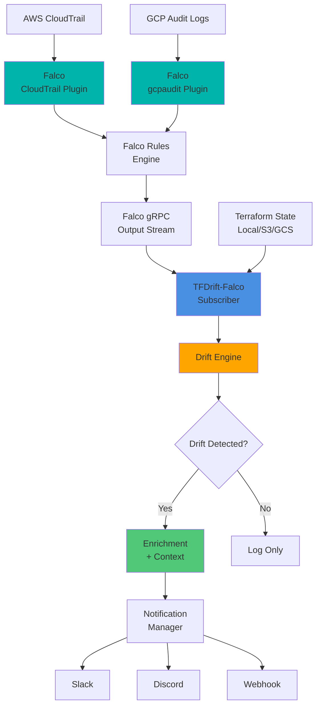

# 🛰️ TFDrift-Falco

**Falcoを活用したリアルタイムTerraformドリフト検知**

[](https://github.com/higakikeita/tfdrift-falco/releases)
[](https://opensource.org/licenses/MIT)
[](https://golang.org/)
[](https://falco.org/)
[](https://ghcr.io/higakikeita/tfdrift-falco)
[](https://github.com/higakikeita/tfdrift-falco/pkgs/container/tfdrift-falco)
[](https://github.com/higakikeita/tfdrift-falco/actions/workflows/test.yml)
[](https://github.com/higakikeita/tfdrift-falco/actions/workflows/lint.yml)
[](https://github.com/higakikeita/tfdrift-falco/actions/workflows/security.yml)
[](https://github.com/higakikeita/tfdrift-falco/actions/workflows/publish-ghcr.yml)
[](https://github.com/higakikeita/tfdrift-falco)
[](https://codecov.io/gh/higakikeita/tfdrift-falco)
[](https://goreportcard.com/report/github.com/higakikeita/tfdrift-falco)

> 🎉 **v0.5.0 リリース!** - **マルチクラウド対応**! GCP Audit Logs統合で12以上のサービスにわたる100以上のイベントマッピング。Terraform StateのGCSバックエンドサポート。[リリースノートを見る](https://github.com/higakikeita/tfdrift-falco/releases/tag/v0.5.0)
>
> 🎯 **v0.4.1** - **Webhook統合**! Slack、Teams、PagerDuty、またはカスタムAPIにドリフトイベントを送信。自動リトライ、タイムアウト処理対応。
>
> 🚀 **v0.4.0** - **構造化イベント出力** SIEM/SOAR統合向け! JSON出力（NDJSON）、イベント駆動型アーキテクチャ。

[English](README.md) | **[日本語]**

---

## 🚀 Quick Start - 3コマンドで完結！

### 最速セットアップ（5分）

```bash
# 1. リポジトリをクローン
git clone https://github.com/higakikeita/tfdrift-falco.git && cd tfdrift-falco

# 2. セットアップスクリプトを実行（対話的に設定）
./quick-start.sh

# 3. 起動！
docker compose up -d
```

**これだけです！** 🎉

スクリプトが自動的に以下を行います：
- ✅ Docker / Docker Compose のチェック
- ✅ AWS credentials の確認
- ✅ Falco + TFDrift-Falco の設定ファイル生成
- ✅ 対話的な設定（AWS Region、Terraform State Backend、Slack Webhook）

### ログを確認

```bash
# ドリフト検知ログを表示
docker compose logs -f tfdrift

# または make コマンドで
make logs
```

### よく使うコマンド

```bash
make start      # 起動
make stop       # 停止
make restart    # 再起動
make status     # 状態確認
make logs       # ログ表示
```

### 詳細なセットアップ手順

ステップバイステップのガイドは [Getting Started Guide](docs/GETTING_STARTED.md) を参照してください。

---

## 🏭 本番環境デプロイメント

TFDrift-Falcoは本番環境対応の **REST API + WebSocket + SSE + React UI** を提供します！

### 🚀 API Serverモード

```bash
# API serverモードで起動
docker-compose up -d

# アクセス
# Frontend UI: http://localhost:3000
# Backend API: http://localhost:8080/api/v1
# WebSocket: ws://localhost:8080/ws
# SSE Stream: http://localhost:8080/api/v1/stream
```

### 📡 REST APIエンドポイント

- `GET /api/v1/graph` - 因果関係グラフ (Cytoscape形式)
- `GET /api/v1/drifts` - Driftアラート一覧 (フィルタリング対応)
- `GET /api/v1/events` - Falcoイベント一覧
- `GET /api/v1/state` - Terraform State概要
- `GET /api/v1/stats` - 統計情報
- `GET /health` - ヘルスチェック

**詳細:** [API Documentation](docs/API.md)

### 🌐 React Web UI


#### 3つのビューモード

1. **📊 グラフビュー** - 因果関係グラフの可視化
   - React Flow with official AWS/Kubernetes icons
   - インタラクティブなノード操作
   - 階層レイアウト、Dagre、Force-directed、Circular

2. **📋 テーブルビュー** - ドリフトイベント履歴
   - 100+イベントの一覧表示
   - フィルタリング（重大度、プロバイダー、検索）
   - ソート機能（最新順、重大度順）
   - 詳細パネル（変更前後の値、ユーザー情報、CloudTrail）

3. **⚡ 分割ビュー** - グラフ + テーブル同時表示（推奨）
   - 左: 因果関係グラフ
   - 右: ドリフト履歴テーブル + 詳細パネル

**主な機能:**
- 🎯 **公式アイコン** - AWS React Icons + Kubernetes official SVG
- 📊 **リアルタイムフィルタリング** - 重大度、プロバイダー、リソースタイプ
- ⚡ **WebSocket/SSE対応** - リアルタイム通知（準備済み）
- 🔍 **大規模グラフ対応** - 1000+ノード対応（LOD、Clustering対応）
- 📱 **レスポンシブデザイン** - Tailwind CSS

#### 開発環境での起動

```bash
cd ui
npm install
npm run dev
# http://localhost:5173/ でアクセス
```

### 🐳 Docker Compose（推奨）

```yaml
services:
  backend:
    image: tfdrift-falco:latest
    ports:
      - "8080:8080"  # API server
      - "9090:9090"  # Prometheus metrics
    command: ["--server", "--api-port", "8080"]

  frontend:
    image: tfdrift-frontend:latest
    ports:
      - "3000:8080"  # Web UI
    environment:
      - VITE_API_BASE_URL=http://backend:8080/api/v1
```

### ☸️ Kubernetesデプロイメント

```bash
# Helm chart（準備中）
helm install tfdrift ./charts/tfdrift-falco

# または kubectl
kubectl apply -f k8s/
```

### 📦 CI/CD

GitHub Actionsワークフロー搭載:
- ✅ Backend tests (Go)
- ✅ Frontend tests (React)
- ✅ Docker multi-platform builds (amd64, arm64)
- ✅ Security scanning (Trivy + Gosec)
- ✅ Codecov integration

**詳細:** [Deployment Guide](docs/deployment.md)

---

## 🔌 出力モード（v0.4.0の新機能）

TFDrift-Falcoは、SIEM、SOAR、監視システムとの統合を容易にする**構造化イベント**を出力できるようになりました。

### JSON出力（NDJSON）

```bash
# 機械可読なJSONイベントのみ
tfdrift --auto --output json

# 出力（改行区切りJSON）:
{"event_type":"terraform_drift_detected","provider":"aws","resource_type":"aws_security_group","resource_id":"sg-12345",...}
{"event_type":"terraform_drift_detected","provider":"aws","resource_type":"aws_instance","resource_id":"i-67890",...}
```

**最適な用途:**
- `jq` - `tfdrift --auto --output json | jq '.resource_type'`
- Fluent Bit / Fluentd
- Vector
- Datadog Agent
- Sysdig Agent
- SIEMプラットフォーム

### 人間可読 + JSON両方

```bash
# 人間可読とJSON両方（デバッグ用）
tfdrift --auto --output both
```

出力先:
- **stderr**: 人間可読ログ
- **stdout**: JSONイベント（NDJSON）

### イベントスキーマ

```json
{
  "event_type": "terraform_drift_detected",
  "provider": "aws",
  "account_id": "123456789012",
  "resource_type": "aws_security_group",
  "resource_id": "sg-12345",
  "change_type": "modified",
  "detected_at": "2025-01-10T12:34:56Z",
  "source": "tfdrift-falco",
  "severity": "critical",
  "region": "us-west-2",
  "user": "admin@example.com",
  "cloudtrail_event": "AuthorizeSecurityGroupIngress",
  "version": "1.0.0"
}
```

---

## 🔗 Webhook統合（v0.4.1の新機能）

**任意のWebhookエンドポイント**にドリフトイベントを送信 - Slack、Teams、PagerDuty、カスタムAPI。

### クイック例

#### Slack統合
```yaml
# config.yaml
output:
  webhook:
    url: "https://hooks.slack.com/services/YOUR/WEBHOOK/URL"
    method: POST
```

ドリフトイベントは以下の形式でSlackメッセージとして表示されます:
- 重大度による色分け（🚨 Critical = 赤、⚠️ High = オレンジ）
- リソース詳細
- ユーザーとリージョン情報
- CloudTrailイベント相関

#### Microsoft Teams
```yaml
output:
  webhook:
    url: "https://outlook.office.com/webhook/YOUR/WEBHOOK/URL"
    method: POST
```

#### 認証付きカスタムAPI
```yaml
output:
  webhook:
    url: "https://your-api.com/drift-events"
    method: POST
    headers:
      Authorization: "Bearer YOUR_TOKEN"
      X-Custom-Header: "custom-value"
    timeout: 30s
    max_retries: 5
    retry_delay: 2s
```

### 機能

✅ **自動リトライ** - 指数バックオフ（1s → 2s → 4s → 8s...）
✅ **タイムアウト処理** - 設定可能なタイムアウト（デフォルト: 10s）
✅ **カスタムヘッダー** - 認証トークン、カスタムヘッダーの追加
✅ **複数メソッド** - POST、PUT、PATCH
✅ **フォーマットヘルパー** - 組み込みSlack & Teamsフォーマッター

### Webhookペイロード

エンドポイントに送信される生JSONペイロード:
```json
{
  "event_type": "terraform_drift_detected",
  "provider": "aws",
  "resource_type": "aws_security_group",
  "resource_id": "sg-12345",
  "change_type": "modified",
  "severity": "critical",
  ...
}
```

---

**要件:**
- Terraform初期化済みディレクトリ（`.terraform/`が存在）
- CloudTrailプラグイン（AWS）またはgcpauditプラグイン（GCP）を使用したFalco実行中
- AWS認証情報設定済み（AWS用）またはGCP認証情報設定済み（GCP用）

---

## 🧩 概要

**TFDrift-Falco**は、以下を組み合わせることで、クラウド環境における手動（IaC管理外）の変更を**リアルタイムで検知**します:

- **Falco** CloudTrailプラグイン（AWS）またはgcpauditプラグイン（GCP）によるランタイムセキュリティ監視
- **Falco gRPC API** リアルタイムイベントストリーミング
- **Terraform State** 比較

従来のドリフト検知ツール（`driftctl`や`tfsec`など）が定期的な静的スキャンを行うのに対し、TFDrift-FalcoはFalcoのクラウド監査ログプラグインを活用した**継続的なイベント駆動型ドリフト検知**を提供します。

### 🚨 使用例

```
誰かがAWSコンソールでEC2インスタンスの削除保護を無効化
    ↓
CloudTrailイベントをFalco CloudTrailプラグインが捕捉
    ↓
Falcoルールがトリガーされ、gRPC経由でイベント送信
    ↓
TFDrift-Falcoがイベントを受信し、Terraform Stateと比較
    ↓
ユーザーIDと変更詳細を含む即座のSlackアラート
```

## 🎯 主要機能

- ⚡ **リアルタイム検知** - Falco gRPC出力をサブスクライブして即座にイベント処理
- 🦅 **Falco駆動** - イベント監視にFalcoのCloudTrailプラグイン（AWS）およびgcpauditプラグイン（GCP）を使用
- 🧩 **Terraform State比較** - IaC定義からの逸脱を検出
- 🔒 **セキュリティコンテキスト** - ユーザーID（IAMユーザー、APIキー、サービスアカウント）を関連付け
- 🔔 **複数の通知チャネル** - Slack、Discord、Falco出力、Webhook
- 🌐 **マルチクラウド対応** - AWS（411イベント、23サービス）、GCP（100以上のイベント、12以上のサービス）、Azure（計画中）
- 🎨 **拡張可能なルール** - YAMLでカスタムFalcoルールを定義
- 🐳 **コンテナ対応** - サイドカーまたはスタンドアロンコンテナとして実行
- 📊 **本番環境対応** - 包括的な負荷テストと監視フレームワーク

## 📋 対応AWSサービス

TFDrift-Falco v0.5.0は、23のAWSサービスにわたる**411のCloudTrailイベント**を監視します:

| サービス | イベント数 | カバレッジ | 優先度 |
|---------|--------|----------|----------|
| **CloudWatch** 📊 | 66 | アラーム、ダッシュボード、メトリクス、ロググループ、複合アラーム、メトリクスストリーム、Insights | 高 |
| **VPC/Networking** 🔒 | 40 | セキュリティグループ、VPC、サブネット、ルートテーブル、ゲートウェイ、ACL、エンドポイント、ピアリング、Transit Gateway、Flow Logs、Network Firewall | 重要 |
| **RDS** 🗃️ | 37 | インスタンス、クラスター、スナップショット、パラメータグループ、サブネットグループ、オプショングループ、レプリカ | 高 |
| **API Gateway** 🌐 | 32 | REST API、リソース、メソッド、デプロイメント、ステージ、モデル、オーソライザー | 高 |
| **IAM** ✅ | 25 | ロール、ユーザー、グループ、ポリシー、アクセスキー、インスタンスプロファイル、タグ | 重要 |
| **ELB/ALB** ⚖️ | 22 | ロードバランサー、ターゲットグループ、リスナー、ルール、SSL証明書 | 高 |
| **S3** 🪣 | 21 | バケット、ポリシー、暗号化、バージョニング、ライフサイクル、レプリケーション、CORS、Website、ロギング | 高 |
| **EC2** 💻 | 17 | インスタンス、AMI、EBSボリューム、スナップショット、ネットワークインターフェース | 高 |
| **ElastiCache** 🗄️ | 16 | キャッシュクラスター、レプリケーショングループ、パラメータグループ、ユーザーグループ | 高 |
| **SageMaker** 🤖 | 16 | エンドポイント、トレーニングジョブ、モデルパッケージ、ノートブックインスタンス | 高 |
| **DynamoDB** 📊 | 14 | テーブル、PITR、バックアップ、グローバルテーブル、ストリーム、モニタリング | 高 |
| **Lambda** ⚡ | 13 | 関数、イベントソース、パーミッション、同時実行数、エイリアス、バージョン | 高 |
| **Kinesis** 🌊 | 13 | ストリーム、コンシューマー、Firehose、Analyticsアプリケーション | 中 |
| **EKS** ☸️ | 12 | クラスター、ノードグループ、アドオン、Fargateプロファイル | 高 |
| **Auto Scaling** 📈 | 10 | ASG、起動設定、ポリシー、スケジュールされたアクション | 中 |
| **CloudFormation** 📚 | 10 | スタック、スタックセット、変更セット | 高 |
| **KMS** 🔐 | 10 | キー、エイリアス、ローテーション、削除、キーポリシー | 重要 |
| **ECS** 🐳 | 8 | サービス、タスク定義、クラスター、キャパシティプロバイダー | 高 |
| **WAF/WAFv2** 🛡️ | 8 | Web ACL、ルールグループ、IPセット、正規表現パターンセット | 高 |
| **AWS Backup** 💾 | 7 | バックアッププラン、バックアップボールト、リカバリポイント、バックアップジョブ | 中 |
| **Step Functions** 🔄 | 5 | ステートマシン、実行、タグ | 中 |
| **AWS Glue** 🔗 | 5 | データベース、テーブル、ジョブ、クローラー | 中 |
| **EventBridge** 📡 | 4 | ルール、ターゲット、イベントバス | 中 |
| **ECR** 📦 | 1 | リポジトリポリシー | 中 |

**合計**: 23サービスにわたる411イベント | 詳細は [AWS Resource Coverage Analysis](./docs/AWS_RESOURCE_COVERAGE_ANALYSIS.md) を参照

## 📋 対応GCPサービス

TFDrift-Falco v0.5.0は、12以上のサービスにわたる**100以上のGCP Audit Logイベント**を監視します:

| サービス | イベント数 | カバレッジ | 優先度 |
|---------|--------|----------|----------|
| **Compute Engine** 💻 | 30+ | インスタンス、ディスク、マシンタイプ、メタデータ、ネットワーク、ファイアウォール | 重要 |
| **Cloud Storage** 🗄️ | 15+ | バケット、オブジェクト、IAMバインディング、ACL、ライフサイクル | 高 |
| **Cloud SQL** 🗃️ | 10+ | インスタンス、データベース、ユーザー、バックアップ | 高 |
| **GKE** ☸️ | 10+ | クラスター、ノードプール、ワークロード | 高 |
| **Cloud Run** 🏃 | 8+ | サービス、リビジョン、IAMポリシー | 高 |
| **IAM** ✅ | 8+ | サービスアカウント、ロール、バインディング、キー | 重要 |
| **VPC/Networking** 🔒 | 10+ | ファイアウォール、ルート、サブネット、ピアリング | 重要 |
| **Cloud Functions** ⚡ | 5+ | 関数、トリガー、IAMポリシー | 中 |
| **BigQuery** 📊 | 5+ | データセット、テーブル、IAMポリシー | 中 |
| **Pub/Sub** 📨 | 5+ | トピック、サブスクリプション、IAMポリシー | 中 |
| **KMS** 🔐 | 5+ | キー、KeyRing、IAMポリシー | 重要 |
| **Secret Manager** 🔒 | 3+ | シークレット、バージョン、IAMポリシー | 高 |

**合計**: 12以上のサービスにわたる100以上のイベント | 設定詳細は [GCP Setup Guide](./docs/gcp-setup.md) を参照

## 🏗️ アーキテクチャ



### コンポーネント

| コンポーネント | 説明 |
|-----------|-------------|
| **Falco Subscriber** | Falco gRPC APIに接続し、CloudTrailイベントをサブスクライブ |
| **Terraform State Loader** | 定期的にTerraform state（ローカル/リモート）を同期 |
| **Drift Engine** | IaC定義とランタイム変更を比較 |
| **Context Enricher** | ユーザーID、リソースタグ、変更履歴を追加 |
| **Notifier** | 設定されたチャネルにアラートを送信 |

## 📊 コード品質とテスト

TFDrift-Falcoは、包括的なテストと継続的インテグレーションにより高いコード品質基準を維持しています:

### テストカバレッジ: 80%以上 🎯

- **ユニットテスト**: 全コアパッケージ（detector、falco、diff、config）
- **統合テスト**: エンドツーエンドのドリフト検知ワークフロー
- **テーブル駆動テスト**: エッジケースの効率的なカバレッジ
- **CI/CD**: すべてのPRで自動テスト、カバレッジ閾値強制（78%）

### コード品質ツール

- ✅ **golangci-lint**: 15以上のリンター有効化による静的解析
- ✅ **Snyk**: 依存関係の脆弱性スキャン（週次）
- ✅ **GoSec**: セキュリティ重視の静的解析
- ✅ **Nancy**: Go依存関係チェッカー
- ✅ **go vet**: 公式Go静的アナライザー
- ✅ **staticcheck**: 高度なGoリンター

### アーキテクチャ品質

- 📁 **単一責任原則**: 集中したファイルによるモジュラー設計（200行未満）
- 🧩 **依存性注入**: モックサポート付きテスト可能コンポーネント
- 🔄 **クリーンリファクタリング**: 主要リファクタリング完了（1,410行 → 17のモジュールファイル）
- 📝 **包括的ドキュメント**: インラインコメントとパッケージドキュメント

### 最近の成果

- テストカバレッジを36.9%から80.0%に改善 ✅
- 3つの大規模ファイル（513、426、473行）を集中モジュールにリファクタリング ✅
- 500行以上のファイルを全て削除（テスト除く） ✅
- すべての重要なgolangci-lint警告を解決 ✅

詳細: [Test Coverage 80% Achievement Article](./docs/test-coverage-80-achievement.md)

## 🐳 Dockerでクイックスタート（最も簡単）

**公式Dockerイメージで30秒で開始:**

```bash
# 公式イメージをプル＆実行
docker run -d \
  --name tfdrift-falco \
  -e TF_STATE_BACKEND=s3 \
  -e TF_STATE_S3_BUCKET=my-terraform-state \
  -e TF_STATE_S3_KEY=prod/terraform.tfstate \
  -e AWS_REGION=ap-northeast-1 \
  -v ~/.aws:/root/.aws:ro \
  ghcr.io/higakikeita/tfdrift-falco:latest
```

**ログ確認:**
```bash
docker logs -f tfdrift-falco
```

**GitHub Container Registryで利用可能:**
- 🚀 `ghcr.io/higakikeita/tfdrift-falco:latest` - 最新安定版
- 📌 `ghcr.io/higakikeita/tfdrift-falco:v0.2.0-beta` - 特定バージョン
- 🔖 全タグを見る: https://github.com/higakikeita/tfdrift-falco/pkgs/container/tfdrift-falco

---

## 🚀 完全インストールガイド

### 前提条件

- Go 1.21以降（ソースからビルドする場合）
- **Falco 0.35+** CloudTrailプラグイン（AWS）またはgcpauditプラグイン（GCP）必須 - [AWSセットアップ](docs/falco-setup.md) | [GCPセットアップ](docs/gcp-setup.md)
- Terraform 1.0+
- AWS CLI設定済み（AWSサポート用）またはgcloud CLI設定済み（GCPサポート用）
- **Docker**（最も簡単なセットアップ方法として推奨）

> **重要**: TFDrift-Falcoは、gRPCが有効で適切なクラウドプラグインが設定されたFalcoインスタンスが必要です:
> - AWS: CloudTrailプラグイン - [セットアップガイド](docs/falco-setup.md)
> - GCP: gcpauditプラグイン - [セットアップガイド](docs/gcp-setup.md)

### インストール

#### オプション1: バイナリリリース

```bash
# 最新リリースをダウンロード
curl -LO https://github.com/keitahigaki/tfdrift-falco/releases/latest/download/tfdrift-linux-amd64
chmod +x tfdrift-linux-amd64
sudo mv tfdrift-linux-amd64 /usr/local/bin/tfdrift
```

#### オプション2: ソースからビルド

```bash
git clone https://github.com/keitahigaki/tfdrift-falco.git
cd tfdrift-falco
go build -o tfdrift ./cmd/tfdrift
```

#### オプション3: Docker（推奨 ⭐）

**GitHub Container Registry（GHCR）で公式イメージが利用可能**

```bash
# 最新の公式イメージをプル
docker pull ghcr.io/higakikeita/tfdrift-falco:latest

# または特定バージョンを使用
docker pull ghcr.io/higakikeita/tfdrift-falco:v0.2.0-beta

# Dockerで実行
docker run -d \
  --name tfdrift-falco \
  -v $(pwd)/config.yaml:/config/config.yaml:ro \
  -v ~/.aws:/root/.aws:ro \
  ghcr.io/higakikeita/tfdrift-falco:latest \
  --config /config/config.yaml
```

**環境変数で簡単スタート:**

```bash
docker run -d \
  --name tfdrift-falco \
  -e TF_STATE_BACKEND=s3 \
  -e TF_STATE_S3_BUCKET=my-terraform-state \
  -e TF_STATE_S3_KEY=prod/terraform.tfstate \
  -e AWS_REGION=ap-northeast-1 \
  -e FALCO_HOSTNAME=localhost \
  -e FALCO_PORT=5060 \
  -v ~/.aws:/root/.aws:ro \
  ghcr.io/higakikeita/tfdrift-falco:latest
```

**ソースからビルド（開発用）:**

```bash
# ローカルでイメージをビルド
make docker-build

# ローカルビルドイメージを実行
docker run -d \
  --name tfdrift-falco \
  -v $(pwd)/config.yaml:/config/config.yaml:ro \
  -v ~/.aws:/root/.aws:ro \
  tfdrift-falco:latest \
  --config /config/config.yaml
```

#### オプション4: Docker Compose（推奨）

全ての依存関係を含む完全なスタックを実行する最も簡単な方法:

```bash
# フルスタックを起動（Falco + TFDrift）
make docker-compose-up

# ログを表示
make docker-compose-logs

# サービスを停止
make docker-compose-down
```

Docker、Kubernetes、Systemdデプロイメントの詳細は[デプロイメントガイド](docs/deployment.md)を参照してください。

### 設定

`config.yaml`を作成:

```yaml
# クラウドプロバイダー設定
providers:
  aws:
    enabled: true
    regions:
      - us-east-1
      - ap-northeast-1
    state:
      backend: "s3"  # local, s3, gcs
      s3_bucket: "my-terraform-state"
      s3_key: "prod/terraform.tfstate"

  gcp:
    enabled: true
    projects:
      - my-project-123
      - my-project-456
    state:
      backend: "gcs"  # local, s3, gcs
      gcs_bucket: "my-terraform-state"
      gcs_prefix: "prod"

# Falco統合（必須）
falco:
  enabled: true
  hostname: "localhost"  # Falco gRPCサーバーホスト名
  port: 5060              # Falco gRPCサーバーポート
  cert_file: ""           # オプション: mTLS用クライアント証明書
  key_file: ""            # オプション: mTLS用クライアントキー
  ca_root_file: ""        # オプション: CAルート証明書

# ドリフト検知ルール
drift_rules:
  - name: "EC2インスタンス変更"
    resource_types:
      - "aws_instance"
    watched_attributes:
      - "disable_api_termination"
      - "instance_type"
      - "security_groups"
    severity: "high"

  - name: "IAMポリシー変更"
    resource_types:
      - "aws_iam_policy"
      - "aws_iam_role"
    watched_attributes:
      - "policy"
      - "assume_role_policy"
    severity: "critical"

  - name: "GCP Compute Instance変更"
    resource_types:
      - "google_compute_instance"
    watched_attributes:
      - "metadata"
      - "labels"
      - "deletion_protection"
    severity: "high"

  - name: "GCPファイアウォールルール変更"
    resource_types:
      - "google_compute_firewall"
    watched_attributes:
      - "allowed"
      - "denied"
      - "source_ranges"
    severity: "critical"

# 通知チャネル
notifications:
  slack:
    enabled: true
    webhook_url: "https://hooks.slack.com/services/YOUR/WEBHOOK/URL"
    channel: "#security-alerts"

  discord:
    enabled: false
    webhook_url: "https://discord.com/api/webhooks/..."

  falco_output:
    enabled: true
    priority: "warning"

  webhook:
    enabled: false
    url: "https://your-siem.example.com/webhook"
    headers:
      Authorization: "Bearer YOUR_TOKEN"

# ロギング
logging:
  level: "info"  # debug, info, warning, error
  format: "json"  # json, text
```

### 実行

```bash
# 設定ファイルで実行
tfdrift --config config.yaml

# 環境変数で実行
export TFDRIFT_AWS_REGIONS="us-east-1,ap-northeast-1"
export TFDRIFT_SLACK_WEBHOOK="https://hooks.slack.com/..."
tfdrift

# デーモンモードで実行
tfdrift --config config.yaml --daemon

# ドライランモード（通知なし）
tfdrift --config config.yaml --dry-run
```

## 📊 出力例

### コンソール出力

```
[2025-01-15 10:30:45] INFO  Starting TFDrift-Falco v0.1.0
[2025-01-15 10:30:45] INFO  Loaded Terraform state: 142 resources
[2025-01-15 10:30:46] INFO  Connected to Falco socket
[2025-01-15 10:30:46] INFO  Listening for CloudTrail events...

[2025-01-15 10:35:12] ALERT Drift Detected!
━━━━━━━━━━━━━━━━━━━━━━━━━━━━━━━━━━━━━━━━━━━━━━━━━━━
Resource:     aws_instance.webserver
Type:         Manual Modification
Severity:     HIGH

Changed Attribute:
  disable_api_termination: false → true

Context:
  User:         admin-user@example.com
  Source:       AWS Console (IAM User)
  IP Address:   203.0.113.42
  Region:       us-east-1
  Timestamp:    2025-01-15T10:35:10Z

CloudTrail:
  EventID:      a1b2c3d4-5678-90ab-cdef-1234567890ab
  EventName:    ModifyInstanceAttribute

Terraform:
  Resource:     aws_instance.webserver
  Module:       modules/ec2
  File:         main.tf:45

Recommendation:
  - Review change with user admin-user@example.com
  - Run 'terraform plan' to sync state
  - Update Terraform code if change is intentional
━━━━━━━━━━━━━━━━━━━━━━━━━━━━━━━━━━━━━━━━━━━━━━━━━━━
```

### Slack通知


```
🚨 Drift Detected: aws_instance.webserver

Changed: disable_api_termination = false → true

User: admin-user@example.com (AWS Console)
Region: us-east-1
Severity: HIGH

CloudTrail EventID: a1b2c3d4-5678-90ab-cdef-1234567890ab

[View in Console] [Terraform Code] [Runbook]
```

## 🧪 使用ケース

TFDrift-Falcoは様々なシナリオで活用できます。**詳細な設定例、アラート例、統合パターンについては [Use Cases Documentation](docs/USE_CASES.md) を参照してください。**

### 1. セキュリティ & コンプライアンス 🔒
**不正なインフラ変更をリアルタイムで検知**
- セキュリティグループの手動変更（例: ポート22を0.0.0.0/0に公開）
- IAMポリシーのTerraform管理外の変更
- 暗号化設定の無効化（RDS、S3、EBSなど）

**実例**: 開発者がAWSコンソールで本番環境のセキュリティグループを変更した瞬間にSlackでCriticalアラート送信

### 2. コスト管理 💰
**コスト影響を伴うリソース変更を即座に検知**
- インスタンスタイプの変更（t3.micro → m5.8xlarge）
- ストレージボリューム拡張（100GB → 1TB）
- EBSボリュームタイプ変更（gp2 → io2）

**実例**: EC2がt3.microからm5.8xlargeにアップグレードされた際、コスト影響（+$1.52/hr）を含むアラートをSlackに送信

### 3. 監査 & ガバナンス 📋
**完全な変更履歴とユーザートラッキング**
- 誰が・いつ・何を変更したかの完全な記録
- SIEMシステムとの統合（JSON形式のイベント出力）
- コンプライアンスレポート生成（SOC2、PCI-DSS、HIPAA）

**実例**: 全てのインフラ変更がJSON形式でSplunkに転送され、監査証跡として永続化

### 4. GitOps強制 🔧
**Infrastructure-as-Code規律の強制**
- コンソールベースの変更を即座に検知してアラート
- コードレビューを経ない変更を防止
- 設定ドリフトの自動検出

**実例**: Terraformで管理されているリソースがAWSコンソールで変更されると、即座にチームSlackチャネルにアラート送信

### 5. インシデント対応 🚨
**セキュリティインシデントのリアルタイム検知**
- バックドアIAMユーザー作成の検知
- 権限昇格の試み検知
- データ流出の可能性がある変更（S3バケットパブリック化）

**実例**: IAMユーザーが作成された瞬間にPagerDutyでインシデント発火、オンコールエンジニアに通知

### 6. マルチクラウドガバナンス 🌐
**AWS + GCPの統一的な監視**
- AWS CloudTrailとGCP Audit Logsを同時監視
- 複数クラウドプロバイダー間の一貫した変更管理
- 統一されたアラート形式とダッシュボード

**実例**: AWSとGCPの両方のインフラ変更を単一のGrafanaダッシュボードで可視化

---

📚 **詳細なユースケース、設定例、統合パターンについては [Use Cases Documentation](docs/USE_CASES.md) をご覧ください。**

## 📘 ベストプラクティス

本番環境でTFDrift-Falcoを安全かつ効率的に運用するためのベストプラクティスを紹介します。

### 本番環境デプロイメント 🚀
- **高可用性**: Active-Passive構成で2つ以上のレプリカをデプロイ
- **リソースサイジング**: ワークロードに応じた適切なCPU/メモリ割り当て（Small: 128Mi/100m, Medium: 256Mi/250m, Large: 512Mi/500m）
- **マルチリージョン**: リージョンごとに独立したTFDrift-Falcoインスタンスを実行

### セキュリティ 🔒
- **IAM権限**: 最小権限の原則（Terraform State読み取り専用）
- **ネットワークセキュリティ**: Falco gRPC接続にmTLSを使用、Kubernetes Network Policyで通信制限
- **シークレット管理**: Webhook URLや認証情報をKubernetes Secrets/AWS Secrets Manager/GCP Secret Managerで管理

### 運用の卓越性 📊
- **ロギング**: 構造化ログ（JSON）を外部ロギングシステムに転送（FluentBit/Elasticsearch）
- **モニタリング**: Prometheusメトリクスを公開、Grafanaで可視化
- **アラート**: Critical/Highレベルのドリフトを即座に通知（Slack/PagerDuty）
- **バックアップ**: Terraform Stateの定期的なバックアップ（S3バージョニング有効化）

### 設定 🔧
- **ドリフトルール**: 環境に応じたルール設計（本番: 全変更、ステージング: Critical のみ）
- **イベントフィルタリング**: 不要なイベントをFalcoルールで事前フィルタリング
- **Stateリフレッシュ**: 環境規模に応じたリフレッシュ間隔（Small: 5m, Medium: 10m, Large: 15m）

### トラブルシューティング 🔍
よくある問題と解決策:
- **"Cannot connect to Falco gRPC"** → Falco起動確認、gRPC設定確認、ネットワーク接続確認
- **"Too many alerts (False Positives)"** → watched_attributes を絞る、Terraform管理外リソースを除外
- **"High memory usage"** → State refresh間隔を延長、Worker数を調整
- **"High detection latency"** → S3 VPCエンドポイント使用、通知timeout短縮

---

📚 **詳細な設定例、トラブルシューティング、パフォーマンスチューニングについては [Best Practices Documentation](docs/BEST_PRACTICES.md) をご覧ください。**

## 🧩 統合例

### Sysdig Secureとの統合

```yaml
notifications:
  webhook:
    enabled: true
    url: "https://secure.sysdig.com/api/v1/events"
    headers:
      Authorization: "Bearer ${SYSDIG_API_TOKEN}"
    payload_template: |
      {
        "event": {
          "name": "Terraform Drift Detected",
          "description": "{{ .ResourceType }} {{ .ResourceName }} was modified",
          "severity": "{{ .Severity }}",
          "tags": {
            "user": "{{ .User }}",
            "resource": "{{ .ResourceID }}",
            "cloud": "{{ .Provider }}"
          }
        }
      }
```

### Falcoルールとの統合

```yaml
# falco-rules.yaml
- rule: Terraform Managed Resource Modified
  desc: Detect modifications to Terraform-managed resources
  condition: >
    evt.type = aws_api_call and
    aws.eventName in (ModifyInstanceAttribute, PutBucketPolicy, UpdateAssumeRolePolicy) and
    not user.name startswith "terraform-"
  output: >
    Terraform resource modified manually
    (user=%user.name resource=%aws.resource.id event=%aws.eventName)
  priority: WARNING
  tags: [terraform, drift, iac]
```

### Grafana/Prometheusとの統合

TFDrift-FalcoはPrometheusメトリクスを公開:

```
# 重大度別のドリフトイベント
tfdrift_events_total{severity="critical"} 5
tfdrift_events_total{severity="high"} 23
tfdrift_events_total{severity="medium"} 45

# リソースタイプ別のドリフトイベント
tfdrift_events_by_type{type="aws_instance"} 12
tfdrift_events_by_type{type="aws_iam_role"} 8

# 検出レイテンシ
tfdrift_detection_latency_seconds{quantile="0.95"} 2.3
```

## 📊 Grafanaダッシュボード（本番環境対応 ✅）

**事前構築されたGrafanaダッシュボードによるリアルタイムドリフトモニタリング**

### クイックスタート（5分）

```bash
cd dashboards/grafana
./quick-start.sh
```

サンプルドリフトイベントを表示する3つの事前構築ダッシュボードで http://localhost:3000 が開きます。

### 機能

✅ **3つの事前構築ダッシュボード**
- **Overview**: 総ドリフト数、重大度の内訳、タイムライン表示
- **Diff Details**: 期待値と実際値の比較を含む設定変更
- **Heatmap & Analytics**: ドリフトパターンとトレンド分析

✅ **リアルタイムモニタリング**
- 5-30秒自動更新
- 重大度レベルの色分け（Critical/High/Medium/Low）
- 多次元フィルタリング

✅ **アラート**
- 6つの事前設定アラートルール
- Slack/Email/Webhook通知サポート
- 重大度によるインテリジェントルーティング

✅ **本番環境対応**
- 包括的ドキュメント（[Getting Started Guide](dashboards/grafana/GETTING_STARTED.md)）
- 自動統合テスト（100%合格率）
- パフォーマンス最適化（<2秒クエリ）

### ドキュメント

- 🚀 **[Getting Started Guide](dashboards/grafana/GETTING_STARTED.md)** - エンドユーザー向け完全セットアップ
- 🚨 **[Alert Configuration](dashboards/grafana/ALERTS.md)** - Slack/Emailアラート設定
- 🎨 **[Customization Guide](dashboards/grafana/CUSTOMIZATION_GUIDE.md)** - ダッシュボードカスタマイズ
- 📖 **[Test Results](dashboards/grafana/INTEGRATION_TEST_RESULTS.md)** - 統合テスト結果

### アーキテクチャ

```
TFDrift-Falco → JSONログ → Promtail → Loki → Grafanaダッシュボード
                                              ↓
                                         アラート → Slack/Email
```

## 🗺️ ロードマップ

詳細なサービス拡張計画については **[AWS Coverage Roadmap](./docs/AWS_COVERAGE_ROADMAP.md)** を参照してください。

### フェーズ1: MVP（✅ 完了 - v0.2.0-beta）
- [x] AWS CloudTrail統合
- [x] Terraform State比較（ローカル）
- [x] Slack通知
- [x] 基本ドリフトルール（EC2、IAM、S3）
- [x] Falcoイベント統合（gRPC）
- [x] Dockerコンテナサポート
- [x] 10のAWSサービスにわたる95のCloudTrailイベント

### フェーズ1.5: AWS カバレッジ強化（✅ 完了 - v0.3.0）
- [x] **ECS** - サービス、タスク定義、クラスター、キャパシティプロバイダー（13イベント）
- [x] **EKS** - クラスター、ノードグループ、アドオン、Fargateプロファイル（12イベント）
- [x] **Lambda強化** - 追加の関数設定（10イベント）
- [x] **EC2強化** - ネットワークインターフェース、ボリューム、スナップショット（17イベント）
- [x] **ElastiCache** - Redis/Memcachedクラスター（12イベント）
- [x] **Auto Scaling** - ASG設定とポリシー（10イベント）
- [x] **RDS強化** - パラメータグループ、サブネットグループ、スナップショット、リードレプリカ、オプショングループ（31イベント）
- [x] **DynamoDB強化** - PITR、バックアップ、グローバルテーブル、ストリーム（合計14イベント）
- [x] **VPC強化** - ピアリング、Transit Gateway、Flow Logs、Network Firewall（合計42イベント）
- [x] **SageMaker** - エンドポイント、トレーニング、モデルパッケージ、ノートブック（16イベント）

**v0.3.0達成**: 203 CloudTrailイベント（当初目標の103% 🎉）
**v0.5.0達成**: 23のAWSサービスにわたる411 CloudTrailイベント（当初目標の**208%** 🚀）

### フェーズ2: 検知強化（✅ GCPサポート完了 - v0.5.0）
- [x] **GCP Audit Logsサポート** - 12以上のサービスで100以上のイベント
- [x] **GCSバックエンドサポート** - Google Cloud StorageからのTerraform State
- [ ] Azure Activity Logsサポート
- [ ] Terraform Cloud/Enterprise統合
- [ ] Azure Blobバックエンドサポート
- [ ] カスタムルールDSL

### フェーズ3: 高度な機能
- [ ] Webダッシュボード UI
- [ ] 機械学習ベースの異常検知
- [ ] 自動修復アクション
- [ ] Policy-as-Code統合（OPA/Rego）
- [ ] ドリフトからのTerraformプラン生成

### フェーズ4: エンタープライズ機能
- [ ] マルチアカウント/マルチOrg対応
- [ ] RBACとチーム管理
- [ ] コンプライアンスレポート（SOC2、PCI-DSS、HIPAA）
- [ ] 統合マーケットプレイス
- [ ] SaaS提供

## 🤝 コントリビューション

コントリビューションを歓迎します！詳細は[CONTRIBUTING.md](CONTRIBUTING.md)をご覧ください。

### 開発環境セットアップ

```bash
# リポジトリをクローン
git clone https://github.com/keitahigaki/tfdrift-falco.git
cd tfdrift-falco

# 依存関係をインストール
go mod download

# テスト実行
go test ./...

# レース検出付きでテスト実行
go test -race ./...

# セキュリティスキャン実行
./scripts/security-scan.sh

# ビルド
make build

# ローカル実行
./tfdrift --config examples/config.yaml
```

### セキュリティスキャン

すべてのコミットで複数のセキュリティツールが実行されます:
- **Snyk**: 依存関係の脆弱性スキャン
- **GoSec**: Goコードセキュリティ監査
- **Nancy**: OSS依存関係スキャナー

ローカルセキュリティスキャン実行:
```bash
./scripts/security-scan.sh
```

セキュリティポリシーと脆弱性報告については[SECURITY.md](.github/SECURITY.md)を参照してください。

### プロジェクト構造

```
tfdrift-falco/
├── cmd/
│   └── tfdrift/           # CLIエントリーポイント
│       └── main.go
├── pkg/
│   ├── cloudtrail/        # CloudTrailイベント取り込み
│   ├── falco/             # Falco統合
│   ├── terraform/         # Terraform State解析
│   ├── detector/          # ドリフト検知エンジン
│   ├── notifier/          # 通知ハンドラー
│   ├── config/            # 設定管理
│   └── enricher/          # コンテキスト拡張
├── docs/                  # ドキュメント
├── examples/              # 設定例
├── tests/                 # 統合テスト
└── scripts/               # ビルドとデプロイスクリプト
```

## 📚 ドキュメント

- [アーキテクチャ概要](docs/architecture.md)
- [Falcoセットアップガイド - AWS](docs/falco-setup.md) - **AWS CloudTrailプラグインセットアップ**
- [Falcoセットアップガイド - GCP](docs/gcp-setup.md) - **GCP gcpauditプラグインセットアップ**
- [デプロイメントガイド](docs/deployment.md) - **Docker、Kubernetes、Systemdデプロイメント**
- [使用ガイド](docs/USAGE.md)
- [Auto-Importガイド](docs/auto-import-guide.md)
- [テストカバレッジ達成](docs/test-coverage-80-achievement.md)

## 🛡️ セキュリティ

セキュリティ脆弱性を発見した場合は、security@example.com にメールを送信してください。すべてのセキュリティ脆弱性は迅速に対処されます。

## 📜 ライセンス

このプロジェクトはMITライセンスの下でライセンスされています - 詳細は[LICENSE](LICENSE)ファイルをご覧ください。

## 🙏 謝辞

- [Falco Project](https://falco.org/) - ランタイムセキュリティ監視
- [Sysdig](https://sysdig.com/) - クラウドネイティブセキュリティプラットフォーム
- [driftctl](https://github.com/snyk/driftctl) - ドリフト検知のインスピレーション
- [Terraform](https://www.terraform.io/) - Infrastructure as Code

## 📞 連絡先

- 作者: Keita Higaki
- GitHub: [@keitahigaki](https://github.com/keitahigaki)
- X (Twitter): [@keitah0322](https://x.com/keitah0322)
- Qiita: [@keitah](https://qiita.com/keitah)

---

**Cloud Native Security Communityの ❤️ を込めて作成**
