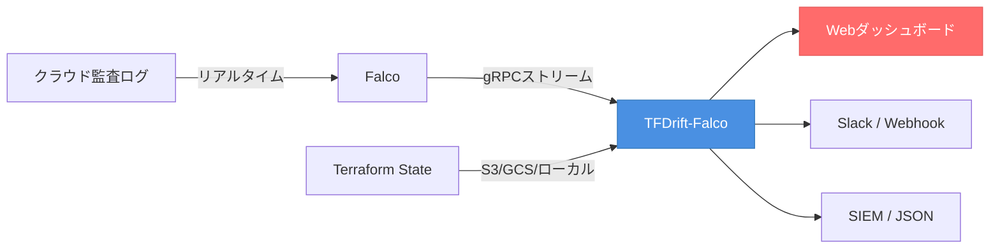

<p align="center">
  <h1 align="center">TFDrift-Falco</h1>
  <p align="center">
    <strong>ドリフトはリスクではない。ランタイムがリスクにする。</strong>
  </p>
  <p align="center">
    FalcoランタイムセキュリティによるリアルタイムTerraformドリフト検知。<br/>
    手動のクラウド変更を数時間ではなく数秒で検知 — 完全なユーザー帰属付き。
  </p>
  <p align="center">
    <a href="https://github.com/higakikeita/tfdrift-falco/actions/workflows/ci.yml"></a>
    <a href="https://codecov.io/gh/higakikeita/tfdrift-falco"></a>
    <a href="https://goreportcard.com/report/github.com/higakikeita/tfdrift-falco"></a>
    <a href="https://opensource.org/licenses/MIT"></a>
  </p>
</p>

[English](README.md) | **[日本語]** | [ドキュメント](https://higakikeita.github.io/tfdrift-falco/)

---

<!-- TODO: 実際のデモGIFに差し替え
<p align="center">
  
</p>
-->

## 課題

誰かがAWSコンソールでセキュリティグループを変更する。Terraformはそれを知らない。次の `terraform plan` は6時間後。その間に影響範囲は拡大している。

**従来のドリフト検知ツールはポーリング型。** スケジュールで `terraform plan` を実行する — 早くて15分、遅ければ数時間。そのギャップにインシデントが起こる。

## 解決策

TFDrift-Falcoは**イベント駆動型**。Falcoのリアルタイムクラウド監査イベントストリーム（CloudTrail、GCP Audit Logs）をフックし、Terraformステートと照合する — **数時間ではなく数秒で。**

```
コンソール/CLI変更 → CloudTrail → Falco → TFDrift-Falco → アラート + ダッシュボード
                                                  ↑
                                          Terraform State
```

*何が*ドリフトしたかだけでなく、*誰が*、*いつ*、*なぜ重要か*がわかる。

---

## 60秒で試す

```bash
git clone https://github.com/higakikeita/tfdrift-falco.git
cd tfdrift-falco
make demo
```

クラウド認証情報なしで、フルスタックをローカルで起動。ダッシュボード、API、アラートをすぐに体験できます。

> **本番環境は？** `./quick-start.sh` で対話的にAWS/GCP環境を設定できます。

---

## 何が手に入るか

| | 機能 | なぜ重要か |
|---|------|-----------|
| ⚡ | **リアルタイム検知** | Falco gRPCによるイベント駆動 — ポーリングなし、cronなし、サブ秒レイテンシ |
| 👤 | **ユーザー帰属** | すべてのドリフトイベントにIAMアイデンティティ、IP、セッションコンテキスト付き |
| 🌍 | **マルチクラウド** | AWS（500+CloudTrailイベント、40+サービス）+ GCP（170+イベント、27+サービス） |
| 📊 | **Webダッシュボード** | SSEリアルタイム更新、トポロジグラフ、ダーク/ライトテーマ対応のReact UI |
| 🔒 | **エンタープライズ認証** | JWT + APIキー（SHA-256ハッシュ）、クライアント別レート制限 |
| 🔌 | **API-first** | OpenAPI 3.0、37エンドポイント、`/api/docs`にSwagger UI |
| 📣 | **柔軟なアラート** | Slack、Discord、Teams、PagerDuty、Webhook、SIEM（NDJSON） |
| 🚀 | **本番対応** | Helmチャート、Docker Compose、Prometheusメトリクス、運用ランブック |

---

## 仕組み


```mermaid
graph LR
    A[クラウド監査ログ] -->|リアルタイム| B[Falco]
    B -->|gRPCストリーム| C[TFDrift-Falco]
    D[Terraform State] -->|S3/GCS/ローカル| C
    C --> E[Webダッシュボード]
    C --> F[Slack / Webhook]
    C --> G[SIEM / JSON]

    style C fill:#4A90E2,color:#fff,stroke:#357ABD
    style E fill:#FF6B6B,color:#fff,stroke:#E55A5A
```

| コンポーネント | 役割 |
|---------------|------|
| **Falco Subscriber** | Falco gRPCに接続、クラウド監査イベントをリアルタイム受信 |
| **State Loader** | ローカル、S3、GCSバックエンドからTerraformステートを同期 |
| **Drift Engine** | ランタイム変更をIaC定義と比較 |
| **Context Enricher** | ユーザーアイデンティティ、リソースタグ、CloudTrailコンテキストを付加 |
| **API Server** | REST API + SSEブロードキャスター（Webダッシュボード向け） |
| **Notifier** | Slack、Discord、Webhook、SIEMへアラートをルーティング |

> **詳細:** [Why Falco?](docs/why-falco.md) — 設計図と目撃者の話。

---

## クラウドカバレッジ

<details>
<summary><strong>AWS</strong> — 40+サービス、500+CloudTrailイベント</summary>

EC2、VPC、IAM、S3、RDS、EKS、ECS、Lambda、DynamoDB、CloudWatch、API Gateway、KMS、WAF、Route53、CloudFront、SNS、SQS、ECR など。

全リスト: [AWSリソースカバレッジ](docs/AWS_RESOURCE_COVERAGE_ANALYSIS.md)
</details>

<details>
<summary><strong>GCP</strong> — 27+サービス、170+ Audit Logイベント</summary>

Compute Engine、Cloud Storage、Cloud SQL、GKE、Cloud Run、IAM、VPC、BigQuery、Pub/Sub、KMS、Secret Manager、Cloud Functions など。

全リスト: [GCPセットアップガイド](docs/gcp-setup.md)
</details>

<details>
<summary><strong>Azure</strong> — 開発中</summary>

Azureサポートは現在開発中です。進捗は[Architectureドキュメント](docs/architecture.md)で追跡できます。
</details>

---

## クイックリファレンス

### よく使うコマンド

```bash
make start       # 全サービス起動
make stop        # 全サービス停止
make demo        # サンプルデータでデモ起動
make logs        # ログ表示
make status      # コンテナ状態確認
```

### APIエンドポイント

```bash
# ドリフトイベント
curl http://localhost:8080/api/v1/events

# リアルタイムストリーム（SSE）
curl http://localhost:8080/api/v1/stream

# ダッシュボード統計
curl http://localhost:8080/api/v1/stats

# ヘルスチェック
curl http://localhost:8080/health
```

### デプロイ方法

```bash
# Docker Compose（推奨）
docker compose up -d

# Kubernetes / Helm
helm install tfdrift ./charts/tfdrift-falco

# スタンドアロンDocker
docker run -d ghcr.io/higakikeita/tfdrift-falco:latest
```

---

## ドキュメント

| | ドキュメント | |
|---|------------|---|
| 🚀 | [Getting Started](docs/GETTING_STARTED.md) | ステップバイステップセットアップ |
| ☁️ | [AWSセットアップ](docs/falco-setup.md) | CloudTrail + Falco設定 |
| ☁️ | [GCPセットアップ](docs/gcp-setup.md) | Audit Log + Falco設定 |
| 📡 | [APIリファレンス](docs/api/README.md) | REST, SSE, WebSocket |
| 🏗️ | [アーキテクチャ](docs/architecture.md) | システム設計 |
| 📦 | [デプロイ](docs/deployment.md) | Docker, K8s, 本番環境 |
| 🔧 | [ベストプラクティス](docs/best-practices.md) | 本番運用ガイド |
| 📊 | [Grafanaダッシュボード](dashboards/grafana/GETTING_STARTED.md) | モニタリング |
| 📝 | [CHANGELOG](CHANGELOG.md) | バージョン履歴 |

ドキュメントサイト: **[higakikeita.github.io/tfdrift-falco](https://higakikeita.github.io/tfdrift-falco/)**

---

## コントリビューション

コントリビューション歓迎！ガイドラインは [CONTRIBUTING.md](CONTRIBUTING.md) を参照してください。

```bash
git clone https://github.com/higakikeita/tfdrift-falco.git
cd tfdrift-falco
make init    # 開発環境セットアップ
make check   # fmt + lint + test 実行
```

---

## なぜ TFDrift-Falco なのか？

多くのドリフト検知ツールは**リアクティブ**— スケジュールでスキャンし、*既に*ドリフトしたものを報告する。TFDrift-Falcoは**プロアクティブ** — 変更が*起きた瞬間*にキャッチし、誰がやったかを教える。

これが重要な理由:

- **MTTR短縮** — 数時間ではなく数秒でアラート。ドリフトが連鎖する前に修正。
- **説明責任** — IAMユーザー、IP、セッションコンテキストによる完全な監査証跡。
- **ブラインドスポットゼロ** — `terraform plan` がチェックするものだけでなく、すべてのCloudTrail/Audit Logイベント。
- **ランタイムコンテキスト** — 純粋なIaCツールでは得られないセキュリティコンテキストをFalcoが提供。

---

<p align="center">
  <strong>役に立ったら ⭐ をお願いします</strong><br/>
  他の人がこのプロジェクトを見つけやすくなります。
</p>

<p align="center">
  <a href="https://github.com/higakikeita/tfdrift-falco">
    
  </a>
</p>

---

## ライセンス

MIT License — 詳細は [LICENSE](LICENSE) を参照。

**作者:** [Keita Higaki](https://github.com/higakikeita) · [X: @keitah0322](https://x.com/keitah0322)
