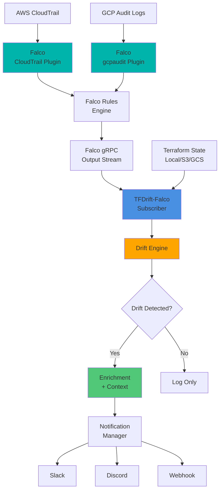

# 🛰️ TFDrift-Falco

**Real-time Terraform Drift Detection powered by Falco**

[](https://github.com/higakikeita/tfdrift-falco/releases)
[](https://opensource.org/licenses/MIT)
[](https://golang.org/)
[](https://falco.org/)
[](https://ghcr.io/higakikeita/tfdrift-falco)
[](https://github.com/higakikeita/tfdrift-falco/pkgs/container/tfdrift-falco)
[](https://github.com/higakikeita/tfdrift-falco/actions/workflows/test.yml)
[](https://github.com/higakikeita/tfdrift-falco/actions/workflows/lint.yml)
[](https://github.com/higakikeita/tfdrift-falco/actions/workflows/security.yml)
[](https://github.com/higakikeita/tfdrift-falco/actions/workflows/publish-ghcr.yml)
[](https://github.com/higakikeita/tfdrift-falco)
[](https://codecov.io/gh/higakikeita/tfdrift-falco)
[](https://goreportcard.com/report/github.com/higakikeita/tfdrift-falco)

> 🎉 **v0.5.0+ Released!** (2026-01-10) - **Massive UI Improvements**!
> - **Storybook-Driven Development** - 30x faster feedback loop (2 min → 4 sec)
> - **28 AWS Official Icons** integrated from aws-icons package
> - **Enhanced VPC/Subnet Hierarchy** - Dramatically improved visibility
> - **Drift Detection Dashboard** - Complete implementation with mock data
> - **Draggable Display Options** - Filters, layout switcher, legend
> - [📊 Details](STATUS_REPORT_2026-01-10.md) | [📘 Storybook](http://localhost:6006/) | [🗺️ Roadmap](PROJECT_ROADMAP.md)
>
> 🌐 **v0.5.0** (2025-12-17) - **Multi-Cloud Support (GCP)**!
> - GCP Audit Logs integration with 100+ event mappings across 12+ services
> - GCS backend support for Terraform state
> - [See Release Notes](https://github.com/higakikeita/tfdrift-falco/releases/tag/v0.5.0) | [📝 CHANGELOG](CHANGELOG.md#050---2025-12-17)
>
> 🎯 **v0.4.1** - **Webhook Integration**!
> - Send drift events to Slack, Teams, PagerDuty, or any custom API
> - Automatic retries, timeout handling

**[English]** | [日本語 (Japanese)](README.ja.md)

---

## 🚀 Quick Start (3 Commands!)

### Fastest Setup (5 minutes)

```bash
# 1. Clone the repository
git clone https://github.com/higakikeita/tfdrift-falco.git && cd tfdrift-falco

# 2. Run setup script (interactive configuration)
./quick-start.sh

# 3. Launch!
docker compose up -d
```

**That's it!** 🎉

The script automatically:
- ✅ Checks Docker / Docker Compose
- ✅ Verifies AWS credentials
- ✅ Generates Falco + TFDrift-Falco configuration files
- ✅ Interactive setup (AWS Region, Terraform State Backend, Slack Webhook)

### View Logs

```bash
# Display drift detection logs
docker compose logs -f tfdrift

# Or use make command
make logs
```

### Common Commands

```bash
make start      # Start services
make stop       # Stop services
make restart    # Restart services
make status     # Check status
make logs       # View logs
```

### Detailed Setup Guide

For step-by-step instructions, see the [Getting Started Guide](docs/GETTING_STARTED.md).

---

## ⚙️ Configuration

TFDrift-Falco requires you to configure your AWS account and Terraform state location.

### Step 1: Create Your Configuration File

```bash
# Copy the example configuration
cp config.yaml.example config.yaml
```

### Step 2: Replace Placeholders

Edit `config.yaml` and replace **`YOUR-AWS-ACCOUNT-ID`** with your actual AWS account ID:

```yaml
providers:
  aws:
    enabled: true
    regions:
      - us-east-1

    cloudtrail:
      # Replace with your actual AWS Account ID
      s3_bucket: "tfdrift-cloudtrail-YOUR-AWS-ACCOUNT-ID-us-east-1"

    state:
      backend: "s3"
      # Replace with your actual AWS Account ID
      s3_bucket: "tfdrift-terraform-state-YOUR-AWS-ACCOUNT-ID"
      s3_key: "production-test/terraform.tfstate"
      s3_region: "us-east-1"
```

### Step 3: Get Your AWS Account ID

If you don't know your AWS Account ID:

```bash
# Method 1: Using AWS CLI
aws sts get-caller-identity --query Account --output text

# Method 2: Check AWS Console
# AWS Console → Top Right → Account ID
```

### Step 4: Configure AWS Credentials

Ensure your AWS credentials are configured:

```bash
# Option 1: AWS CLI configuration
aws configure

# Option 2: Environment variables
export AWS_ACCESS_KEY_ID="your-access-key"
export AWS_SECRET_ACCESS_KEY="your-secret-key"
export AWS_REGION="us-east-1"

# Option 3: IAM Role (recommended for EC2/ECS)
# Attach an IAM role with appropriate permissions
```

### Step 5: Verify Configuration

```bash
# Test AWS authentication
aws sts get-caller-identity

# Start TFDrift-Falco
docker compose up -d
```

**Important Notes:**
- ⚠️ **Never commit `config.yaml` to version control** - it's already in `.gitignore`
- ✅ Use `config.yaml.example` as a template
- 🔒 Use IAM users (not root account) for better security
- 📝 For GCP configuration, see [GCP Setup Guide](docs/gcp-setup.md)

---

## 🏭 Production Deployment

TFDrift-Falco provides production-ready **REST API + WebSocket + SSE + React UI**!

### 🚀 API Server Mode

```bash
# Launch in API server mode
docker-compose up -d

# Access:
# Frontend UI: http://localhost:3000
# Backend API: http://localhost:8080/api/v1
# WebSocket: ws://localhost:8080/ws
# SSE Stream: http://localhost:8080/api/v1/stream
```

### 📡 REST API Endpoints

- `GET /api/v1/graph` - Causal graph (Cytoscape format)
- `GET /api/v1/drifts` - Drift alerts list (with filtering)
- `GET /api/v1/events` - Falco events list
- `GET /api/v1/state` - Terraform state overview
- `GET /api/v1/stats` - Statistics
- `GET /health` - Health check

**Details:** [API Documentation](docs/API.md)

### 🌐 React Web UI


#### Three View Modes

1. **📊 Graph View** - Causal relationship visualization
   - React Flow with official AWS/Kubernetes icons
   - Interactive node operations
   - Hierarchical, Dagre, Force-directed, Circular layouts

2. **📋 Table View** - Drift event history
   - 100+ events list display
   - Filtering (severity, provider, search)
   - Sort functions (latest, severity order)
   - Detail panel (before/after values, user info, CloudTrail)

3. **⚡ Split View** - Graph + Table simultaneous display (Recommended)
   - Left: Causal relationship graph
   - Right: Drift history table + detail panel

**Key Features:**
- 🎯 **Official Icons** - AWS React Icons + Kubernetes official SVG
- 📊 **Real-time Filtering** - Severity, provider, resource type
- ⚡ **WebSocket/SSE Ready** - Real-time notifications (prepared)
- 🔍 **Large-scale Graph Support** - 1000+ nodes (LOD, Clustering ready)
- 📱 **Responsive Design** - Tailwind CSS

#### Development Environment

```bash
cd ui
npm install
npm run dev
# Access at http://localhost:5173/
```

### 🐳 Docker Compose (Recommended)

```yaml
services:
  backend:
    image: tfdrift-falco:latest
    ports:
      - "8080:8080"  # API server
      - "9090:9090"  # Prometheus metrics
    command: ["--server", "--api-port", "8080"]

  frontend:
    image: tfdrift-frontend:latest
    ports:
      - "3000:8080"  # Web UI
    environment:
      - VITE_API_BASE_URL=http://backend:8080/api/v1
```

### ☸️ Kubernetes Deployment

```bash
# Helm chart (coming soon)
helm install tfdrift ./charts/tfdrift-falco

# Or kubectl
kubectl apply -f k8s/
```

### 📦 CI/CD

GitHub Actions workflows included:
- ✅ Backend tests (Go)
- ✅ Frontend tests (React)
- ✅ Docker multi-platform builds (amd64, arm64)
- ✅ Security scanning (Trivy + Gosec)
- ✅ Codecov integration

**Details:** [Deployment Guide](docs/deployment.md)

---

## 🔌 Output Modes (NEW in v0.4.0)

TFDrift-Falco now outputs **structured events** for easy integration with SIEM, SOAR, and monitoring systems.

### JSON Output (NDJSON)

```bash
# Machine-readable JSON events only
tfdrift --auto --output json

# Output (newline-delimited JSON):
{"event_type":"terraform_drift_detected","provider":"aws","resource_type":"aws_security_group","resource_id":"sg-12345",...}
{"event_type":"terraform_drift_detected","provider":"aws","resource_type":"aws_instance","resource_id":"i-67890",...}
```

**Perfect for:**
- `jq` - `tfdrift --auto --output json | jq '.resource_type'`
- Fluent Bit / Fluentd
- Vector
- Datadog Agent
- Sysdig Agent
- SIEM platforms

### Both Human + JSON

```bash
# Both human-readable and JSON (for debugging)
tfdrift --auto --output both
```

Outputs to:
- **stderr**: Human-readable logs
- **stdout**: JSON events (NDJSON)

### Event Schema

```json
{
  "event_type": "terraform_drift_detected",
  "provider": "aws",
  "account_id": "123456789012",
  "resource_type": "aws_security_group",
  "resource_id": "sg-12345",
  "change_type": "modified",
  "detected_at": "2025-01-10T12:34:56Z",
  "source": "tfdrift-falco",
  "severity": "critical",
  "region": "us-west-2",
  "user": "admin@example.com",
  "cloudtrail_event": "AuthorizeSecurityGroupIngress",
  "version": "1.0.0"
}
```

---

## 🔗 Webhook Integration (NEW in v0.4.1)

Send drift events to **any webhook endpoint** - Slack, Teams, PagerDuty, or custom APIs.

### Quick Examples

#### Slack Integration
```yaml
# config.yaml
output:
  webhook:
    url: "https://hooks.slack.com/services/YOUR/WEBHOOK/URL"
    method: POST
```

Drift events appear as formatted Slack messages with:
- Color-coded by severity (🚨 Critical = Red, ⚠️  High = Orange)
- Resource details
- User and region information
- CloudTrail event correlation

#### Microsoft Teams
```yaml
output:
  webhook:
    url: "https://outlook.office.com/webhook/YOUR/WEBHOOK/URL"
    method: POST
```

#### Custom API with Auth
```yaml
output:
  webhook:
    url: "https://your-api.com/drift-events"
    method: POST
    headers:
      Authorization: "Bearer YOUR_TOKEN"
      X-Custom-Header: "custom-value"
    timeout: 30s
    max_retries: 5
    retry_delay: 2s
```

### Features

✅ **Automatic Retries** - Exponential backoff (1s → 2s → 4s → 8s...)
✅ **Timeout Handling** - Configurable timeouts (default: 10s)
✅ **Custom Headers** - Add auth tokens, custom headers
✅ **Multiple Methods** - POST, PUT, PATCH
✅ **Format Helpers** - Built-in Slack & Teams formatters

### Webhook Payload

Raw JSON payload sent to your endpoint:
```json
{
  "event_type": "terraform_drift_detected",
  "provider": "aws",
  "resource_type": "aws_security_group",
  "resource_id": "sg-12345",
  "change_type": "modified",
  "severity": "critical",
  ...
}
```

---

**Requirements:**
- Terraform initialized directory (`.terraform/` exists)
- Falco running with CloudTrail plugin (AWS) or gcpaudit plugin (GCP)
- AWS credentials configured (for AWS) or GCP credentials configured (for GCP)

---

## 🧩 Overview

**TFDrift-Falco** detects manual (non-IaC) changes in your cloud environment in **real-time** by combining:

- **Falco** runtime security monitoring with CloudTrail plugin (AWS) or gcpaudit plugin (GCP)
- **Falco gRPC API** for real-time event streaming
- **Terraform State** comparison

Unlike traditional drift detection tools (like `driftctl` or `tfsec`) that perform periodic static scans, TFDrift-Falco provides **continuous, event-driven drift detection** powered by Falco's cloud audit log plugins.

### 🚨 Example Use Case

```
Someone disables termination protection on an EC2 instance via AWS Console
    ↓
CloudTrail event captured by Falco CloudTrail plugin
    ↓
Falco rule triggers and sends event via gRPC
    ↓
TFDrift-Falco receives event and compares with Terraform state
    ↓
Instant Slack alert with user identity and change details
```

---

## 📖 Why Falco? - A Story

**The Perfect Blueprint and The Witness**

Imagine a city with a brilliant architect who meticulously documents everything in a **blueprint** (Terraform). Every building, every road, every gate—perfectly mapped out. The blueprint represents the "ideal city."

But one night, someone secretly replaces a gate. By morning, a lock has been added. Yet the blueprint... shows no changes.

The architect walks through the city the next day, comparing reality to the blueprint. Finally, they notice: *"...ah, it's different."*

But it's too late. They can see:
- ✅ **What** changed
- ❌ **Who** did it
- ❌ **When** it happened
- ❌ **Why** it was done

**The blueprint only speaks of results, not actions.**

---

### Enter Falco: The Witness

So the city hires **Falco**—not an architect, not a designer, but a **witness**. Falco's job is singular and essential:

> **To observe the exact moment someone takes action.**

Falco doesn't build. Falco doesn't draw maps. Falco watches:
- **Who** touched the gate
- **When** they did it
- **Which** gate it was
- **What** their intent was

Not after the change—**during the moment of change**.

One midnight, Falco observes an unfamiliar person approaching the gate from an unusual path, reaching for the lock. At that instant, Falco alerts:

> *"Now. This is not the city we know."*

---

### The Meeting of Blueprint and Witness

The architect listens to Falco's report:
- *"Who touched it?"*
- *"When?"*
- *"Which gate?"*

The architect opens the blueprint and realizes:

> **"That change... doesn't exist in my blueprint."**

In that moment, they both understand:

**The Blueprint (Terraform)**
→ Knows *what should exist*

**The Witness (Falco)**
→ Knows *what actually happened*

Neither alone can protect the city.

---

### Why Falco?

What makes Falco special is that it speaks of **actions, not just results**:

- Not states, but **behaviors**
- Not diffs, but **intentions**
- Not resources, but **people**

That's why Falco can answer:

> *"Not just 'what happened in this city,' but 'why it happened.'"*

---

### The Modern City (Cloud)

Today's cities aren't built by humans alone:
- Bots
- CI/CD pipelines
- Automation
- AI agents

Changes happen in an instant.

That's why we need more than post-mortem audits.
We need **someone who was there when it happened**.

---

**In one sentence:**

> Terraform tells us **what should exist**.
> Falco tells us **what actually happened**.

That's why placing Falco between your infrastructure means:

**Adding a "witness" to your cloud.**

---

## 🎯 Key Features

- ⚡ **Real-time Detection** - Subscribes to Falco gRPC outputs for instant event processing
- 🦅 **Falco-Powered** - Uses Falco's CloudTrail plugin (AWS) and gcpaudit plugin (GCP) for event monitoring
- 🧩 **Terraform State Comparison** - Detect deviations from IaC definitions
- 🔒 **Security Context** - Correlate user identity (IAM user, API key, service account)
- 🔔 **Multiple Notification Channels** - Slack, Discord, Falco output, Webhook
- 🌐 **Multi-Cloud Support** - AWS (411 events, 23 services), GCP (100+ events, 12+ services), Azure (planned)
- 🎨 **Extensible Rules** - Define custom Falco rules in YAML
- 🐳 **Container-Ready** - Run as a sidecar or standalone container
- 📊 **Production-Ready** - Comprehensive load testing and monitoring framework

## 📋 Supported AWS Services

TFDrift-Falco v0.5.0 monitors **411 CloudTrail events** across 23 AWS services:

| Service | Events | Coverage | Priority |
|---------|--------|----------|----------|
| **CloudWatch** 📊 | 66 | Alarms, Dashboards, Metrics, Log Groups, Composite Alarms, Metric Streams, Insights | High |
| **VPC/Networking** 🔒 | 40 | Security Groups, VPC, Subnets, Route Tables, Gateways, ACLs, Endpoints, Peering, Transit Gateway, Flow Logs, Network Firewall | Critical |
| **RDS** 🗃️ | 37 | Instances, Clusters, Snapshots, Parameter Groups, Subnet Groups, Option Groups, Replicas | High |
| **API Gateway** 🌐 | 32 | REST APIs, Resources, Methods, Deployments, Stages, Models, Authorizers | High |
| **IAM** ✅ | 25 | Roles, Users, Groups, Policies, Access Keys, Instance Profiles, Tags | Critical |
| **ELB/ALB** ⚖️ | 22 | Load Balancers, Target Groups, Listeners, Rules, SSL Certificates | High |
| **S3** 🪣 | 21 | Buckets, Policies, Encryption, Versioning, Lifecycle, Replication, CORS, Website, Logging | High |
| **EC2** 💻 | 17 | Instances, AMIs, EBS Volumes, Snapshots, Network Interfaces | High |
| **ElastiCache** 🗄️ | 16 | Cache Clusters, Replication Groups, Parameter Groups, User Groups | High |
| **SageMaker** 🤖 | 16 | Endpoints, Training Jobs, Model Packages, Notebook Instances | High |
| **DynamoDB** 📊 | 14 | Tables, PITR, Backups, Global Tables, Streams, Monitoring | High |
| **Lambda** ⚡ | 13 | Functions, Event Sources, Permissions, Concurrency, Aliases, Versions | High |
| **Kinesis** 🌊 | 13 | Streams, Consumers, Firehose, Analytics Applications | Medium |
| **EKS** ☸️ | 12 | Clusters, Node Groups, Addons, Fargate Profiles | High |
| **Auto Scaling** 📈 | 10 | ASGs, Launch Configurations, Policies, Scheduled Actions | Medium |
| **CloudFormation** 📚 | 10 | Stacks, Stack Sets, Change Sets | High |
| **KMS** 🔐 | 10 | Keys, Aliases, Rotation, Deletion, Key Policies | Critical |
| **ECS** 🐳 | 8 | Services, Task Definitions, Clusters, Capacity Providers | High |
| **WAF/WAFv2** 🛡️ | 8 | Web ACLs, Rule Groups, IP Sets, Regex Pattern Sets | High |
| **AWS Backup** 💾 | 7 | Backup Plans, Backup Vaults, Recovery Points, Backup Jobs | Medium |
| **Step Functions** 🔄 | 5 | State Machines, Executions, Tags | Medium |
| **AWS Glue** 🔗 | 5 | Databases, Tables, Jobs, Crawlers | Medium |
| **EventBridge** 📡 | 4 | Rules, Targets, Event Buses | Medium |
| **ECR** 📦 | 1 | Repository Policies | Medium |

**Total**: 411 events across 23 services | See [AWS Resource Coverage Analysis](./docs/AWS_RESOURCE_COVERAGE_ANALYSIS.md) for details

## 📋 Supported GCP Services

TFDrift-Falco v0.5.0 monitors **100+ GCP Audit Log events** across 12+ services:

| Service | Events | Coverage | Priority |
|---------|--------|----------|----------|
| **Compute Engine** 💻 | 30+ | Instances, Disks, Machine Types, Metadata, Networks, Firewalls | Critical |
| **Cloud Storage** 🗄️ | 15+ | Buckets, Objects, IAM Bindings, ACLs, Lifecycle | High |
| **Cloud SQL** 🗃️ | 10+ | Instances, Databases, Users, Backups | High |
| **GKE** ☸️ | 10+ | Clusters, Node Pools, Workloads | High |
| **Cloud Run** 🏃 | 8+ | Services, Revisions, IAM Policies | High |
| **IAM** ✅ | 8+ | Service Accounts, Roles, Bindings, Keys | Critical |
| **VPC/Networking** 🔒 | 10+ | Firewalls, Routes, Subnets, Peering | Critical |
| **Cloud Functions** ⚡ | 5+ | Functions, Triggers, IAM Policies | Medium |
| **BigQuery** 📊 | 5+ | Datasets, Tables, IAM Policies | Medium |
| **Pub/Sub** 📨 | 5+ | Topics, Subscriptions, IAM Policies | Medium |
| **KMS** 🔐 | 5+ | Keys, KeyRings, IAM Policies | Critical |
| **Secret Manager** 🔒 | 3+ | Secrets, Versions, IAM Policies | High |

**Total**: 100+ events across 12+ services | See [GCP Setup Guide](./docs/gcp-setup.md) for configuration details

### 🗺️ AWS Service Coverage Roadmap

We're expanding AWS service coverage in a phased approach. See the **[AWS Coverage Roadmap](./docs/AWS_COVERAGE_ROADMAP.md)** for the complete plan.

**Upcoming in v0.3.0 (Q1 2025):**
- **ECS** (Elastic Container Service) - 15 events
- **EKS** (Elastic Kubernetes Service) - 12 events
- **Lambda Enhanced** - +10 events (total 14)
- **EC2 Enhanced** - +15 events (total 18)
- **ElastiCache** - 12 events
- **Auto Scaling** - 10 events

**Target: +82 events** (198 total by v0.3.0)

**Want to see a service added?** Submit a [Service Request](https://github.com/higakikeita/tfdrift-falco/issues/new?template=service-request.yml) or check the [full roadmap](./docs/AWS_COVERAGE_ROADMAP.md) for upcoming releases.

## 🏗️ Architecture



### Components

| Component | Description |
|-----------|-------------|
| **Falco Subscriber** | Connects to Falco gRPC API and subscribes to CloudTrail events |
| **Terraform State Loader** | Periodically syncs Terraform state (local/remote) |
| **Drift Engine** | Compares IaC definitions with runtime changes |
| **Context Enricher** | Adds user identity, resource tags, change history |
| **Notifier** | Sends alerts to configured channels |

## 📊 Code Quality & Testing

TFDrift-Falco maintains high code quality standards with comprehensive testing and continuous integration:

### Test Coverage: 80%+ 🎯

- **Unit Tests**: All core packages (detector, falco, diff, config)
- **Integration Tests**: End-to-end drift detection workflows
- **Table-Driven Tests**: Efficient coverage of edge cases
- **CI/CD**: Automated testing on every PR with coverage threshold enforcement (78%)

### Code Quality Tools

- ✅ **golangci-lint**: Static analysis with 15+ linters enabled
- ✅ **Snyk**: Dependency vulnerability scanning (weekly)
- ✅ **GoSec**: Security-focused static analysis
- ✅ **Nancy**: Go dependency checker
- ✅ **go vet**: Official Go static analyzer
- ✅ **staticcheck**: Advanced Go linter

### Architecture Quality

- 📁 **Single Responsibility Principle**: Modular design with focused files (<200 lines)
- 🧩 **Dependency Injection**: Testable components with mock support
- 🔄 **Clean Refactoring**: Major refactoring completed (1,410 lines → 17 modular files)
- 📝 **Comprehensive Documentation**: Inline comments and package docs

### Recent Achievements

- Improved test coverage from 36.9% to 80.0% ✅
- Refactored 3 major files (513, 426, 473 lines) into focused modules ✅
- Eliminated all 500+ line files (excluding tests) ✅
- Resolved all critical golangci-lint warnings ✅

Read more: [Test Coverage 80% Achievement Article](./docs/test-coverage-80-achievement.md)

## 🐳 Quick Start with Docker (Easiest)

**Get started in 30 seconds with the official Docker image:**

```bash
# Pull and run the official image
docker run -d \
  --name tfdrift-falco \
  -e TF_STATE_BACKEND=s3 \
  -e TF_STATE_S3_BUCKET=my-terraform-state \
  -e TF_STATE_S3_KEY=prod/terraform.tfstate \
  -e AWS_REGION=us-east-1 \
  -v ~/.aws:/root/.aws:ro \
  ghcr.io/higakikeita/tfdrift-falco:latest
```

**View logs:**
```bash
docker logs -f tfdrift-falco
```

**Available on GitHub Container Registry:**
- 🚀 `ghcr.io/higakikeita/tfdrift-falco:latest` - Latest stable
- 📌 `ghcr.io/higakikeita/tfdrift-falco:v0.2.0-beta` - Specific version
- 🔖 See all tags: https://github.com/higakikeita/tfdrift-falco/pkgs/container/tfdrift-falco

---

## 🚀 Full Installation Guide

### Prerequisites

- Go 1.21 or later (for building from source)
- **Falco 0.35+** with CloudTrail plugin (AWS) or gcpaudit plugin (GCP) - [AWS Setup](docs/falco-setup.md) | [GCP Setup](docs/gcp-setup.md)
- Terraform 1.0+
- AWS CLI configured (for AWS support) or gcloud CLI configured (for GCP support)
- **Docker** (recommended for easiest setup)

> **Important**: TFDrift-Falco requires a running Falco instance with gRPC enabled and the appropriate cloud plugin configured:
> - AWS: CloudTrail plugin - [Setup Guide](docs/falco-setup.md)
> - GCP: gcpaudit plugin - [Setup Guide](docs/gcp-setup.md)

### Installation

#### Option 1: Binary Release

```bash
# Download latest release
curl -LO https://github.com/keitahigaki/tfdrift-falco/releases/latest/download/tfdrift-linux-amd64
chmod +x tfdrift-linux-amd64
sudo mv tfdrift-linux-amd64 /usr/local/bin/tfdrift
```

#### Option 2: Build from Source

```bash
git clone https://github.com/keitahigaki/tfdrift-falco.git
cd tfdrift-falco
go build -o tfdrift ./cmd/tfdrift
```

#### Option 3: Docker (Recommended ⭐)

**Official image available on GitHub Container Registry (GHCR)**

```bash
# Pull the latest official image
docker pull ghcr.io/higakikeita/tfdrift-falco:latest

# Or use a specific version
docker pull ghcr.io/higakikeita/tfdrift-falco:v0.2.0-beta

# Run with Docker
docker run -d \
  --name tfdrift-falco \
  -v $(pwd)/config.yaml:/config/config.yaml:ro \
  -v ~/.aws:/root/.aws:ro \
  ghcr.io/higakikeita/tfdrift-falco:latest \
  --config /config/config.yaml
```

**Quick start with environment variables:**

```bash
docker run -d \
  --name tfdrift-falco \
  -e TF_STATE_BACKEND=s3 \
  -e TF_STATE_S3_BUCKET=my-terraform-state \
  -e TF_STATE_S3_KEY=prod/terraform.tfstate \
  -e AWS_REGION=us-east-1 \
  -e FALCO_HOSTNAME=localhost \
  -e FALCO_PORT=5060 \
  -v ~/.aws:/root/.aws:ro \
  ghcr.io/higakikeita/tfdrift-falco:latest
```

**Build from source (for development):**

```bash
# Build image locally
make docker-build

# Run locally built image
docker run -d \
  --name tfdrift-falco \
  -v $(pwd)/config.yaml:/config/config.yaml:ro \
  -v ~/.aws:/root/.aws:ro \
  tfdrift-falco:latest \
  --config /config/config.yaml
```

#### Option 4: Docker Compose (Recommended)

The easiest way to run TFDrift-Falco with all dependencies:

```bash
# Start the full stack (Falco + TFDrift)
make docker-compose-up

# View logs
make docker-compose-logs

# Stop services
make docker-compose-down
```

See [Deployment Guide](docs/deployment.md) for detailed Docker and Kubernetes deployment instructions.

### Configuration

Create `config.yaml`:

```yaml
# Cloud Provider Configuration
providers:
  aws:
    enabled: true
    regions:
      - us-east-1
      - us-west-2
    state:
      backend: "s3"  # local, s3, gcs
      s3_bucket: "my-terraform-state"
      s3_key: "prod/terraform.tfstate"

  gcp:
    enabled: true
    projects:
      - my-project-123
      - my-project-456
    state:
      backend: "gcs"  # local, s3, gcs
      gcs_bucket: "my-terraform-state"
      gcs_prefix: "prod"

# Falco Integration (Required)
falco:
  enabled: true
  hostname: "localhost"  # Falco gRPC server hostname
  port: 5060              # Falco gRPC server port
  cert_file: ""           # Optional: client certificate for mTLS
  key_file: ""            # Optional: client key for mTLS
  ca_root_file: ""        # Optional: CA root certificate

# Drift Detection Rules
drift_rules:
  - name: "EC2 Instance Modification"
    resource_types:
      - "aws_instance"
    watched_attributes:
      - "disable_api_termination"
      - "instance_type"
      - "security_groups"
    severity: "high"

  - name: "IAM Policy Change"
    resource_types:
      - "aws_iam_policy"
      - "aws_iam_role"
    watched_attributes:
      - "policy"
      - "assume_role_policy"
    severity: "critical"

  - name: "GCP Compute Instance Modification"
    resource_types:
      - "google_compute_instance"
    watched_attributes:
      - "metadata"
      - "labels"
      - "deletion_protection"
    severity: "high"

  - name: "GCP Firewall Rule Change"
    resource_types:
      - "google_compute_firewall"
    watched_attributes:
      - "allowed"
      - "denied"
      - "source_ranges"
    severity: "critical"

# Notification Channels
notifications:
  slack:
    enabled: true
    webhook_url: "https://hooks.slack.com/services/YOUR/WEBHOOK/URL"
    channel: "#security-alerts"

  discord:
    enabled: false
    webhook_url: "https://discord.com/api/webhooks/..."

  falco_output:
    enabled: true
    priority: "warning"

  webhook:
    enabled: false
    url: "https://your-siem.example.com/webhook"
    headers:
      Authorization: "Bearer YOUR_TOKEN"

# Logging
logging:
  level: "info"  # debug, info, warning, error
  format: "json"  # json, text
```

### Running

```bash
# Run with config file
tfdrift --config config.yaml

# Run with environment variables
export TFDRIFT_AWS_REGIONS="us-east-1,us-west-2"
export TFDRIFT_SLACK_WEBHOOK="https://hooks.slack.com/..."
tfdrift

# Run in daemon mode
tfdrift --config config.yaml --daemon

# Dry-run mode (no notifications)
tfdrift --config config.yaml --dry-run
```

## 📊 Example Output

### Console Output

```
[2025-01-15 10:30:45] INFO  Starting TFDrift-Falco v0.1.0
[2025-01-15 10:30:45] INFO  Loaded Terraform state: 142 resources
[2025-01-15 10:30:46] INFO  Connected to Falco socket
[2025-01-15 10:30:46] INFO  Listening for CloudTrail events...

[2025-01-15 10:35:12] ALERT Drift Detected!
━━━━━━━━━━━━━━━━━━━━━━━━━━━━━━━━━━━━━━━━━━━━━━━━━━━
Resource:     aws_instance.webserver
Type:         Manual Modification
Severity:     HIGH

Changed Attribute:
  disable_api_termination: false → true

Context:
  User:         admin-user@example.com
  Source:       AWS Console (IAM User)
  IP Address:   203.0.113.42
  Region:       us-east-1
  Timestamp:    2025-01-15T10:35:10Z

CloudTrail:
  EventID:      a1b2c3d4-5678-90ab-cdef-1234567890ab
  EventName:    ModifyInstanceAttribute

Terraform:
  Resource:     aws_instance.webserver
  Module:       modules/ec2
  File:         main.tf:45

Recommendation:
  - Review change with user admin-user@example.com
  - Run 'terraform plan' to sync state
  - Update Terraform code if change is intentional
━━━━━━━━━━━━━━━━━━━━━━━━━━━━━━━━━━━━━━━━━━━━━━━━━━━
```

### Slack Notification


```
🚨 Drift Detected: aws_instance.webserver

Changed: disable_api_termination = false → true

User: admin-user@example.com (AWS Console)
Region: us-east-1
Severity: HIGH

CloudTrail EventID: a1b2c3d4-5678-90ab-cdef-1234567890ab

[View in Console] [Terraform Code] [Runbook]
```

## 🧪 Use Cases

For detailed configuration examples, alert patterns, and integration guides, see the [Use Cases Documentation](docs/USE_CASES.md).

### 1. Security & Compliance 🔒
**Detect unauthorized infrastructure changes in real-time**
- Manual security group modifications (e.g., opening port 22 to 0.0.0.0/0)
- IAM policy changes outside Terraform management
- Encryption setting disablement (RDS, S3, EBS, etc.)

**Example**: Developer modifies production security group via AWS Console → Critical alert sent to Slack instantly

### 2. Cost Management 💰
**Instantly detect resource changes with cost impact**
- Instance type changes (t3.micro → m5.8xlarge)
- Storage volume expansion (100GB → 1TB)
- EBS volume type changes (gp2 → io2)

**Example**: EC2 upgraded from t3.micro to m5.8xlarge → Alert with cost impact (+$1.52/hr) sent to Slack

### 3. Audit & Governance 📋
**Complete change history and user tracking**
- Full record of who changed what and when
- SIEM system integration (JSON event output)
- Compliance report generation (SOC2, PCI-DSS, HIPAA)

**Example**: All infrastructure changes forwarded to Splunk in JSON format and persisted as audit trail

### 4. GitOps Enforcement 🔧
**Enforce Infrastructure-as-Code discipline**
- Instantly detect and alert on console-based changes
- Prevent changes without code review
- Automatic configuration drift detection

**Example**: Terraform-managed resource modified via AWS Console → Immediate alert to team Slack channel

### 5. Incident Response 🚨
**Real-time detection of security incidents**
- Backdoor IAM user creation detection
- Privilege escalation attempt detection
- Data exfiltration risk changes (S3 bucket made public)

**Example**: IAM user created → PagerDuty incident fired instantly, on-call engineer notified

### 6. Multi-Cloud Governance 🌐
**Unified monitoring of AWS + GCP**
- Simultaneous monitoring of AWS CloudTrail and GCP Audit Logs
- Consistent change management across multiple cloud providers
- Unified alert format and dashboard

**Example**: Both AWS and GCP infrastructure changes visualized in single Grafana dashboard

---

📚 **For detailed use cases, configuration examples, and integration patterns, see [Use Cases Documentation](docs/USE_CASES.md).**

## 📘 Best Practices

Best practices for running TFDrift-Falco safely and efficiently in production environments.

### Production Deployment 🚀
- **High Availability**: Deploy 2+ replicas in Active-Passive configuration
- **Resource Sizing**: Appropriate CPU/memory allocation based on workload (Small: 128Mi/100m, Medium: 256Mi/250m, Large: 512Mi/500m)
- **Multi-Region**: Run independent TFDrift-Falco instances per region

### Security 🔒
- **IAM Permissions**: Principle of least privilege (Terraform State read-only)
- **Network Security**: Use mTLS for Falco gRPC connections, restrict communication with Kubernetes Network Policies
- **Secrets Management**: Manage webhook URLs and credentials with Kubernetes Secrets/AWS Secrets Manager/GCP Secret Manager

### Operational Excellence 📊
- **Logging**: Forward structured logs (JSON) to external logging systems (FluentBit/Elasticsearch)
- **Monitoring**: Expose Prometheus metrics, visualize with Grafana
- **Alerting**: Immediately notify Critical/High level drifts (Slack/PagerDuty)
- **Backup**: Regular Terraform State backups (enable S3 versioning)

### Configuration 🔧
- **Drift Rules**: Environment-specific rule design (Production: all changes, Staging: Critical only)
- **Event Filtering**: Pre-filter unnecessary events with Falco rules
- **State Refresh**: Refresh interval based on environment scale (Small: 5m, Medium: 10m, Large: 15m)

### Troubleshooting 🔍
Common issues and solutions:
- **"Cannot connect to Falco gRPC"** → Verify Falco startup, check gRPC configuration, verify network connectivity
- **"Too many alerts (False Positives)"** → Narrow watched_attributes, exclude non-Terraform-managed resources
- **"High memory usage"** → Extend state refresh interval, adjust worker count
- **"High detection latency"** → Use S3 VPC endpoint, reduce notification timeout

---

📚 **For detailed configuration examples, troubleshooting, and performance tuning, see [Best Practices Documentation](docs/BEST_PRACTICES.md).**

## 🧩 Integration Examples

### With Sysdig Secure

```yaml
notifications:
  webhook:
    enabled: true
    url: "https://secure.sysdig.com/api/v1/events"
    headers:
      Authorization: "Bearer ${SYSDIG_API_TOKEN}"
    payload_template: |
      {
        "event": {
          "name": "Terraform Drift Detected",
          "description": "{{ .ResourceType }} {{ .ResourceName }} was modified",
          "severity": "{{ .Severity }}",
          "tags": {
            "user": "{{ .User }}",
            "resource": "{{ .ResourceID }}",
            "cloud": "{{ .Provider }}"
          }
        }
      }
```

### With Falco Rules

```yaml
# falco-rules.yaml
- rule: Terraform Managed Resource Modified
  desc: Detect modifications to Terraform-managed resources
  condition: >
    evt.type = aws_api_call and
    aws.eventName in (ModifyInstanceAttribute, PutBucketPolicy, UpdateAssumeRolePolicy) and
    not user.name startswith "terraform-"
  output: >
    Terraform resource modified manually
    (user=%user.name resource=%aws.resource.id event=%aws.eventName)
  priority: WARNING
  tags: [terraform, drift, iac]
```

### With Grafana/Prometheus

TFDrift-Falco exposes Prometheus metrics:

```
# Drift events by severity
tfdrift_events_total{severity="critical"} 5
tfdrift_events_total{severity="high"} 23
tfdrift_events_total{severity="medium"} 45

# Drift events by resource type
tfdrift_events_by_type{type="aws_instance"} 12
tfdrift_events_by_type{type="aws_iam_role"} 8

# Detection latency
tfdrift_detection_latency_seconds{quantile="0.95"} 2.3
```

## 📊 Grafana Dashboards (Production Ready ✅)

**Real-time drift monitoring with pre-built Grafana dashboards**

### Quick Start (5 minutes)

```bash
cd dashboards/grafana
./quick-start.sh
```

This opens http://localhost:3000 with 3 pre-built dashboards showing sample drift events.

### Features

✅ **3 Pre-Built Dashboards**
- **Overview**: Total drifts, severity breakdown, timeline view
- **Diff Details**: Configuration changes with expected vs actual comparison
- **Heatmap & Analytics**: Drift patterns and trend analysis

✅ **Real-time Monitoring**
- 5-30 second auto-refresh
- Color-coded severity levels (Critical/High/Medium/Low)
- Multi-dimensional filtering

✅ **Alerting**
- 6 pre-configured alert rules
- Slack/Email/Webhook notification support
- Intelligent routing by severity

✅ **Production Ready**
- Comprehensive documentation ([Getting Started Guide](dashboards/grafana/GETTING_STARTED.md))
- Automated integration testing (100% pass rate)
- Performance optimized (<2s queries)

### Documentation

- 🚀 **[Getting Started Guide](dashboards/grafana/GETTING_STARTED.md)** - Complete setup for end users
- 🚨 **[Alert Configuration](dashboards/grafana/ALERTS.md)** - Slack/Email alerts setup
- 🎨 **[Customization Guide](dashboards/grafana/CUSTOMIZATION_GUIDE.md)** - Dashboard customization
- 📖 **[Test Results](dashboards/grafana/INTEGRATION_TEST_RESULTS.md)** - Integration test report

### Architecture

```
TFDrift-Falco → JSON Logs → Promtail → Loki → Grafana Dashboards
                                              ↓
                                         Alerting → Slack/Email
```

## 🗺️ Roadmap

See the **[AWS Coverage Roadmap](./docs/AWS_COVERAGE_ROADMAP.md)** for detailed service expansion plans.

### Phase 1: MVP (✅ Complete - v0.2.0-beta)
- [x] AWS CloudTrail integration
- [x] Terraform state comparison (local)
- [x] Slack notifications
- [x] Basic drift rules (EC2, IAM, S3)
- [x] Falco event integration (gRPC)
- [x] Docker container support
- [x] 95 CloudTrail events across 10 AWS services

### Phase 1.5: Enhanced AWS Coverage (✅ Complete - v0.3.0)
- [x] **ECS** - Services, Task Definitions, Clusters, Capacity Providers (13 events)
- [x] **EKS** - Clusters, Node Groups, Addons, Fargate Profiles (12 events)
- [x] **Lambda Enhanced** - Additional function configuration (10 events)
- [x] **EC2 Enhanced** - Network interfaces, volumes, snapshots (17 events)
- [x] **ElastiCache** - Redis/Memcached clusters (12 events)
- [x] **Auto Scaling** - ASG configuration and policies (10 events)
- [x] **RDS Enhanced** - Parameter groups, subnet groups, snapshots, read replicas, option groups (31 events)
- [x] **DynamoDB Enhanced** - PITR, backups, global tables, streams (14 events total)
- [x] **VPC Enhanced** - Peering, Transit Gateway, Flow Logs, Network Firewall (42 events total)
- [x] **SageMaker** - Endpoints, training, model packages, notebooks (16 events)

**v0.3.0 Achievement**: 203 CloudTrail events (103% of original goal 🎉)
**v0.5.0 Achievement**: 411 CloudTrail events across 23 AWS services (**208%** of original goal 🚀)

### Phase 2: Enhanced Detection (✅ GCP Support Complete - v0.5.0)
- [x] **GCP Audit Logs support** - 100+ events across 12+ services
- [x] **GCS backend support** - Terraform state from Google Cloud Storage
- [ ] Azure Activity Logs support
- [ ] Terraform Cloud/Enterprise integration
- [ ] Azure Blob backend support
- [ ] Custom rule DSL

### Phase 3: Advanced Features
- [ ] Web dashboard UI
- [ ] Machine learning-based anomaly detection
- [ ] Auto-remediation actions
- [ ] Policy-as-Code integration (OPA/Rego)
- [ ] Terraform plan generation from drift

### Phase 4: Enterprise Features
- [ ] Multi-account/multi-org support
- [ ] RBAC and team management
- [ ] Compliance reporting (SOC2, PCI-DSS, HIPAA)
- [ ] Integration marketplace
- [ ] SaaS offering

## 🤝 Contributing

Contributions are welcome! Please see [CONTRIBUTING.md](CONTRIBUTING.md) for details.

### Development Setup

```bash
# Clone repository
git clone https://github.com/keitahigaki/tfdrift-falco.git
cd tfdrift-falco

# Install dependencies
go mod download

# Run tests
go test ./...

# Run with race detection
go test -race ./...

# Run security scans
./scripts/security-scan.sh

# Build
make build

# Run locally
./tfdrift --config examples/config.yaml
```

### Security Scanning

Multiple security tools run on every commit:
- **Snyk**: Dependency vulnerability scanning
- **GoSec**: Go code security audit
- **Nancy**: OSS dependency scanner

Run local security scans:
```bash
./scripts/security-scan.sh
```

See [SECURITY.md](.github/SECURITY.md) for security policy and reporting vulnerabilities.

### Project Structure

```
tfdrift-falco/
├── cmd/
│   └── tfdrift/           # CLI entry point
│       └── main.go
├── pkg/
│   ├── cloudtrail/        # CloudTrail event ingestion
│   ├── falco/             # Falco integration
│   ├── terraform/         # Terraform state parsing
│   ├── detector/          # Drift detection engine
│   ├── notifier/          # Notification handlers
│   ├── config/            # Configuration management
│   └── enricher/          # Context enrichment
├── docs/                  # Documentation
├── examples/              # Example configurations
├── tests/                 # Integration tests
└── scripts/               # Build and deployment scripts
```

## 📚 Documentation

- [Architecture Overview](docs/architecture.md)
- [Falco Setup Guide - AWS](docs/falco-setup.md) - **AWS CloudTrail plugin setup**
- [Falco Setup Guide - GCP](docs/gcp-setup.md) - **GCP gcpaudit plugin setup**
- [Deployment Guide](docs/deployment.md) - **Docker, Kubernetes, Systemd deployments**
- [Usage Guide](docs/USAGE.md)
- [Auto-Import Guide](docs/auto-import-guide.md)
- [Test Coverage Achievement](docs/test-coverage-80-achievement.md)

## 🛡️ Security

If you discover a security vulnerability, please send an email to security@example.com. All security vulnerabilities will be promptly addressed.

## 📜 License

This project is licensed under the MIT License - see the [LICENSE](LICENSE) file for details.

## 🙏 Acknowledgments

- [Falco Project](https://falco.org/) - Runtime security monitoring
- [Sysdig](https://sysdig.com/) - Cloud-native security platform
- [driftctl](https://github.com/snyk/driftctl) - Inspiration for drift detection
- [Terraform](https://www.terraform.io/) - Infrastructure as Code

## 📞 Contact

- Author: Keita Higaki
- GitHub: [@keitahigaki](https://github.com/keitahigaki)
- X (Twitter): [@keitah0322](https://x.com/keitah0322)
- Qiita: [@keitah](https://qiita.com/keitah)

---

**Made with ❤️ by the Cloud Native Security Community**
