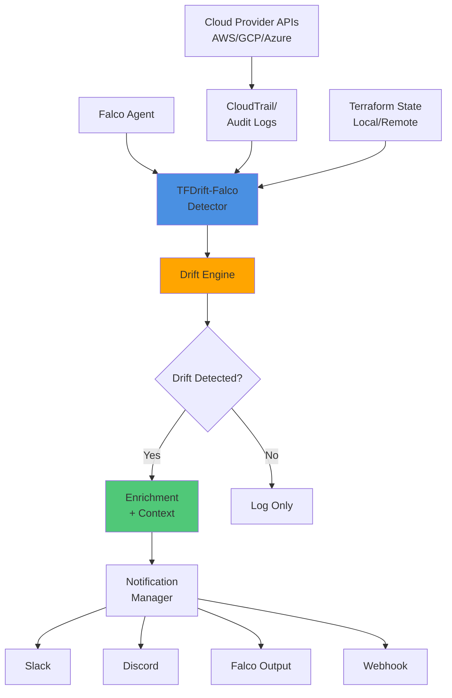

# 🛰️ TFDrift-Falco

**Real-time Terraform Drift Detection powered by Falco**

[](https://opensource.org/licenses/MIT)
[](https://golang.org/)
[](https://falco.org/)

[English](#english) | [日本語](#japanese)

---

<a name="english"></a>

## 🧩 Overview

**TFDrift-Falco** detects manual (non-IaC) changes in your cloud environment in **real-time** by combining:

- **Falco** runtime security monitoring
- **CloudTrail / Cloud Audit Logs** event streams
- **Terraform State** comparison

Unlike traditional drift detection tools (like `driftctl` or `tfsec`) that perform periodic static scans, TFDrift-Falco provides **continuous, event-driven drift detection** with security context.

### 🚨 Example Use Case

```
Someone disables termination protection on an EC2 instance via AWS Console
    ↓
CloudTrail event captured by Falco
    ↓
TFDrift-Falco compares with Terraform state
    ↓
Instant Slack alert with user identity and change details
```

## 🎯 Key Features

- ⚡ **Real-time Detection** - Monitor AWS CloudTrail, GCP Audit Logs, and Falco events
- 🧩 **Terraform State Comparison** - Detect deviations from IaC definitions
- 🔒 **Security Context** - Correlate user identity (IAM user, API key, service account)
- 🔔 **Multiple Notification Channels** - Slack, Discord, Falco output, Syslog, Webhook
- 🌐 **Multi-Cloud Support** - AWS (initial), GCP and Azure (planned)
- 🎨 **Extensible Rules** - Define custom drift detection rules in YAML
- 🐳 **Container-Ready** - Run as a sidecar or standalone container

## 🏗️ Architecture



### Components

| Component | Description |
|-----------|-------------|
| **CloudTrail Connector** | Ingests AWS CloudTrail events from S3/EventBridge |
| **Falco Listener** | Receives Falco events via gRPC or Unix socket |
| **Terraform State Loader** | Periodically syncs Terraform state (local/remote) |
| **Drift Engine** | Compares IaC definitions with runtime changes |
| **Context Enricher** | Adds user identity, resource tags, change history |
| **Notifier** | Sends alerts to configured channels |

## 🚀 Quick Start

### Prerequisites

- Go 1.21 or later
- Falco 0.35+ (optional, for enhanced detection)
- Terraform 1.0+
- AWS CLI configured (for AWS support)

### Installation

#### Option 1: Binary Release

```bash
# Download latest release
curl -LO https://github.com/keitahigaki/tfdrift-falco/releases/latest/download/tfdrift-linux-amd64
chmod +x tfdrift-linux-amd64
sudo mv tfdrift-linux-amd64 /usr/local/bin/tfdrift
```

#### Option 2: Build from Source

```bash
git clone https://github.com/keitahigaki/tfdrift-falco.git
cd tfdrift-falco
go build -o tfdrift ./cmd/tfdrift
```

#### Option 3: Docker

```bash
docker pull keitahigaki/tfdrift-falco:latest

docker run -v $(pwd)/config.yaml:/config.yaml \
           -v ~/.aws:/root/.aws:ro \
           keitahigaki/tfdrift-falco:latest \
           --config /config.yaml
```

### Configuration

Create `config.yaml`:

```yaml
# Cloud Provider Configuration
providers:
  aws:
    enabled: true
    regions:
      - us-east-1
      - us-west-2
    cloudtrail:
      s3_bucket: "my-cloudtrail-bucket"
      sqs_queue: "cloudtrail-events"
    state:
      backend: "s3"  # local, s3, remote
      s3_bucket: "my-terraform-state"
      s3_key: "prod/terraform.tfstate"

# Falco Integration
falco:
  enabled: true
  socket: "/var/run/falco.sock"
  grpc_endpoint: "unix:///var/run/falco.sock"

# Drift Detection Rules
drift_rules:
  - name: "EC2 Instance Modification"
    resource_types:
      - "aws_instance"
    watched_attributes:
      - "disable_api_termination"
      - "instance_type"
      - "security_groups"
    severity: "high"

  - name: "IAM Policy Change"
    resource_types:
      - "aws_iam_policy"
      - "aws_iam_role"
    watched_attributes:
      - "policy"
      - "assume_role_policy"
    severity: "critical"

# Notification Channels
notifications:
  slack:
    enabled: true
    webhook_url: "https://hooks.slack.com/services/YOUR/WEBHOOK/URL"
    channel: "#security-alerts"

  discord:
    enabled: false
    webhook_url: "https://discord.com/api/webhooks/..."

  falco_output:
    enabled: true
    priority: "warning"

  webhook:
    enabled: false
    url: "https://your-siem.example.com/webhook"
    headers:
      Authorization: "Bearer YOUR_TOKEN"

# Logging
logging:
  level: "info"  # debug, info, warning, error
  format: "json"  # json, text
```

### Running

```bash
# Run with config file
tfdrift --config config.yaml

# Run with environment variables
export TFDRIFT_AWS_REGIONS="us-east-1,us-west-2"
export TFDRIFT_SLACK_WEBHOOK="https://hooks.slack.com/..."
tfdrift

# Run in daemon mode
tfdrift --config config.yaml --daemon

# Dry-run mode (no notifications)
tfdrift --config config.yaml --dry-run
```

## 📊 Example Output

### Console Output

```
[2025-01-15 10:30:45] INFO  Starting TFDrift-Falco v0.1.0
[2025-01-15 10:30:45] INFO  Loaded Terraform state: 142 resources
[2025-01-15 10:30:46] INFO  Connected to Falco socket
[2025-01-15 10:30:46] INFO  Listening for CloudTrail events...

[2025-01-15 10:35:12] ALERT Drift Detected!
━━━━━━━━━━━━━━━━━━━━━━━━━━━━━━━━━━━━━━━━━━━━━━━━━━━
Resource:     aws_instance.webserver
Type:         Manual Modification
Severity:     HIGH

Changed Attribute:
  disable_api_termination: false → true

Context:
  User:         admin-user@example.com
  Source:       AWS Console (IAM User)
  IP Address:   203.0.113.42
  Region:       us-east-1
  Timestamp:    2025-01-15T10:35:10Z

CloudTrail:
  EventID:      a1b2c3d4-5678-90ab-cdef-1234567890ab
  EventName:    ModifyInstanceAttribute

Terraform:
  Resource:     aws_instance.webserver
  Module:       modules/ec2
  File:         main.tf:45

Recommendation:
  - Review change with user admin-user@example.com
  - Run 'terraform plan' to sync state
  - Update Terraform code if change is intentional
━━━━━━━━━━━━━━━━━━━━━━━━━━━━━━━━━━━━━━━━━━━━━━━━━━━
```

### Slack Notification


```
🚨 Drift Detected: aws_instance.webserver

Changed: disable_api_termination = false → true

User: admin-user@example.com (AWS Console)
Region: us-east-1
Severity: HIGH

CloudTrail EventID: a1b2c3d4-5678-90ab-cdef-1234567890ab

[View in Console] [Terraform Code] [Runbook]
```

## 🧪 Use Cases

### 1. Security Compliance
Detect unauthorized infrastructure changes that bypass IaC workflows:
- Manual security group modifications
- IAM policy changes outside Terraform
- Encryption settings disabled

### 2. Cost Management
Identify resource changes that impact costs:
- Instance type upgrades
- Storage volume expansions
- EBS volume type changes

### 3. Audit & Governance
Track who made what changes and when:
- Complete change history with user identity
- Integration with SIEM systems
- Compliance reporting

### 4. GitOps Enforcement
Ensure all infrastructure changes go through code review:
- Alert on console-based changes
- Enforce infrastructure-as-code discipline
- Prevent configuration drift

## 🧩 Integration Examples

### With Sysdig Secure

```yaml
notifications:
  webhook:
    enabled: true
    url: "https://secure.sysdig.com/api/v1/events"
    headers:
      Authorization: "Bearer ${SYSDIG_API_TOKEN}"
    payload_template: |
      {
        "event": {
          "name": "Terraform Drift Detected",
          "description": "{{ .ResourceType }} {{ .ResourceName }} was modified",
          "severity": "{{ .Severity }}",
          "tags": {
            "user": "{{ .User }}",
            "resource": "{{ .ResourceID }}",
            "cloud": "{{ .Provider }}"
          }
        }
      }
```

### With Falco Rules

```yaml
# falco-rules.yaml
- rule: Terraform Managed Resource Modified
  desc: Detect modifications to Terraform-managed resources
  condition: >
    evt.type = aws_api_call and
    aws.eventName in (ModifyInstanceAttribute, PutBucketPolicy, UpdateAssumeRolePolicy) and
    not user.name startswith "terraform-"
  output: >
    Terraform resource modified manually
    (user=%user.name resource=%aws.resource.id event=%aws.eventName)
  priority: WARNING
  tags: [terraform, drift, iac]
```

### With Grafana/Prometheus

TFDrift-Falco exposes Prometheus metrics:

```
# Drift events by severity
tfdrift_events_total{severity="critical"} 5
tfdrift_events_total{severity="high"} 23
tfdrift_events_total{severity="medium"} 45

# Drift events by resource type
tfdrift_events_by_type{type="aws_instance"} 12
tfdrift_events_by_type{type="aws_iam_role"} 8

# Detection latency
tfdrift_detection_latency_seconds{quantile="0.95"} 2.3
```

## 🗺️ Roadmap

### Phase 1: MVP (Current)
- [x] AWS CloudTrail integration
- [x] Terraform state comparison (local)
- [x] Slack notifications
- [x] Basic drift rules (EC2, IAM, S3)
- [ ] Falco event integration
- [ ] Docker container support

### Phase 2: Enhanced Detection
- [ ] GCP Audit Logs support
- [ ] Azure Activity Logs support
- [ ] Terraform Cloud/Enterprise integration
- [ ] Remote state backend support (S3, GCS, Azure Blob)
- [ ] Custom rule DSL

### Phase 3: Advanced Features
- [ ] Web dashboard UI
- [ ] Machine learning-based anomaly detection
- [ ] Auto-remediation actions
- [ ] Policy-as-Code integration (OPA/Rego)
- [ ] Terraform plan generation from drift

### Phase 4: Enterprise Features
- [ ] Multi-account/multi-org support
- [ ] RBAC and team management
- [ ] Compliance reporting (SOC2, PCI-DSS, HIPAA)
- [ ] Integration marketplace
- [ ] SaaS offering

## 🤝 Contributing

Contributions are welcome! Please see [CONTRIBUTING.md](CONTRIBUTING.md) for details.

### Development Setup

```bash
# Clone repository
git clone https://github.com/keitahigaki/tfdrift-falco.git
cd tfdrift-falco

# Install dependencies
go mod download

# Run tests
go test ./...

# Run with race detection
go test -race ./...

# Build
make build

# Run locally
./tfdrift --config examples/config.yaml
```

### Project Structure

```
tfdrift-falco/
├── cmd/
│   └── tfdrift/           # CLI entry point
│       └── main.go
├── pkg/
│   ├── cloudtrail/        # CloudTrail event ingestion
│   ├── falco/             # Falco integration
│   ├── terraform/         # Terraform state parsing
│   ├── detector/          # Drift detection engine
│   ├── notifier/          # Notification handlers
│   ├── config/            # Configuration management
│   └── enricher/          # Context enrichment
├── docs/                  # Documentation
├── examples/              # Example configurations
├── tests/                 # Integration tests
└── scripts/               # Build and deployment scripts
```

## 📚 Documentation

- [Architecture Overview](docs/architecture.md)
- [Configuration Guide](docs/configuration.md)
- [Drift Rules Reference](docs/rules.md)
- [API Documentation](docs/api.md)
- [Deployment Guide](docs/deployment.md)
- [Troubleshooting](docs/troubleshooting.md)

## 🛡️ Security

If you discover a security vulnerability, please send an email to security@example.com. All security vulnerabilities will be promptly addressed.

## 📜 License

This project is licensed under the MIT License - see the [LICENSE](LICENSE) file for details.

## 🙏 Acknowledgments

- [Falco Project](https://falco.org/) - Runtime security monitoring
- [Sysdig](https://sysdig.com/) - Cloud-native security platform
- [driftctl](https://github.com/snyk/driftctl) - Inspiration for drift detection
- [Terraform](https://www.terraform.io/) - Infrastructure as Code

## 📞 Contact

- Author: Keita Higaki
- GitHub: [@keitahigaki](https://github.com/keitahigaki)
- Twitter: [@keitahigaki](https://twitter.com/keitahigaki)
- Blog: [blog.keitahigaki.com](https://blog.keitahigaki.com)

---

<a name="japanese"></a>

## 🧩 概要（日本語）

**TFDrift-Falco** は、クラウド環境における手動変更（IaC管理外の変更）を**リアルタイムで検知**するツールです。

以下を組み合わせた、次世代のドリフト検知ソリューション：

- **Falco** ランタイムセキュリティ監視
- **CloudTrail / Cloud Audit Logs** イベントストリーム
- **Terraform State** 比較

従来のドリフト検知ツール（`driftctl`や`tfsec`など）は定期的な静的スキャンを行いますが、TFDrift-Falcoは**継続的なイベント駆動型のドリフト検知**を、セキュリティコンテキスト付きで提供します。

### 🚨 使用例

```
誰かがAWSコンソールでEC2インスタンスの削除保護を無効化
    ↓
CloudTrailイベントをFalcoが捕捉
    ↓
TFDrift-FalcoがTerraform Stateと比較
    ↓
ユーザー情報と変更内容を含むSlackアラートを即座に送信
```

## 🎯 主要機能

- ⚡ **リアルタイム検知** - AWS CloudTrail、GCP Audit Logs、Falcoイベントを監視
- 🧩 **Terraform State比較** - IaC定義からの逸脱を検出
- 🔒 **セキュリティコンテキスト** - ユーザーID（IAMユーザー、APIキー、サービスアカウント）と相関
- 🔔 **複数の通知チャネル** - Slack、Discord、Falco出力、Syslog、Webhook
- 🌐 **マルチクラウド対応** - AWS（初期）、GCPとAzure（計画中）
- 🎨 **拡張可能なルール** - YAMLでカスタムドリフト検知ルールを定義
- 🐳 **コンテナ対応** - サイドカーまたはスタンドアロンコンテナとして実行

## 🚀 クイックスタート

### 前提条件

- Go 1.21以降
- Falco 0.35+（オプション、拡張検知用）
- Terraform 1.0+
- AWS CLI設定済み（AWSサポート用）

### インストール

#### オプション1: バイナリリリース

```bash
# 最新リリースをダウンロード
curl -LO https://github.com/keitahigaki/tfdrift-falco/releases/latest/download/tfdrift-linux-amd64
chmod +x tfdrift-linux-amd64
sudo mv tfdrift-linux-amd64 /usr/local/bin/tfdrift
```

#### オプション2: ソースからビルド

```bash
git clone https://github.com/keitahigaki/tfdrift-falco.git
cd tfdrift-falco
go build -o tfdrift ./cmd/tfdrift
```

#### オプション3: Docker

```bash
docker pull keitahigaki/tfdrift-falco:latest

docker run -v $(pwd)/config.yaml:/config.yaml \
           -v ~/.aws:/root/.aws:ro \
           keitahigaki/tfdrift-falco:latest \
           --config /config.yaml
```

### 設定

`config.yaml`を作成：

```yaml
# クラウドプロバイダー設定
providers:
  aws:
    enabled: true
    regions:
      - us-east-1
      - ap-northeast-1
    cloudtrail:
      s3_bucket: "my-cloudtrail-bucket"
      sqs_queue: "cloudtrail-events"
    state:
      backend: "s3"
      s3_bucket: "my-terraform-state"
      s3_key: "prod/terraform.tfstate"

# Falco統合
falco:
  enabled: true
  socket: "/var/run/falco.sock"

# ドリフト検知ルール
drift_rules:
  - name: "EC2インスタンス変更"
    resource_types:
      - "aws_instance"
    watched_attributes:
      - "disable_api_termination"
      - "instance_type"
      - "security_groups"
    severity: "high"

# 通知チャネル
notifications:
  slack:
    enabled: true
    webhook_url: "https://hooks.slack.com/services/YOUR/WEBHOOK/URL"
    channel: "#security-alerts"
```

### 実行

```bash
# 設定ファイルで実行
tfdrift --config config.yaml

# デーモンモードで実行
tfdrift --config config.yaml --daemon

# ドライランモード（通知なし）
tfdrift --config config.yaml --dry-run
```

## 🧪 使用ケース

### 1. セキュリティコンプライアンス
IaCワークフローをバイパスした不正なインフラ変更を検知：
- 手動でのセキュリティグループ変更
- Terraform管理外のIAMポリシー変更
- 暗号化設定の無効化

### 2. コスト管理
コストに影響するリソース変更を特定：
- インスタンスタイプのアップグレード
- ストレージボリュームの拡張
- EBSボリュームタイプの変更

### 3. 監査とガバナンス
誰がいつ何を変更したかを追跡：
- ユーザーIDを含む完全な変更履歴
- SIEMシステムとの統合
- コンプライアンスレポート

### 4. GitOps強制
すべてのインフラ変更がコードレビューを経ることを保証：
- コンソールベースの変更に対するアラート
- Infrastructure-as-Code規律の強制
- 設定ドリフトの防止

## 🗺️ ロードマップ

### フェーズ1: MVP（現在）
- [x] AWS CloudTrail統合
- [x] Terraform State比較（ローカル）
- [x] Slack通知
- [x] 基本ドリフトルール（EC2、IAM、S3）
- [ ] Falcoイベント統合
- [ ] Dockerコンテナサポート

### フェーズ2: 検知強化
- [ ] GCP Audit Logsサポート
- [ ] Azure Activity Logsサポート
- [ ] Terraform Cloud/Enterprise統合
- [ ] リモートStateバックエンドサポート

### フェーズ3: 高度な機能
- [ ] Webダッシュボード UI
- [ ] 機械学習ベースの異常検知
- [ ] 自動修復アクション
- [ ] Policy-as-Code統合（OPA/Rego）

### フェーズ4: エンタープライズ機能
- [ ] マルチアカウント/マルチOrg対応
- [ ] RBACとチーム管理
- [ ] コンプライアンスレポート
- [ ] SaaS提供

## 🤝 コントリビューション

コントリビューションを歓迎します！詳細は[CONTRIBUTING.md](CONTRIBUTING.md)をご覧ください。

## 📜 ライセンス

このプロジェクトはMITライセンスの下でライセンスされています - 詳細は[LICENSE](LICENSE)ファイルをご覧ください。

## 📞 連絡先

- 作者: Keita Higaki
- GitHub: [@keitahigaki](https://github.com/keitahigaki)
- Twitter: [@keitahigaki](https://twitter.com/keitahigaki)

---

**Made with ❤️ by the Cloud Native Security Community**
