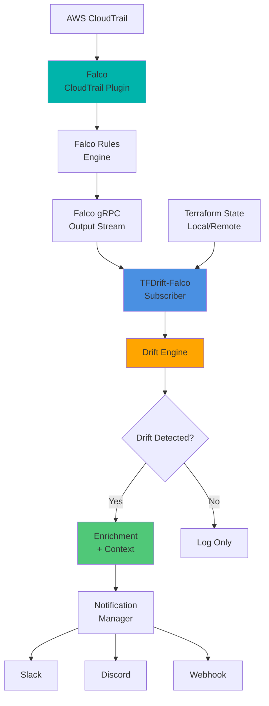

# 🛰️ TFDrift-Falco

**Real-time Terraform Drift Detection powered by Falco**

[](https://github.com/higakikeita/tfdrift-falco/releases)
[](https://opensource.org/licenses/MIT)
[](https://golang.org/)
[](https://falco.org/)
[](https://ghcr.io/higakikeita/tfdrift-falco)
[](https://github.com/higakikeita/tfdrift-falco/pkgs/container/tfdrift-falco)
[](https://github.com/higakikeita/tfdrift-falco/actions/workflows/test.yml)
[](https://github.com/higakikeita/tfdrift-falco/actions/workflows/lint.yml)
[](https://github.com/higakikeita/tfdrift-falco/actions/workflows/security.yml)
[](https://github.com/higakikeita/tfdrift-falco/actions/workflows/publish-ghcr.yml)
[](https://github.com/higakikeita/tfdrift-falco)
[](https://codecov.io/gh/higakikeita/tfdrift-falco)
[](https://goreportcard.com/report/github.com/higakikeita/tfdrift-falco)

> 🎉 **v0.2.0-beta Released!** - Now supports **95 CloudTrail events** (+265%) including VPC/Security Groups, ELB/ALB, KMS, and DynamoDB. [See CHANGELOG](./CHANGELOG.md)

[English](#english) | [日本語](#japanese)

---

<a name="english"></a>

## 🧩 Overview

**TFDrift-Falco** detects manual (non-IaC) changes in your cloud environment in **real-time** by combining:

- **Falco** runtime security monitoring with CloudTrail plugin
- **Falco gRPC API** for real-time event streaming
- **Terraform State** comparison

Unlike traditional drift detection tools (like `driftctl` or `tfsec`) that perform periodic static scans, TFDrift-Falco provides **continuous, event-driven drift detection** powered by Falco's CloudTrail plugin.

### 🚨 Example Use Case

```
Someone disables termination protection on an EC2 instance via AWS Console
    ↓
CloudTrail event captured by Falco CloudTrail plugin
    ↓
Falco rule triggers and sends event via gRPC
    ↓
TFDrift-Falco receives event and compares with Terraform state
    ↓
Instant Slack alert with user identity and change details
```

## 🎯 Key Features

- ⚡ **Real-time Detection** - Subscribes to Falco gRPC outputs for instant event processing
- 🦅 **Falco-Powered** - Uses Falco's CloudTrail plugin for AWS event monitoring
- 🧩 **Terraform State Comparison** - Detect deviations from IaC definitions
- 🔒 **Security Context** - Correlate user identity (IAM user, API key, service account)
- 🔔 **Multiple Notification Channels** - Slack, Discord, Falco output, Webhook
- 🌐 **Multi-Cloud Support** - AWS (95 events), GCP and Azure (planned)
- 🎨 **Extensible Rules** - Define custom Falco rules in YAML
- 🐳 **Container-Ready** - Run as a sidecar or standalone container
- 📊 **Production-Ready** - Comprehensive load testing and monitoring framework

## 📋 Supported AWS Services

TFDrift-Falco v0.3.0-dev monitors **169 CloudTrail events** across 16 AWS services:

| Service | Events | Coverage | Priority |
|---------|--------|----------|----------|
| **VPC/Networking** 🔒 | 33 | Security Groups, VPC, Subnets, Route Tables, Gateways, ACLs, Endpoints | Critical |
| **RDS** 🗃️ | 31 | Instances, Clusters, Snapshots, Parameter Groups, Subnet Groups, Option Groups | High |
| **EC2** 💻 | 17 | Instances, AMIs, EBS Volumes, Snapshots, Network Interfaces | High |
| **ELB/ALB** | 15 | Load Balancers, Target Groups, Listeners, Rules | High |
| **IAM** ✅ | 14 | Roles, Users, Groups, Policies, Access Keys | Critical |
| **ECS** 🐳 | 13 | Services, Task Definitions, Clusters, Capacity Providers | High |
| **EKS** ☸️ | 12 | Clusters, Node Groups, Addons, Fargate Profiles | High |
| **ElastiCache** 🗄️ | 12 | Cache Clusters, Replication Groups, Parameter Groups | High |
| **KMS** 🔐 | 10 | Keys, Aliases, Rotation, Deletion | Critical |
| **Lambda** ⚡ | 10 | Functions, Event Sources, Permissions, Concurrency | High |
| **Auto Scaling** 📈 | 10 | ASGs, Launch Configurations, Policies, Scheduled Actions | Medium |
| **S3** | 8 | Policies, Encryption, Versioning, Public Access | High |
| **DynamoDB** | 5 | Tables, TTL, Backups | Medium |
| **ECR** | 1 | Repository Policies | Medium |

**Total**: 169 events | See [AWS Resource Coverage Analysis](./docs/AWS_RESOURCE_COVERAGE_ANALYSIS.md) for details

## 🏗️ Architecture



### Components

| Component | Description |
|-----------|-------------|
| **Falco Subscriber** | Connects to Falco gRPC API and subscribes to CloudTrail events |
| **Terraform State Loader** | Periodically syncs Terraform state (local/remote) |
| **Drift Engine** | Compares IaC definitions with runtime changes |
| **Context Enricher** | Adds user identity, resource tags, change history |
| **Notifier** | Sends alerts to configured channels |

## 📊 Code Quality & Testing

TFDrift-Falco maintains high code quality standards with comprehensive testing and continuous integration:

### Test Coverage: 80%+ 🎯

- **Unit Tests**: All core packages (detector, falco, diff, config)
- **Integration Tests**: End-to-end drift detection workflows
- **Table-Driven Tests**: Efficient coverage of edge cases
- **CI/CD**: Automated testing on every PR with coverage threshold enforcement (78%)

### Code Quality Tools

- ✅ **golangci-lint**: Static analysis with 15+ linters enabled
- ✅ **Snyk**: Dependency vulnerability scanning (weekly)
- ✅ **GoSec**: Security-focused static analysis
- ✅ **Nancy**: Go dependency checker
- ✅ **go vet**: Official Go static analyzer
- ✅ **staticcheck**: Advanced Go linter

### Architecture Quality

- 📁 **Single Responsibility Principle**: Modular design with focused files (<200 lines)
- 🧩 **Dependency Injection**: Testable components with mock support
- 🔄 **Clean Refactoring**: Major refactoring completed (1,410 lines → 17 modular files)
- 📝 **Comprehensive Documentation**: Inline comments and package docs

### Recent Achievements

- Improved test coverage from 36.9% to 80.0% ✅
- Refactored 3 major files (513, 426, 473 lines) into focused modules ✅
- Eliminated all 500+ line files (excluding tests) ✅
- Resolved all critical golangci-lint warnings ✅

Read more: [Test Coverage 80% Achievement Article](./docs/test-coverage-80-achievement.md)

## 🐳 Quick Start with Docker (Easiest)

**Get started in 30 seconds with the official Docker image:**

```bash
# Pull and run the official image
docker run -d \
  --name tfdrift-falco \
  -e TF_STATE_BACKEND=s3 \
  -e TF_STATE_S3_BUCKET=my-terraform-state \
  -e TF_STATE_S3_KEY=prod/terraform.tfstate \
  -e AWS_REGION=us-east-1 \
  -v ~/.aws:/root/.aws:ro \
  ghcr.io/higakikeita/tfdrift-falco:latest
```

**View logs:**
```bash
docker logs -f tfdrift-falco
```

**Available on GitHub Container Registry:**
- 🚀 `ghcr.io/higakikeita/tfdrift-falco:latest` - Latest stable
- 📌 `ghcr.io/higakikeita/tfdrift-falco:v0.2.0-beta` - Specific version
- 🔖 See all tags: https://github.com/higakikeita/tfdrift-falco/pkgs/container/tfdrift-falco

---

## 🚀 Full Installation Guide

### Prerequisites

- Go 1.21 or later (for building from source)
- **Falco 0.35+** with CloudTrail plugin (required) - [Setup Guide](docs/falco-setup.md)
- Terraform 1.0+
- AWS CLI configured (for AWS support)
- **Docker** (recommended for easiest setup)

> **Important**: TFDrift-Falco requires a running Falco instance with gRPC enabled and the CloudTrail plugin configured. See the [Falco Setup Guide](docs/falco-setup.md) for detailed installation instructions.

### Installation

#### Option 1: Binary Release

```bash
# Download latest release
curl -LO https://github.com/keitahigaki/tfdrift-falco/releases/latest/download/tfdrift-linux-amd64
chmod +x tfdrift-linux-amd64
sudo mv tfdrift-linux-amd64 /usr/local/bin/tfdrift
```

#### Option 2: Build from Source

```bash
git clone https://github.com/keitahigaki/tfdrift-falco.git
cd tfdrift-falco
go build -o tfdrift ./cmd/tfdrift
```

#### Option 3: Docker (Recommended ⭐)

**Official image available on GitHub Container Registry (GHCR)**

```bash
# Pull the latest official image
docker pull ghcr.io/higakikeita/tfdrift-falco:latest

# Or use a specific version
docker pull ghcr.io/higakikeita/tfdrift-falco:v0.2.0-beta

# Run with Docker
docker run -d \
  --name tfdrift-falco \
  -v $(pwd)/config.yaml:/config/config.yaml:ro \
  -v ~/.aws:/root/.aws:ro \
  ghcr.io/higakikeita/tfdrift-falco:latest \
  --config /config/config.yaml
```

**Quick start with environment variables:**

```bash
docker run -d \
  --name tfdrift-falco \
  -e TF_STATE_BACKEND=s3 \
  -e TF_STATE_S3_BUCKET=my-terraform-state \
  -e TF_STATE_S3_KEY=prod/terraform.tfstate \
  -e AWS_REGION=us-east-1 \
  -e FALCO_HOSTNAME=localhost \
  -e FALCO_PORT=5060 \
  -v ~/.aws:/root/.aws:ro \
  ghcr.io/higakikeita/tfdrift-falco:latest
```

**Build from source (for development):**

```bash
# Build image locally
make docker-build

# Run locally built image
docker run -d \
  --name tfdrift-falco \
  -v $(pwd)/config.yaml:/config/config.yaml:ro \
  -v ~/.aws:/root/.aws:ro \
  tfdrift-falco:latest \
  --config /config/config.yaml
```

#### Option 4: Docker Compose (Recommended)

The easiest way to run TFDrift-Falco with all dependencies:

```bash
# Start the full stack (Falco + TFDrift)
make docker-compose-up

# View logs
make docker-compose-logs

# Stop services
make docker-compose-down
```

See [Deployment Guide](docs/deployment.md) for detailed Docker and Kubernetes deployment instructions.

### Configuration

Create `config.yaml`:

```yaml
# Cloud Provider Configuration
providers:
  aws:
    enabled: true
    regions:
      - us-east-1
      - us-west-2
    state:
      backend: "s3"  # local, s3, remote
      s3_bucket: "my-terraform-state"
      s3_key: "prod/terraform.tfstate"

# Falco Integration (Required)
falco:
  enabled: true
  hostname: "localhost"  # Falco gRPC server hostname
  port: 5060              # Falco gRPC server port
  cert_file: ""           # Optional: client certificate for mTLS
  key_file: ""            # Optional: client key for mTLS
  ca_root_file: ""        # Optional: CA root certificate

# Drift Detection Rules
drift_rules:
  - name: "EC2 Instance Modification"
    resource_types:
      - "aws_instance"
    watched_attributes:
      - "disable_api_termination"
      - "instance_type"
      - "security_groups"
    severity: "high"

  - name: "IAM Policy Change"
    resource_types:
      - "aws_iam_policy"
      - "aws_iam_role"
    watched_attributes:
      - "policy"
      - "assume_role_policy"
    severity: "critical"

# Notification Channels
notifications:
  slack:
    enabled: true
    webhook_url: "https://hooks.slack.com/services/YOUR/WEBHOOK/URL"
    channel: "#security-alerts"

  discord:
    enabled: false
    webhook_url: "https://discord.com/api/webhooks/..."

  falco_output:
    enabled: true
    priority: "warning"

  webhook:
    enabled: false
    url: "https://your-siem.example.com/webhook"
    headers:
      Authorization: "Bearer YOUR_TOKEN"

# Logging
logging:
  level: "info"  # debug, info, warning, error
  format: "json"  # json, text
```

### Running

```bash
# Run with config file
tfdrift --config config.yaml

# Run with environment variables
export TFDRIFT_AWS_REGIONS="us-east-1,us-west-2"
export TFDRIFT_SLACK_WEBHOOK="https://hooks.slack.com/..."
tfdrift

# Run in daemon mode
tfdrift --config config.yaml --daemon

# Dry-run mode (no notifications)
tfdrift --config config.yaml --dry-run
```

## 📊 Example Output

### Console Output

```
[2025-01-15 10:30:45] INFO  Starting TFDrift-Falco v0.1.0
[2025-01-15 10:30:45] INFO  Loaded Terraform state: 142 resources
[2025-01-15 10:30:46] INFO  Connected to Falco socket
[2025-01-15 10:30:46] INFO  Listening for CloudTrail events...

[2025-01-15 10:35:12] ALERT Drift Detected!
━━━━━━━━━━━━━━━━━━━━━━━━━━━━━━━━━━━━━━━━━━━━━━━━━━━
Resource:     aws_instance.webserver
Type:         Manual Modification
Severity:     HIGH

Changed Attribute:
  disable_api_termination: false → true

Context:
  User:         admin-user@example.com
  Source:       AWS Console (IAM User)
  IP Address:   203.0.113.42
  Region:       us-east-1
  Timestamp:    2025-01-15T10:35:10Z

CloudTrail:
  EventID:      a1b2c3d4-5678-90ab-cdef-1234567890ab
  EventName:    ModifyInstanceAttribute

Terraform:
  Resource:     aws_instance.webserver
  Module:       modules/ec2
  File:         main.tf:45

Recommendation:
  - Review change with user admin-user@example.com
  - Run 'terraform plan' to sync state
  - Update Terraform code if change is intentional
━━━━━━━━━━━━━━━━━━━━━━━━━━━━━━━━━━━━━━━━━━━━━━━━━━━
```

### Slack Notification


```
🚨 Drift Detected: aws_instance.webserver

Changed: disable_api_termination = false → true

User: admin-user@example.com (AWS Console)
Region: us-east-1
Severity: HIGH

CloudTrail EventID: a1b2c3d4-5678-90ab-cdef-1234567890ab

[View in Console] [Terraform Code] [Runbook]
```

## 🧪 Use Cases

### 1. Security Compliance
Detect unauthorized infrastructure changes that bypass IaC workflows:
- Manual security group modifications
- IAM policy changes outside Terraform
- Encryption settings disabled

### 2. Cost Management
Identify resource changes that impact costs:
- Instance type upgrades
- Storage volume expansions
- EBS volume type changes

### 3. Audit & Governance
Track who made what changes and when:
- Complete change history with user identity
- Integration with SIEM systems
- Compliance reporting

### 4. GitOps Enforcement
Ensure all infrastructure changes go through code review:
- Alert on console-based changes
- Enforce infrastructure-as-code discipline
- Prevent configuration drift

## 🧩 Integration Examples

### With Sysdig Secure

```yaml
notifications:
  webhook:
    enabled: true
    url: "https://secure.sysdig.com/api/v1/events"
    headers:
      Authorization: "Bearer ${SYSDIG_API_TOKEN}"
    payload_template: |
      {
        "event": {
          "name": "Terraform Drift Detected",
          "description": "{{ .ResourceType }} {{ .ResourceName }} was modified",
          "severity": "{{ .Severity }}",
          "tags": {
            "user": "{{ .User }}",
            "resource": "{{ .ResourceID }}",
            "cloud": "{{ .Provider }}"
          }
        }
      }
```

### With Falco Rules

```yaml
# falco-rules.yaml
- rule: Terraform Managed Resource Modified
  desc: Detect modifications to Terraform-managed resources
  condition: >
    evt.type = aws_api_call and
    aws.eventName in (ModifyInstanceAttribute, PutBucketPolicy, UpdateAssumeRolePolicy) and
    not user.name startswith "terraform-"
  output: >
    Terraform resource modified manually
    (user=%user.name resource=%aws.resource.id event=%aws.eventName)
  priority: WARNING
  tags: [terraform, drift, iac]
```

### With Grafana/Prometheus

TFDrift-Falco exposes Prometheus metrics:

```
# Drift events by severity
tfdrift_events_total{severity="critical"} 5
tfdrift_events_total{severity="high"} 23
tfdrift_events_total{severity="medium"} 45

# Drift events by resource type
tfdrift_events_by_type{type="aws_instance"} 12
tfdrift_events_by_type{type="aws_iam_role"} 8

# Detection latency
tfdrift_detection_latency_seconds{quantile="0.95"} 2.3
```

## 📊 Grafana Dashboards (Production Ready ✅)

**Real-time drift monitoring with pre-built Grafana dashboards**

### Quick Start (5 minutes)

```bash
cd dashboards/grafana
./quick-start.sh
```

This opens http://localhost:3000 with 3 pre-built dashboards showing sample drift events.

### Features

✅ **3 Pre-Built Dashboards**
- **Overview**: Total drifts, severity breakdown, timeline view
- **Diff Details**: Configuration changes with expected vs actual comparison
- **Heatmap & Analytics**: Drift patterns and trend analysis

✅ **Real-time Monitoring**
- 5-30 second auto-refresh
- Color-coded severity levels (Critical/High/Medium/Low)
- Multi-dimensional filtering

✅ **Alerting**
- 6 pre-configured alert rules
- Slack/Email/Webhook notification support
- Intelligent routing by severity

✅ **Production Ready**
- Comprehensive documentation ([Getting Started Guide](dashboards/grafana/GETTING_STARTED.md))
- Automated integration testing (100% pass rate)
- Performance optimized (<2s queries)

### Documentation

- 🚀 **[Getting Started Guide](dashboards/grafana/GETTING_STARTED.md)** - Complete setup for end users
- 🚨 **[Alert Configuration](dashboards/grafana/ALERTS.md)** - Slack/Email alerts setup
- 🎨 **[Customization Guide](dashboards/grafana/CUSTOMIZATION_GUIDE.md)** - Dashboard customization
- 📖 **[Test Results](dashboards/grafana/INTEGRATION_TEST_RESULTS.md)** - Integration test report

### Architecture

```
TFDrift-Falco → JSON Logs → Promtail → Loki → Grafana Dashboards
                                              ↓
                                         Alerting → Slack/Email
```

## 🗺️ Roadmap

See the **[AWS Coverage Roadmap](./docs/AWS_COVERAGE_ROADMAP.md)** for detailed service expansion plans.

### Phase 1: MVP (✅ Complete - v0.2.0-beta)
- [x] AWS CloudTrail integration
- [x] Terraform state comparison (local)
- [x] Slack notifications
- [x] Basic drift rules (EC2, IAM, S3)
- [x] Falco event integration (gRPC)
- [x] Docker container support
- [x] 95 CloudTrail events across 10 AWS services

### Phase 1.5: Enhanced AWS Coverage (🚧 In Progress - v0.3.0)
- [x] **ECS** - Services, Task Definitions, Clusters, Capacity Providers (13 events)
- [x] **EKS** - Clusters, Node Groups, Addons, Fargate Profiles (12 events)
- [x] **Lambda Enhanced** - Additional function configuration (10 events)
- [x] **EC2 Enhanced** - Network interfaces, volumes, snapshots (17 events)
- [x] **ElastiCache** - Redis/Memcached clusters (12 events)
- [x] **Auto Scaling** - ASG configuration and policies (10 events)
- [x] **RDS Enhanced** - Parameter groups, subnet groups, snapshots, read replicas, option groups (31 events total)

**v0.3.0 Target**: 198 CloudTrail events (169/198 complete - 85%)

### Phase 2: Enhanced Detection
- [ ] GCP Audit Logs support
- [ ] Azure Activity Logs support
- [ ] Terraform Cloud/Enterprise integration
- [ ] Remote state backend support (S3, GCS, Azure Blob)
- [ ] Custom rule DSL

### Phase 3: Advanced Features
- [ ] Web dashboard UI
- [ ] Machine learning-based anomaly detection
- [ ] Auto-remediation actions
- [ ] Policy-as-Code integration (OPA/Rego)
- [ ] Terraform plan generation from drift

### Phase 4: Enterprise Features
- [ ] Multi-account/multi-org support
- [ ] RBAC and team management
- [ ] Compliance reporting (SOC2, PCI-DSS, HIPAA)
- [ ] Integration marketplace
- [ ] SaaS offering

## 🤝 Contributing

Contributions are welcome! Please see [CONTRIBUTING.md](CONTRIBUTING.md) for details.

### Development Setup

```bash
# Clone repository
git clone https://github.com/keitahigaki/tfdrift-falco.git
cd tfdrift-falco

# Install dependencies
go mod download

# Run tests
go test ./...

# Run with race detection
go test -race ./...

# Run security scans
./scripts/security-scan.sh

# Build
make build

# Run locally
./tfdrift --config examples/config.yaml
```

### Security Scanning

Multiple security tools run on every commit:
- **Snyk**: Dependency vulnerability scanning
- **GoSec**: Go code security audit
- **Nancy**: OSS dependency scanner

Run local security scans:
```bash
./scripts/security-scan.sh
```

See [SECURITY.md](.github/SECURITY.md) for security policy and reporting vulnerabilities.

### Project Structure

```
tfdrift-falco/
├── cmd/
│   └── tfdrift/           # CLI entry point
│       └── main.go
├── pkg/
│   ├── cloudtrail/        # CloudTrail event ingestion
│   ├── falco/             # Falco integration
│   ├── terraform/         # Terraform state parsing
│   ├── detector/          # Drift detection engine
│   ├── notifier/          # Notification handlers
│   ├── config/            # Configuration management
│   └── enricher/          # Context enrichment
├── docs/                  # Documentation
├── examples/              # Example configurations
├── tests/                 # Integration tests
└── scripts/               # Build and deployment scripts
```

## 📚 Documentation

- [Architecture Overview](docs/architecture.md)
- [Falco Setup Guide](docs/falco-setup.md) - **Start here for Falco installation**
- [Deployment Guide](docs/deployment.md) - **Docker, Kubernetes, Systemd deployments**
- [Usage Guide](docs/USAGE.md)
- [Auto-Import Guide](docs/auto-import-guide.md)
- [Test Coverage Achievement](docs/test-coverage-80-achievement.md)

## 🛡️ Security

If you discover a security vulnerability, please send an email to security@example.com. All security vulnerabilities will be promptly addressed.

## 📜 License

This project is licensed under the MIT License - see the [LICENSE](LICENSE) file for details.

## 🙏 Acknowledgments

- [Falco Project](https://falco.org/) - Runtime security monitoring
- [Sysdig](https://sysdig.com/) - Cloud-native security platform
- [driftctl](https://github.com/snyk/driftctl) - Inspiration for drift detection
- [Terraform](https://www.terraform.io/) - Infrastructure as Code

## 📞 Contact

- Author: Keita Higaki
- GitHub: [@keitahigaki](https://github.com/keitahigaki)
- X (Twitter): [@keitah0322](https://x.com/keitah0322)
- Qiita: [@keitah](https://qiita.com/keitah)

---

<a name="japanese"></a>

## 🧩 概要（日本語）

**TFDrift-Falco** は、クラウド環境における手動変更（IaC管理外の変更）を**リアルタイムで検知**するツールです。

以下を組み合わせた、次世代のドリフト検知ソリューション：

- **Falco** ランタイムセキュリティ監視
- **CloudTrail / Cloud Audit Logs** イベントストリーム
- **Terraform State** 比較

従来のドリフト検知ツール（`driftctl`や`tfsec`など）は定期的な静的スキャンを行いますが、TFDrift-Falcoは**継続的なイベント駆動型のドリフト検知**を、セキュリティコンテキスト付きで提供します。

### 🚨 使用例

```
誰かがAWSコンソールでEC2インスタンスの削除保護を無効化
    ↓
CloudTrailイベントをFalcoが捕捉
    ↓
TFDrift-FalcoがTerraform Stateと比較
    ↓
ユーザー情報と変更内容を含むSlackアラートを即座に送信
```

## 🎯 主要機能

- ⚡ **リアルタイム検知** - AWS CloudTrail、GCP Audit Logs、Falcoイベントを監視
- 🧩 **Terraform State比較** - IaC定義からの逸脱を検出
- 🔒 **セキュリティコンテキスト** - ユーザーID（IAMユーザー、APIキー、サービスアカウント）と相関
- 🔔 **複数の通知チャネル** - Slack、Discord、Falco出力、Syslog、Webhook
- 🌐 **マルチクラウド対応** - AWS（初期）、GCPとAzure（計画中）
- 🎨 **拡張可能なルール** - YAMLでカスタムドリフト検知ルールを定義
- 🐳 **コンテナ対応** - サイドカーまたはスタンドアロンコンテナとして実行

## 🐳 Dockerで30秒クイックスタート

**公式Dockerイメージで即座に開始:**

```bash
# 公式イメージをプル＆実行
docker run -d \
  --name tfdrift-falco \
  -e TF_STATE_BACKEND=s3 \
  -e TF_STATE_S3_BUCKET=my-terraform-state \
  -e TF_STATE_S3_KEY=prod/terraform.tfstate \
  -e AWS_REGION=ap-northeast-1 \
  -v ~/.aws:/root/.aws:ro \
  ghcr.io/higakikeita/tfdrift-falco:latest
```

**ログ確認:**
```bash
docker logs -f tfdrift-falco
```

**GitHub Container Registryで利用可能:**
- 🚀 `ghcr.io/higakikeita/tfdrift-falco:latest` - 最新安定版
- 📌 `ghcr.io/higakikeita/tfdrift-falco:v0.2.0-beta` - 特定バージョン
- 🔖 全タグを見る: https://github.com/higakikeita/tfdrift-falco/pkgs/container/tfdrift-falco

---

## 🚀 完全インストールガイド

### 前提条件

- Go 1.21以降（ソースからビルドする場合）
- **Falco 0.35+** CloudTrailプラグイン必須 - [セットアップガイド](docs/falco-setup.md)
- Terraform 1.0+
- AWS CLI設定済み（AWSサポート用）
- **Docker**（最も簡単なセットアップ方法として推奨）

> **重要**: TFDrift-Falcoは、gRPCが有効でCloudTrailプラグインが設定されたFalcoインスタンスが必要です。詳細なインストール手順は[Falcoセットアップガイド](docs/falco-setup.md)を参照してください。

### インストール

#### オプション1: バイナリリリース

```bash
# 最新リリースをダウンロード
curl -LO https://github.com/keitahigaki/tfdrift-falco/releases/latest/download/tfdrift-linux-amd64
chmod +x tfdrift-linux-amd64
sudo mv tfdrift-linux-amd64 /usr/local/bin/tfdrift
```

#### オプション2: ソースからビルド

```bash
git clone https://github.com/keitahigaki/tfdrift-falco.git
cd tfdrift-falco
go build -o tfdrift ./cmd/tfdrift
```

#### オプション3: Docker（推奨 ⭐）

**GitHub Container Registry（GHCR）で公式イメージが利用可能**

```bash
# 最新の公式イメージをプル
docker pull ghcr.io/higakikeita/tfdrift-falco:latest

# または特定バージョンを使用
docker pull ghcr.io/higakikeita/tfdrift-falco:v0.2.0-beta

# Dockerで実行
docker run -d \
  --name tfdrift-falco \
  -v $(pwd)/config.yaml:/config/config.yaml:ro \
  -v ~/.aws:/root/.aws:ro \
  ghcr.io/higakikeita/tfdrift-falco:latest \
  --config /config/config.yaml
```

**環境変数で簡単スタート:**

```bash
docker run -d \
  --name tfdrift-falco \
  -e TF_STATE_BACKEND=s3 \
  -e TF_STATE_S3_BUCKET=my-terraform-state \
  -e TF_STATE_S3_KEY=prod/terraform.tfstate \
  -e AWS_REGION=ap-northeast-1 \
  -e FALCO_HOSTNAME=localhost \
  -e FALCO_PORT=5060 \
  -v ~/.aws:/root/.aws:ro \
  ghcr.io/higakikeita/tfdrift-falco:latest
```

**ソースからビルド（開発用）:**

```bash
# ローカルでイメージをビルド
make docker-build

# ローカルビルドイメージを実行
docker run -d \
  --name tfdrift-falco \
  -v $(pwd)/config.yaml:/config/config.yaml:ro \
  -v ~/.aws:/root/.aws:ro \
  tfdrift-falco:latest \
  --config /config/config.yaml
```

#### オプション4: Docker Compose（推奨）

全ての依存関係を含む完全なスタックを実行する最も簡単な方法：

```bash
# フルスタックを起動（Falco + TFDrift）
make docker-compose-up

# ログを表示
make docker-compose-logs

# サービスを停止
make docker-compose-down
```

Docker、Kubernetes、Systemdデプロイメントの詳細は[デプロイメントガイド](docs/deployment.md)を参照してください。

### 設定

`config.yaml`を作成：

```yaml
# クラウドプロバイダー設定
providers:
  aws:
    enabled: true
    regions:
      - us-east-1
      - ap-northeast-1
    cloudtrail:
      s3_bucket: "my-cloudtrail-bucket"
      sqs_queue: "cloudtrail-events"
    state:
      backend: "s3"
      s3_bucket: "my-terraform-state"
      s3_key: "prod/terraform.tfstate"

# Falco統合
falco:
  enabled: true
  socket: "/var/run/falco.sock"

# ドリフト検知ルール
drift_rules:
  - name: "EC2インスタンス変更"
    resource_types:
      - "aws_instance"
    watched_attributes:
      - "disable_api_termination"
      - "instance_type"
      - "security_groups"
    severity: "high"

# 通知チャネル
notifications:
  slack:
    enabled: true
    webhook_url: "https://hooks.slack.com/services/YOUR/WEBHOOK/URL"
    channel: "#security-alerts"
```

### 実行

```bash
# 設定ファイルで実行
tfdrift --config config.yaml

# デーモンモードで実行
tfdrift --config config.yaml --daemon

# ドライランモード（通知なし）
tfdrift --config config.yaml --dry-run
```

## 🧪 使用ケース

### 1. セキュリティコンプライアンス
IaCワークフローをバイパスした不正なインフラ変更を検知：
- 手動でのセキュリティグループ変更
- Terraform管理外のIAMポリシー変更
- 暗号化設定の無効化

### 2. コスト管理
コストに影響するリソース変更を特定：
- インスタンスタイプのアップグレード
- ストレージボリュームの拡張
- EBSボリュームタイプの変更

### 3. 監査とガバナンス
誰がいつ何を変更したかを追跡：
- ユーザーIDを含む完全な変更履歴
- SIEMシステムとの統合
- コンプライアンスレポート

### 4. GitOps強制
すべてのインフラ変更がコードレビューを経ることを保証：
- コンソールベースの変更に対するアラート
- Infrastructure-as-Code規律の強制
- 設定ドリフトの防止

## 🗺️ ロードマップ

### フェーズ1: MVP（✅ 完了）
- [x] AWS CloudTrail統合
- [x] Terraform State比較（ローカル）
- [x] Slack通知
- [x] 基本ドリフトルール（EC2、IAM、S3）
- [x] Falcoイベント統合（gRPC）
- [x] Dockerコンテナサポート

### フェーズ2: 検知強化
- [ ] GCP Audit Logsサポート
- [ ] Azure Activity Logsサポート
- [ ] Terraform Cloud/Enterprise統合
- [ ] リモートStateバックエンドサポート

### フェーズ3: 高度な機能
- [ ] Webダッシュボード UI
- [ ] 機械学習ベースの異常検知
- [ ] 自動修復アクション
- [ ] Policy-as-Code統合（OPA/Rego）

### フェーズ4: エンタープライズ機能
- [ ] マルチアカウント/マルチOrg対応
- [ ] RBACとチーム管理
- [ ] コンプライアンスレポート
- [ ] SaaS提供

## 🤝 コントリビューション

コントリビューションを歓迎します！詳細は[CONTRIBUTING.md](CONTRIBUTING.md)をご覧ください。

## 📜 ライセンス

このプロジェクトはMITライセンスの下でライセンスされています - 詳細は[LICENSE](LICENSE)ファイルをご覧ください。

## 📞 連絡先

- 作者: Keita Higaki
- GitHub: [@keitahigaki](https://github.com/keitahigaki)
- X (Twitter): [@keitah0322](https://x.com/keitah0322)
- Qiita: [@keitah](https://qiita.com/keitah)

---

**Made with ❤️ by the Cloud Native Security Community**
