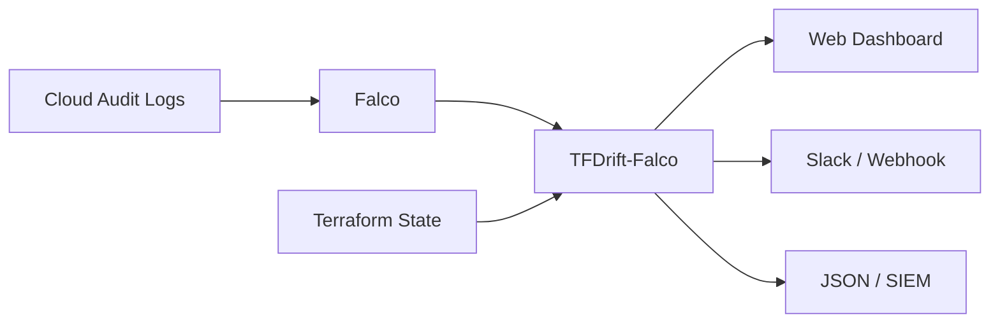
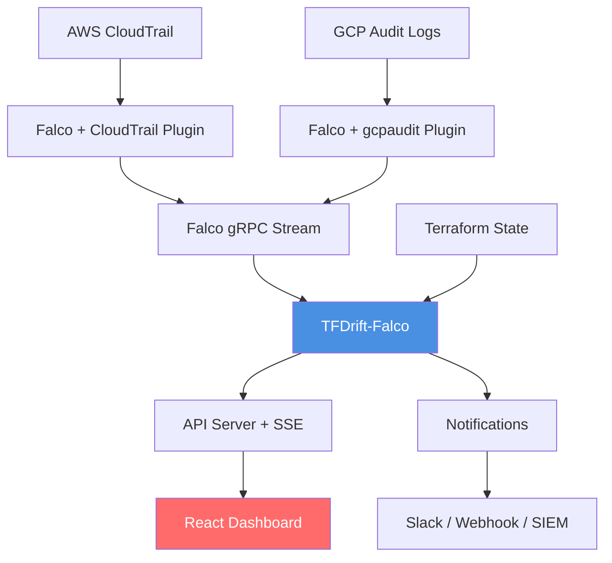

# TFDrift-Falco

**Real-time Terraform Drift Detection powered by Falco**

[](https://github.com/higakikeita/tfdrift-falco/actions/workflows/ci.yml)
[](https://codecov.io/gh/higakikeita/tfdrift-falco)
[](https://goreportcard.com/report/github.com/higakikeita/tfdrift-falco)
[](https://opensource.org/licenses/MIT)

**[English]** | [日本語 (Japanese)](README.ja.md)

---

Someone changes a security group via the AWS Console. Within seconds, TFDrift-Falco detects it, identifies who made the change, and alerts your team — all without running `terraform plan`.

```
CloudTrail Event → Falco → TFDrift-Falco → Compare with Terraform State → Alert
```

## Quick Start

### Prerequisites

- [Docker](https://docs.docker.com/get-docker/) and Docker Compose
- AWS credentials configured (`aws configure` or environment variables)
- A Terraform state file (local or S3)

### 1. Clone and configure

```bash
git clone https://github.com/higakikeita/tfdrift-falco.git
cd tfdrift-falco

# Interactive setup — walks you through AWS region, state backend, and notifications
./quick-start.sh
```

### 2. Launch

```bash
docker compose up -d
```

### 3. Open the dashboard

- **Web UI**: http://localhost:3000
- **API**: http://localhost:8080/api/v1
- **Real-time stream**: http://localhost:8080/api/v1/stream (SSE)

That's it. Drift events will appear in the dashboard as they're detected.

### Common commands

```bash
make start       # Start services
make stop        # Stop services
make logs        # View logs
make status      # Check status
```

> For manual configuration without the setup script, see [Getting Started Guide](docs/GETTING_STARTED.md).

---

## How It Works

TFDrift-Falco combines two data sources that are powerful together:

- **Terraform state** knows *what your infrastructure should look like*
- **Falco** (via CloudTrail/GCP Audit Logs) knows *what actually happened, when, and by whom*

When someone makes a manual change, Falco captures it in real-time via its gRPC stream. TFDrift-Falco compares the change against your Terraform state and, if it's a drift, enriches it with user identity, CloudTrail context, and severity — then sends an alert.


```mermaid
graph LR
    A[Cloud Audit Logs] --> B[Falco]
    B --> C[TFDrift-Falco]
    D[Terraform State] --> C
    C --> E[Web Dashboard]
    C --> F[Slack / Webhook]
    C --> G[JSON / SIEM]
```

> **Want to understand the philosophy behind this approach?** Read [Why Falco?](docs/why-falco.md) — a story about blueprints and witnesses.

---

## Key Features

- **Real-time detection** — Event-driven via Falco gRPC, not periodic scanning
- **User attribution** — Know *who* made each change, not just *what* changed
- **Multi-cloud** — AWS (500+ CloudTrail events, 40+ services) and GCP (170+ Audit Log events, 27+ services)
- **Web dashboard** — React UI with real-time SSE updates, topology graph, and dark/light theme
- **Enterprise security** — JWT authentication, API key auth with SHA-256 hashing, per-client rate limiting
- **API-first** — OpenAPI 3.0 spec with Swagger UI at `/api/docs`, 37 documented endpoints
- **Flexible output** — Slack, Discord, webhooks, JSON (NDJSON), SSE, WebSocket
- **Production-ready** — Helm chart, Docker Compose, Prometheus metrics, operations runbook

---

## Web Dashboard

The React dashboard provides four main views:

| Page | What it shows |
|------|---------------|
| **Dashboard** | Overview stats, severity breakdown, recent events |
| **Events** | Full event history with filtering, sorting, and JSON diff detail |
| **Topology** | Interactive graph visualization of resource relationships |
| **Settings** | Webhooks, detection rules, provider configuration |

### Local development

```bash
cd ui
npm install
npm run dev    # http://localhost:5173
```

---

## Configuration

TFDrift-Falco uses a `config.yaml` file. Start from the example:

```bash
cp config.yaml.example config.yaml
```

Edit `config.yaml` and set your AWS Account ID, Terraform state location, and notification preferences. See the comments in the example file for guidance.

> **Tip**: The `quick-start.sh` script generates this file interactively, so you may not need to edit it manually.

For detailed configuration options, see:
- [Configuration Reference](docs/GETTING_STARTED.md)
- [AWS Setup](docs/falco-setup.md)
- [GCP Setup](docs/gcp-setup.md)

---

## Deployment

### Docker Compose (recommended)

```bash
docker compose up -d
```

### Docker (standalone)

```bash
docker run -d \
  --name tfdrift-falco \
  -e TF_STATE_BACKEND=s3 \
  -e TF_STATE_S3_BUCKET=my-terraform-state \
  -e TF_STATE_S3_KEY=prod/terraform.tfstate \
  -e AWS_REGION=us-east-1 \
  -v ~/.aws:/root/.aws:ro \
  ghcr.io/higakikeita/tfdrift-falco:latest
```

### Kubernetes

```bash
helm install tfdrift ./charts/tfdrift-falco
# or: kubectl apply -f k8s/
```

For production deployment best practices (HA, sizing, security), see [Deployment Guide](docs/deployment.md).

---

## API

REST API is available at `http://localhost:8080/api/v1`:

| Endpoint | Description |
|----------|-------------|
| `GET /api/v1/events` | Drift events (with filtering, sorting, pagination) |
| `GET /api/v1/events/{id}` | Event detail with JSON diff |
| `GET /api/v1/graph` | Topology graph data |
| `GET /api/v1/stats` | Dashboard statistics |
| `GET /api/v1/stream` | SSE real-time event stream |
| `POST /api/v1/auth/token` | Generate JWT token |
| `POST /api/v1/auth/api-keys` | Create / list / revoke API keys |
| `WS /ws` | WebSocket for bidirectional communication |
| `GET /api/docs` | Swagger UI (OpenAPI 3.0) |
| `GET /health` | Health check (public, no auth) |

Full API documentation: [API Reference](docs/api/README.md) | [OpenAPI Spec](docs/api/openapi.yaml)

---

## Integrations

TFDrift-Falco outputs structured JSON events compatible with most monitoring and security tools:

- **Slack / Discord / Microsoft Teams** — Built-in webhook formatters
- **SIEM** (Splunk, Datadog, Sysdig) — NDJSON output or webhook integration
- **Grafana** — Pre-built dashboards with Loki backend ([setup guide](dashboards/grafana/GETTING_STARTED.md))
- **PagerDuty** — Webhook integration for on-call alerting
- **Custom APIs** — Configurable webhook with auth headers and retry logic

See [Webhook Configuration](docs/GETTING_STARTED.md) and [Integration Examples](docs/use-cases.md) for details.

---

## Cloud Coverage

<details>
<summary><strong>AWS</strong> — 500+ CloudTrail events across 40+ services</summary>

Key services: VPC/Networking, IAM, S3, EC2, RDS, EKS, ECS, Lambda, DynamoDB, CloudWatch, API Gateway, KMS, WAF, and more.

See [AWS Resource Coverage Analysis](docs/AWS_RESOURCE_COVERAGE_ANALYSIS.md) for the full list.
</details>

<details>
<summary><strong>GCP</strong> — 170+ Audit Log events across 27+ services</summary>

Key services: Compute Engine, Cloud Storage, Cloud SQL, GKE, Cloud Run, IAM, VPC, BigQuery, Pub/Sub, KMS, and more.

See [GCP Setup Guide](docs/gcp-setup.md) for the full list.
</details>

**Azure** support is in progress (tracking via [roadmap](docs/architecture.md)).

---

## Architecture


```mermaid
graph TB
    A[AWS CloudTrail] --> B[Falco + CloudTrail Plugin]
    A2[GCP Audit Logs] --> B2[Falco + gcpaudit Plugin]
    B --> C[Falco gRPC Stream]
    B2 --> C
    C --> D[TFDrift-Falco]
    E[Terraform State] --> D
    D --> F[API Server + SSE]
    D --> G[Notifications]
    F --> H[React Dashboard]
    G --> I[Slack / Webhook / SIEM]

    style D fill:#4A90E2,color:#fff
    style H fill:#FF6B6B,color:#fff
```

| Component | Role |
|-----------|------|
| **Falco Subscriber** | Connects to Falco gRPC and receives cloud audit events |
| **State Loader** | Syncs Terraform state from local, S3, or GCS |
| **Drift Engine** | Compares runtime changes against IaC definitions |
| **Context Enricher** | Adds user identity, resource tags, CloudTrail context |
| **API Server** | REST API + SSE broadcaster for the web dashboard |
| **Notifier** | Sends alerts to Slack, Discord, webhooks |

---

## Project Structure

```
tfdrift-falco/
├── cmd/tfdrift/       # CLI entry point
├── pkg/               # Core Go packages
│   ├── api/           # REST API server
│   ├── detector/      # Drift detection engine
│   ├── falco/         # Falco gRPC integration
│   ├── terraform/     # State parsing
│   ├── graph/         # Topology graph store
│   └── notifier/      # Notification handlers
├── ui/                # React web dashboard
├── charts/            # Helm chart
├── dashboards/        # Grafana dashboards
├── docs/              # Documentation
└── scripts/           # Build and deployment scripts
```

---

## Contributing

Contributions are welcome! See [CONTRIBUTING.md](CONTRIBUTING.md) for development setup, testing, and code style guidelines.

```bash
git clone https://github.com/higakikeita/tfdrift-falco.git
cd tfdrift-falco
go mod download
go test ./...
make build
```

---

## Documentation

| Document | Description |
|----------|-------------|
| [Getting Started](docs/GETTING_STARTED.md) | Step-by-step setup guide |
| [AWS Falco Setup](docs/falco-setup.md) | CloudTrail plugin configuration |
| [GCP Setup](docs/gcp-setup.md) | GCP Audit Log plugin configuration |
| [API Reference](docs/api/README.md) | REST API endpoints and usage |
| [Deployment Guide](docs/deployment.md) | Docker, Kubernetes, production best practices |
| [Use Cases](docs/use-cases.md) | Security, compliance, cost management examples |
| [Best Practices](docs/best-practices.md) | Production operation guide |
| [Grafana Dashboards](dashboards/grafana/GETTING_STARTED.md) | Monitoring dashboard setup |
| [Why Falco?](docs/why-falco.md) | The philosophy behind event-driven drift detection |
| [Architecture](docs/architecture.md) | System design overview |
| [CHANGELOG](CHANGELOG.md) | Version history |

---

## License

MIT License — see [LICENSE](LICENSE) for details.

## Contact

- **Author**: Keita Higaki
- **GitHub**: [@higakikeita](https://github.com/higakikeita)
- **X**: [@keitah0322](https://x.com/keitah0322)
