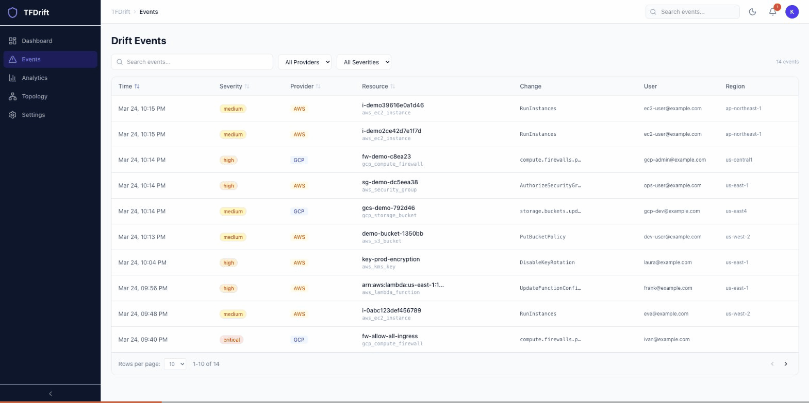
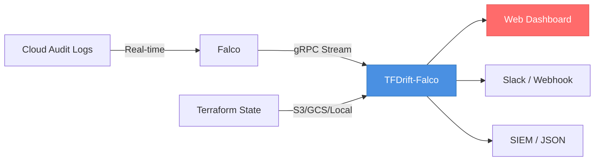

<p align="center">
  <h1 align="center">TFDrift-Falco</h1>
  <p align="center">
    <strong>Drift is not risk. Runtime makes it real.</strong>
  </p>
  <p align="center">
    Real-time Terraform drift detection powered by Falco runtime security.<br/>
    Detect manual cloud changes in seconds — not hours — with full user attribution.
  </p>
  <p align="center">
    <a href="https://github.com/higakikeita/tfdrift-falco/actions/workflows/ci.yml"></a>
    <a href="https://codecov.io/gh/higakikeita/tfdrift-falco"></a>
    <a href="https://goreportcard.com/report/github.com/higakikeita/tfdrift-falco"></a>
    <a href="https://opensource.org/licenses/MIT"></a>
  </p>
</p>

**[English]** | [日本語 (Japanese)](README.ja.md) | [Documentation](https://higakikeita.github.io/tfdrift-falco/)

---

<p align="center">
  
</p>

## The Problem

Someone opens the AWS Console and changes a security group. Terraform doesn't know. Your next `terraform plan` is 6 hours away. By then, the blast radius has grown.

**Traditional drift detection tools poll.** They run `terraform plan` on a schedule — 15 minutes at best, hours at worst. That gap is where incidents happen.

## The Solution

TFDrift-Falco is **event-driven**. It hooks into Falco's real-time stream of cloud audit events (CloudTrail, GCP Audit Logs) and cross-references them against your Terraform state — **in seconds, not hours.**

```
Console/CLI change → CloudTrail → Falco → TFDrift-Falco → Alert + Dashboard
                                                  ↑
                                          Terraform State
```

You get not just *what* drifted, but *who* did it, *when*, and *why it matters*.

---

## Try It in 60 Seconds

```bash
git clone https://github.com/higakikeita/tfdrift-falco.git
cd tfdrift-falco
make demo
```

This spins up the full stack locally with sample data so you can explore the dashboard, API, and alerts without any cloud credentials.

> **Production setup?** Run `./quick-start.sh` for interactive configuration with your real AWS/GCP environment.

---

## What You Get

| | Feature | Why it matters |
|---|---------|----------------|
| ⚡ | **Real-time detection** | Event-driven via Falco gRPC — no polling, no cron, sub-second latency |
| 👤 | **User attribution** | Every drift event tagged with IAM identity, IP, and session context |
| 🌍 | **Multi-cloud** | AWS (500+ CloudTrail events, 40+ services) + GCP (170+ events, 27+ services) |
| 📊 | **Web dashboard** | React UI with live SSE updates, topology graph, dark/light theme |
| 🔒 | **Enterprise auth** | JWT + API key (SHA-256 hashed), per-client rate limiting |
| 🔌 | **API-first** | OpenAPI 3.0, 37 endpoints, Swagger UI at `/api/docs` |
| 📣 | **Flexible alerting** | Slack, Discord, Teams, PagerDuty, webhooks, SIEM (NDJSON) |
| 🚀 | **Production-ready** | Helm chart, Docker Compose, Prometheus metrics, operations runbook |

---

## How It Works


```mermaid
graph LR
    A[Cloud Audit Logs] -->|Real-time| B[Falco]
    B -->|gRPC Stream| C[TFDrift-Falco]
    D[Terraform State] -->|S3/GCS/Local| C
    C --> E[Web Dashboard]
    C --> F[Slack / Webhook]
    C --> G[SIEM / JSON]

    style C fill:#4A90E2,color:#fff,stroke:#357ABD
    style E fill:#FF6B6B,color:#fff,stroke:#E55A5A
```

| Component | Role |
|-----------|------|
| **Falco Subscriber** | Connects to Falco gRPC, receives cloud audit events in real-time |
| **State Loader** | Syncs Terraform state from local, S3, or GCS backends |
| **Drift Engine** | Compares runtime changes against IaC definitions |
| **Context Enricher** | Adds user identity, resource tags, CloudTrail context |
| **API Server** | REST API + SSE broadcaster for the web dashboard |
| **Notifier** | Routes alerts to Slack, Discord, webhooks, SIEM |

> **Deep dive:** [Why Falco?](docs/why-falco.md) — A story about blueprints and witnesses.

---

## Cloud Coverage

<details>
<summary><strong>AWS</strong> — 500+ CloudTrail events across 40+ services</summary>

EC2, VPC, IAM, S3, RDS, EKS, ECS, Lambda, DynamoDB, CloudWatch, API Gateway, KMS, WAF, Route53, CloudFront, SNS, SQS, ECR, and more.

Full list: [AWS Resource Coverage](docs/AWS_RESOURCE_COVERAGE_ANALYSIS.md)
</details>

<details>
<summary><strong>GCP</strong> — 170+ Audit Log events across 27+ services</summary>

Compute Engine, Cloud Storage, Cloud SQL, GKE, Cloud Run, IAM, VPC, BigQuery, Pub/Sub, KMS, Secret Manager, Cloud Functions, and more.

Full list: [GCP Setup Guide](docs/gcp-setup.md)
</details>

<details>
<summary><strong>Azure</strong> — In Progress</summary>

Azure support is actively under development. Track progress in the [Architecture doc](docs/architecture.md).
</details>

---

## Quick Reference

### Common Commands

```bash
make start       # Start all services
make stop        # Stop all services
make demo        # Launch demo with sample data
make logs        # Tail logs
make status      # Check running containers
```

### API Endpoints

```bash
# Drift events
curl http://localhost:8080/api/v1/events

# Real-time stream (SSE)
curl http://localhost:8080/api/v1/stream

# Dashboard stats
curl http://localhost:8080/api/v1/stats

# Health check
curl http://localhost:8080/health
```

### Deployment Options

```bash
# Docker Compose (recommended)
docker compose up -d

# Kubernetes / Helm
helm install tfdrift ./charts/tfdrift-falco

# Standalone Docker
docker run -d ghcr.io/higakikeita/tfdrift-falco:latest
```

---

## Documentation

| | Document | |
|---|----------|---|
| 🚀 | [Getting Started](docs/GETTING_STARTED.md) | Step-by-step setup |
| ☁️ | [AWS Setup](docs/falco-setup.md) | CloudTrail + Falco config |
| ☁️ | [GCP Setup](docs/gcp-setup.md) | Audit Log + Falco config |
| 📡 | [API Reference](docs/api/README.md) | REST, SSE, WebSocket |
| 🏗️ | [Architecture](docs/architecture.md) | System design |
| 📦 | [Deployment](docs/deployment.md) | Docker, K8s, production |
| 🔧 | [Best Practices](docs/best-practices.md) | Production operations |
| 📊 | [Grafana Dashboards](dashboards/grafana/GETTING_STARTED.md) | Monitoring |
| 📝 | [CHANGELOG](CHANGELOG.md) | Version history |

Full docs site: **[higakikeita.github.io/tfdrift-falco](https://higakikeita.github.io/tfdrift-falco/)**

---

## Contributing

Contributions welcome! See [CONTRIBUTING.md](CONTRIBUTING.md) for guidelines.

```bash
git clone https://github.com/higakikeita/tfdrift-falco.git
cd tfdrift-falco
make init    # Set up dev environment
make check   # Run fmt + lint + test
```

---

## Why TFDrift-Falco?

Most drift detection tools are **reactive** — they scan on a schedule and tell you what *already* drifted. TFDrift-Falco is **proactive** — it catches changes *as they happen* and tells you who made them.

This matters because:

- **Faster MTTR** — Alert in seconds, not hours. Fix drift before it cascades.
- **Accountability** — Full audit trail with IAM user, IP, and session context.
- **Zero blind spots** — Every CloudTrail/Audit Log event, not just what `terraform plan` checks.
- **Runtime context** — Falco provides security context that pure IaC tools can't.

---

<p align="center">
  <strong>If this is useful, consider giving it a ⭐</strong><br/>
  It helps others discover the project.
</p>

<p align="center">
  <a href="https://github.com/higakikeita/tfdrift-falco">
    
  </a>
</p>

---

## License

MIT License — see [LICENSE](LICENSE) for details.

**Author:** [Keita Higaki](https://github.com/higakikeita) · [X: @keitah0322](https://x.com/keitah0322)
