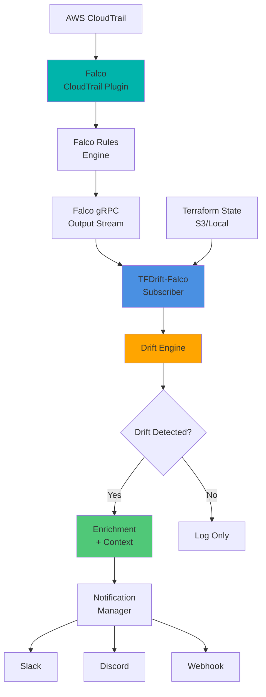

# なぜFalcoなのか - 地図と目撃者の物語

## はじめに

[TFDrift-Falco](https://github.com/higakikeita/tfdrift-falco) は、Falco を使って Terraform のドリフト（状態のズレ）をリアルタイムに検知する OSS ツールです。

しかし、なぜ「Falco」を間に挟む必要があるのでしょうか？
Terraform だけではダメなのでしょうか？

この問いに答えるため、技術的な説明の前に、一つの物語からお話しします。

---

## 📖 物語｜「地図」と「目撃者」

### 第1章：完璧な地図を持つ街

ある街には、とても優秀な設計士がいました。
彼は街のすべてを **地図（Terraform）** に書きました。

- 家はここ
- 道路はこう
- 門はこの大きさ
- 鍵はこの数

その地図は完璧でした。
誰が見ても「理想の街」でした。

### 第2章：地図は"今"を語らない

ところがある日、問題が起きます。

- 夜中に誰かが門を付け替えた
- 朝には鍵が一つ増えていた
- でも地図は… 何も変わっていない

設計士は言います。

> 「おかしい。地図では、そんな変更はしていないはずだ」

彼は翌朝、街を歩いて回り、地図と現実を見比べました。

そしてようやく気づきます。

> 「……あ、変わってる」

### 第3章：でも遅すぎた

設計士はわかりました。

✅ 何が変わったか
✅ どこが違うか

でも、分からないことが多すぎました。

❓ **誰がやったのか**
❓ **いつやったのか**
❓ **なぜやったのか**

地図は「結果」しか語らない。
**行為の瞬間** は、どこにも書いていないのです。

### 第4章：目撃者の登場

そこで街は、ある人物を雇いました。

それが **Falco**。
彼は設計士ではありません。
警察でもありません。

ただの **"目撃者"** です。

### 第5章：Falcoの仕事

Falco は、街を作りません。
地図も引きません。

彼がやるのは、たった一つ。

> **「誰かが"何かをした瞬間"を見ること」**

- 誰が
- いつ
- どの門に
- どんな手を伸ばしたか

変わった"あと"ではなく、
**変えようとした"瞬間"** を見る。

### 第6章：ある夜の出来事

真夜中。
街が眠っている時間。

Falco は見ました。

- 見慣れない人物が
- 本来使わない道から
- 門の鍵に手をかけた瞬間を

その瞬間、Falco は叫びます。

> 「今だ。これは"いつもの街"じゃない」

### 第7章：地図と目撃者が出会う

設計士は、Falco の話を聞きます。

> 「誰が、いつ、どこを触った？」

設計士は地図を開きます。

> 「その変更は……地図には存在しない」

その瞬間、2人は理解します。

### 第8章：役割の違い

**地図（Terraform）**
→ 「あるべき姿」を知っている

**目撃者（Falco）**
→ 「実際に起きた行為」を知っている

どちらか一方では、街は守れない。

### 第9章：なぜFalcoなのか

Falco が特別なのは、
**結果ではなく"行為"を語るから**。

- 状態ではなく、**動作**
- 差分ではなく、**意図**
- リソースではなく、**人**

だから Falco は言える。

> 「この街で"何が起きたか"ではなく、**"なぜ起きたか"**を」

### 最終章：現代の街（クラウド）

今の街は、人間だけで作られていません。

- Bot
- CI/CD
- 自動化
- AI Agent

変更は一瞬で起きる。

だからこそ必要なのは、

**後から見る監査ではなく、その瞬間を見ていた存在**

---

## 🧠 この物語を一文で

> **Terraform は地図を描く。**
> **Falco は現場を見ている。**

だから、

> **Falco を挟むとは、「クラウドに"目撃者"を置くこと」**

---

## 🔧 技術的な背景

### 従来のドリフト検知

一般的なドリフト検知ツール（driftctl など）は：

```bash
# 定期的にスキャン
terraform plan
driftctl scan
```

**見ているもの:**
- ✅ 何が変わったか（結果）
- ❌ 誰が / いつ / なぜ 変えたか（原因）

👉 「事故後の健康診断」に近い

### Falco を挟むと

TFDrift-Falco のアプローチ：

```
IAM User が API を叩いた
  ↓
CloudTrail / Audit Log
  ↓
Falco がイベントを即時検知
  ↓
Terraform State と比較
  ↓
即座にアラート
```

**見ているもの:**
- ✅ 誰が（IAM User、サービスアカウント）
- ✅ いつ（タイムスタンプ）
- ✅ なぜ（API イベント名、コンテキスト）
- ✅ 何を（リソース変更）

👉 「変更される瞬間」を捉える

---

## 📊 比較表

| 観点 | 従来のドリフト検知 | Falco + TFDrift |
|------|-------------------|-----------------|
| **検知対象** | 差分（結果） | 行為（原因） |
| **主語** | リソース | 人 / Role / Bot |
| **時間** | 遅延（定期スキャン） | ほぼリアルタイム |
| **ユーザー特定** | 困難 | CloudTrail から取得 |
| **検知タイミング** | 変更後 | 変更の瞬間 |

---

## 🎯 実用例

### ケース1：セキュリティ違反の即座検知

**シナリオ:**
開発者が本番環境のセキュリティグループを AWS Console から手動変更

**従来のドリフト検知:**
```bash
# 翌日の定期スキャンで発見
$ terraform plan
# "security_groups" が変更されています
```
- ❌ 誰が変更したか不明
- ❌ いつ変更されたか不明
- ❌ なぜ変更したか不明

**TFDrift-Falco:**
```
[2025-01-15 14:32:10] ALERT Drift Detected!
━━━━━━━━━━━━━━━━━━━━━━━━━━━━━━━━━━━━━
Resource:     aws_security_group.web
Type:         Manual Modification

Changed Attribute:
  ingress.0.cidr_blocks: ["10.0.0.0/8"] → ["0.0.0.0/0"]

Context:
  User:         developer@example.com
  Source:       AWS Console (IAM User)
  IP Address:   203.0.113.42
  Region:       ap-northeast-1
  Timestamp:    2025-01-15T14:32:08Z

CloudTrail:
  EventID:      a1b2c3d4-...
  EventName:    AuthorizeSecurityGroupIngress

→ Slack に即時通知
━━━━━━━━━━━━━━━━━━━━━━━━━━━━━━━━━━━━━
```

✅ 誰が: `developer@example.com`
✅ いつ: `14:32:08`（リアルタイム）
✅ なぜ: `AuthorizeSecurityGroupIngress` API 呼び出し
✅ 何を: `0.0.0.0/0` を許可（セキュリティリスク）

---

## 🌐 実装アーキテクチャ



### 動作フロー

1. **AWS Console でリソース変更**
   → CloudTrail にイベント記録

2. **Falco がイベントを検知**
   → CloudTrail Plugin 経由でストリーミング

3. **TFDrift-Falco が受信**
   → Terraform State と比較

4. **ドリフト判定**
   → 差分があれば即座にアラート

5. **通知送信**
   → Slack / Discord / Webhook

---

## 💡 まとめ

### なぜ Falco を挟むのか？

**Terraform だけでは「結果」しか分からない。**
**Falco があることで「原因」が見える。**

| ツール | 役割 |
|--------|------|
| **Terraform** | 「あるべき姿」を定義 |
| **Falco** | 「実際に起きた行為」を観測 |
| **TFDrift-Falco** | 両者を翻訳して意味を抽出 |

### Falco の本質

Falco は単なるログ収集ツールではありません。
**「行為」を「意図」として解釈するエンジン** です。

- 状態 → 行為
- 差分 → 意図
- リソース → 人

この変換があるから、
**「誰が・なぜ・いつ」が見える** のです。

---

## 🔗 リンク

- **TFDrift-Falco リポジトリ**: https://github.com/higakikeita/tfdrift-falco
- **Falco 公式サイト**: https://falco.org/
- **Sysdig Community**: https://community.sysdig.com/

---

## 🙏 最後に

この物語が、**「なぜ Falco なのか」** の理解の一助になれば幸いです。

技術は時に複雑ですが、本質はシンプルです。

> **地図は「あるべき姿」を語る。**
> **目撃者は「起きた行為」を語る。**

両方があって、初めて街は守られる。

---

**Written by [@keitah0322](https://x.com/keitah0322)**
**GitHub: [@higakikeita](https://github.com/higakikeita)**
**Project: [TFDrift-Falco](https://github.com/higakikeita/tfdrift-falco)**
