# TFDrift-Falco Architecture

> **Version:** v0.5.0+ (Multi-Cloud Support)
> **Supported Providers:** AWS, Google Cloud Platform
> **Status:** Production Ready

## Table of Contents

1. [System Overview](#system-overview)
2. [Component Architecture](#component-architecture)
3. [Data Flow](#data-flow)
4. [Detection Engine](#detection-engine)
5. [Integration Points](#integration-points)
6. [Deployment Models](#deployment-models)
7. [Scalability Considerations](#scalability-considerations)

---

## System Overview

TFDrift-Falco is designed as a **real-time, event-driven, multi-cloud drift detection system** that bridges the gap between Infrastructure-as-Code (IaC) and runtime security monitoring.

**v0.5.0 Multi-Cloud Support:**
- ✅ **AWS** - CloudTrail events, S3 state backend (203 events, 19 services)
- ✅ **GCP** - Audit Logs via Falco gcpaudit plugin, GCS state backend (100+ events, 12+ services)
- 🔄 **Azure** - Planned for future release

### Design Principles

1. **Event-Driven Architecture** - React to changes in real-time, not periodic scans
2. **Security-First** - Enrich infrastructure changes with security context
3. **Cloud-Native** - Designed for containerized, multi-cloud environments
4. **Extensible** - Plugin architecture for custom integrations
5. **Low Overhead** - Minimal performance impact on monitored systems

### High-Level Architecture

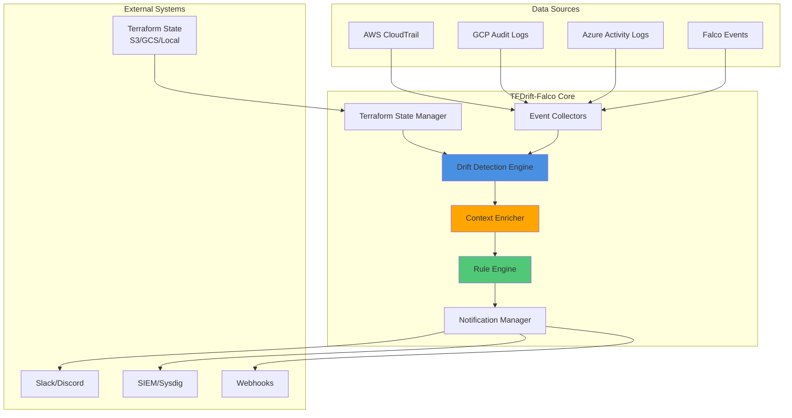

---

## Component Architecture

### 1. Event Collectors

Responsible for ingesting events from various cloud providers and security tools.

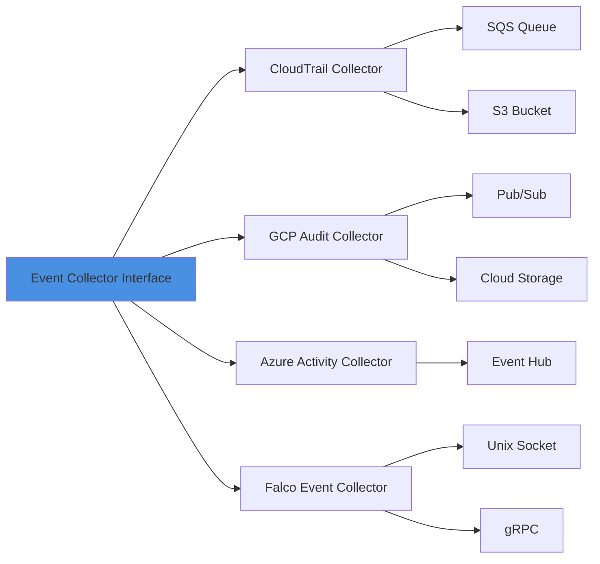

#### CloudTrail Collector

```go
type CloudTrailCollector struct {
    sqsClient    *sqs.Client
    s3Client     *s3.Client
    queueURL     string
    eventChannel chan<- CloudEvent
}

func (c *CloudTrailCollector) Start(ctx context.Context) error {
    // Poll SQS queue for CloudTrail events
    for {
        messages, err := c.sqsClient.ReceiveMessage(ctx, &sqs.ReceiveMessageInput{
            QueueUrl:            &c.queueURL,
            MaxNumberOfMessages: 10,
            WaitTimeSeconds:     20,
        })

        for _, msg := range messages.Messages {
            event := c.parseCloudTrailEvent(msg.Body)
            c.eventChannel <- event
        }
    }
}
```

#### GCP Audit Collector (v0.5.0+)

```go
type GCPAuditCollector struct {
    parser       *gcp.AuditParser
    grpcClient   *client.Client
    eventChannel chan<- CloudEvent
}

func (g *GCPAuditCollector) Start(ctx context.Context) error {
    // Connect to Falco gRPC output with gcpaudit plugin
    fcs, err := g.grpcClient.OutputsWatch(ctx, &outputs.Request{})
    if err != nil {
        return fmt.Errorf("failed to connect to Falco gRPC: %w", err)
    }

    for {
        res, err := fcs.Recv()
        if err != nil {
            return fmt.Errorf("error receiving event: %w", err)
        }

        // Parse GCP Audit Log event from Falco
        event := g.parser.Parse(res)
        if event != nil {
            g.eventChannel <- event
        }
    }
}
```

#### Falco Event Collector

```go
type FalcoCollector struct {
    socketPath   string
    conn         net.Conn
    eventChannel chan<- FalcoEvent
}

func (f *FalcoCollector) Start(ctx context.Context) error {
    conn, err := net.Dial("unix", f.socketPath)
    if err != nil {
        return fmt.Errorf("failed to connect to Falco socket: %w", err)
    }

    scanner := bufio.NewScanner(conn)
    for scanner.Scan() {
        event := f.parseFalcoEvent(scanner.Bytes())
        f.eventChannel <- event
    }
}
```

### 2. Terraform State Manager

Manages synchronization and parsing of Terraform state files.

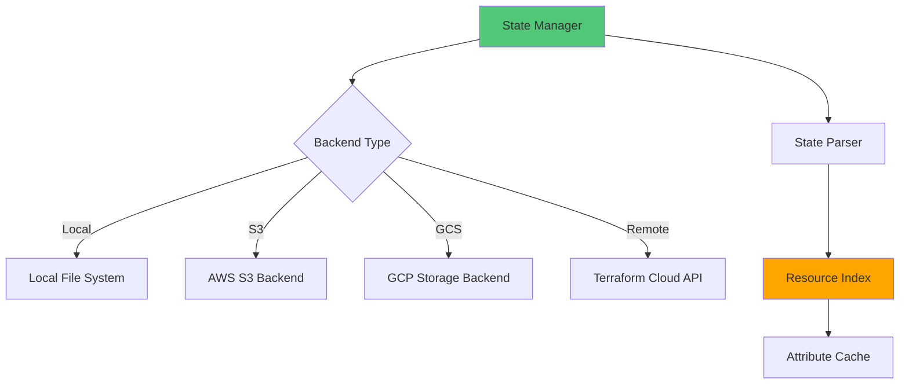

#### State Synchronization Strategy

```yaml
# Synchronization modes
sync_mode:
  periodic:
    interval: "5m"  # Poll every 5 minutes

  event_driven:
    # Sync when Terraform-related events detected
    triggers:
      - "terraform apply"
      - "terraform destroy"

  hybrid:
    # Periodic sync + event-driven sync
    base_interval: "10m"
    event_triggers: true
```

#### State Data Structure

```go
type TerraformState struct {
    Version          int                    `json:"version"`
    TerraformVersion string                 `json:"terraform_version"`
    Resources        []ResourceState        `json:"resources"`
    Outputs          map[string]interface{} `json:"outputs"`
}

type ResourceState struct {
    Mode      string                 `json:"mode"`       // "managed" or "data"
    Type      string                 `json:"type"`       // "aws_instance"
    Name      string                 `json:"name"`       // "webserver"
    Provider  string                 `json:"provider"`   // "provider[\"registry.terraform.io/hashicorp/aws\"]"
    Instances []ResourceInstance     `json:"instances"`
}

type ResourceInstance struct {
    SchemaVersion  int                    `json:"schema_version"`
    Attributes     map[string]interface{} `json:"attributes"`
    AttributesFlat map[string]string      // Flattened for comparison
    Dependencies   []string               `json:"dependencies"`
}
```

### 3. Drift Detection Engine

Core logic for comparing runtime events with IaC definitions.

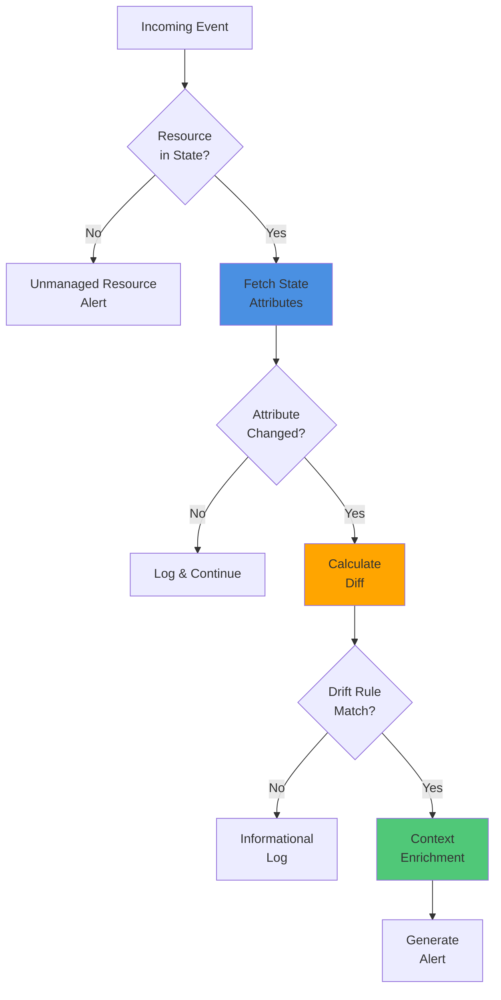

#### Detection Algorithm

```go
type DriftDetector struct {
    stateManager *StateManager
    ruleEngine   *RuleEngine
    enricher     *ContextEnricher
}

func (d *DriftDetector) DetectDrift(event CloudEvent) (*DriftAlert, error) {
    // 1. Extract resource identifier from event
    resourceID := d.extractResourceID(event)

    // 2. Look up resource in Terraform state
    stateResource, exists := d.stateManager.GetResource(resourceID)
    if !exists {
        return &DriftAlert{
            Type:     UnmanagedResource,
            Severity: Medium,
            Message:  fmt.Sprintf("Resource %s not found in Terraform state", resourceID),
        }, nil
    }

    // 3. Extract changed attributes from event
    changedAttrs := d.extractChangedAttributes(event)

    // 4. Compare with state
    diffs := d.compareAttributes(stateResource.Attributes, changedAttrs)
    if len(diffs) == 0 {
        return nil, nil // No drift
    }

    // 5. Evaluate rules
    matchedRules := d.ruleEngine.Evaluate(stateResource.Type, diffs)
    if len(matchedRules) == 0 {
        return nil, nil // Drift exists but no rules match
    }

    // 6. Enrich with context
    enrichedAlert := d.enricher.Enrich(&DriftAlert{
        Type:           AttributeDrift,
        ResourceType:   stateResource.Type,
        ResourceName:   stateResource.Name,
        Diffs:          diffs,
        MatchedRules:   matchedRules,
        SourceEvent:    event,
    })

    return enrichedAlert, nil
}
```

#### Attribute Comparison Logic

```go
func (d *DriftDetector) compareAttributes(
    stateAttrs map[string]interface{},
    eventAttrs map[string]interface{},
) []AttributeDiff {
    var diffs []AttributeDiff

    for key, eventValue := range eventAttrs {
        stateValue, exists := stateAttrs[key]

        if !exists {
            diffs = append(diffs, AttributeDiff{
                Attribute: key,
                OldValue:  nil,
                NewValue:  eventValue,
                ChangeType: "added",
            })
            continue
        }

        if !d.valuesEqual(stateValue, eventValue) {
            diffs = append(diffs, AttributeDiff{
                Attribute:  key,
                OldValue:   stateValue,
                NewValue:   eventValue,
                ChangeType: "modified",
            })
        }
    }

    return diffs
}
```

### 4. Context Enricher

Adds security and operational context to detected drifts.

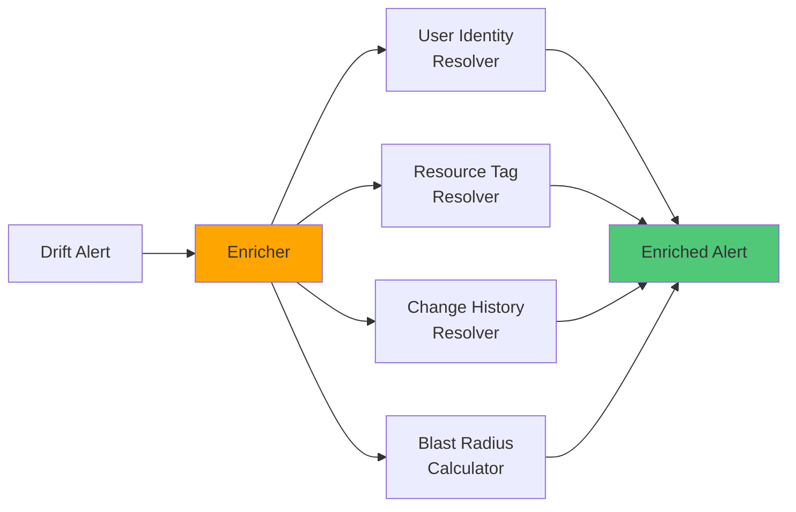

#### Enrichment Pipeline

```go
type ContextEnricher struct {
    identityResolver *IdentityResolver
    tagResolver      *TagResolver
    historyResolver  *HistoryResolver
    blastRadius      *BlastRadiusCalculator
}

func (e *ContextEnricher) Enrich(alert *DriftAlert) *EnrichedDriftAlert {
    enriched := &EnrichedDriftAlert{
        DriftAlert: alert,
    }

    // 1. Resolve user identity
    enriched.UserContext = e.identityResolver.Resolve(alert.SourceEvent)

    // 2. Fetch resource tags
    enriched.ResourceTags = e.tagResolver.FetchTags(alert.ResourceID)

    // 3. Get change history
    enriched.ChangeHistory = e.historyResolver.GetHistory(
        alert.ResourceID,
        time.Now().Add(-7*24*time.Hour), // Last 7 days
        time.Now(),
    )

    // 4. Calculate blast radius
    enriched.BlastRadius = e.blastRadius.Calculate(alert.ResourceID)

    // 5. Add runbook links
    enriched.RunbookURL = e.generateRunbookURL(alert)

    return enriched
}
```

### 5. Rule Engine

Evaluates drift detection rules against detected changes.

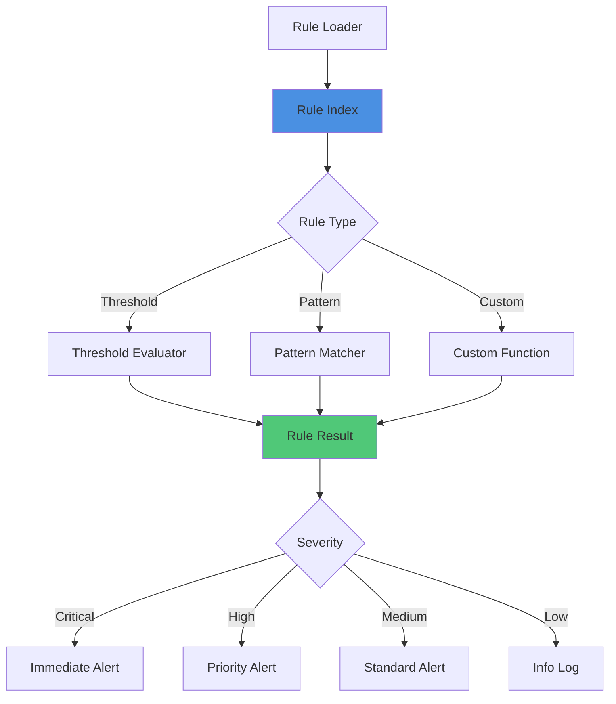

#### Rule Definition Format

```yaml
# rules/aws-security-critical.yaml
rules:
  - id: "aws-001"
    name: "EC2 Termination Protection Disabled"
    description: "Detects when termination protection is disabled on production EC2 instances"
    resource_types:
      - "aws_instance"
    conditions:
      - attribute: "disable_api_termination"
        operator: "changed"
        from: true
        to: false
      - attribute: "tags.Environment"
        operator: "equals"
        value: "production"
    severity: "critical"
    actions:
      - type: "alert"
        channels: ["slack", "pagerduty"]
      - type: "create_ticket"
        system: "jira"
    remediation:
      - "Review change with user who made the modification"
      - "Re-enable termination protection if unauthorized"
      - "Run: aws ec2 modify-instance-attribute --instance-id {instance_id} --disable-api-termination"
    runbook: "https://wiki.example.com/runbooks/ec2-termination-protection"

  - id: "aws-002"
    name: "IAM Policy Modification"
    description: "Detects modifications to IAM policies"
    resource_types:
      - "aws_iam_policy"
      - "aws_iam_role_policy"
    conditions:
      - attribute: "policy"
        operator: "changed"
    severity: "high"
    filters:
      # Ignore changes by Terraform automation user
      - user_identity:
          type: "AssumedRole"
          principal_id: "AIDAI***TERRAFORM"
        action: "skip"
    actions:
      - type: "alert"
        channels: ["slack"]
      - type: "audit_log"

# rules/gcp-security-critical.yaml (v0.5.0+)
rules:
  - id: "gcp-001"
    name: "GCP Firewall Rule Modification"
    description: "Detects modifications to GCP firewall rules"
    resource_types:
      - "google_compute_firewall"
    conditions:
      - attribute: "allowed"
        operator: "changed"
      - attribute: "source_ranges"
        operator: "changed"
    severity: "critical"
    actions:
      - type: "alert"
        channels: ["slack", "pagerduty"]
    remediation:
      - "Review change with user who made the modification"
      - "Verify the firewall rule change is authorized"
      - "Revert with: terraform apply to restore state"
    runbook: "https://wiki.example.com/runbooks/gcp-firewall-rules"

  - id: "gcp-002"
    name: "GCS Bucket IAM Policy Change"
    description: "Detects IAM policy changes on GCS buckets"
    resource_types:
      - "google_storage_bucket_iam_binding"
    conditions:
      - attribute: "members"
        operator: "changed"
    severity: "high"
    filters:
      # Ignore changes by Terraform service account
      - user_identity:
          principal_email: "*@*-terraform.iam.gserviceaccount.com"
        action: "skip"
    actions:
      - type: "alert"
        channels: ["slack"]
```

#### Rule Evaluation Engine

```go
type RuleEngine struct {
    rules map[string]*DriftRule
}

func (r *RuleEngine) Evaluate(
    resourceType string,
    diffs []AttributeDiff,
) []*MatchedRule {
    var matched []*MatchedRule

    for _, rule := range r.rules {
        if !r.resourceTypeMatches(rule, resourceType) {
            continue
        }

        if r.conditionsMatch(rule, diffs) {
            matched = append(matched, &MatchedRule{
                Rule:     rule,
                MatchedConditions: r.getMatchedConditions(rule, diffs),
            })
        }
    }

    // Sort by severity
    sort.Slice(matched, func(i, j int) bool {
        return matched[i].Rule.Severity > matched[j].Rule.Severity
    })

    return matched
}
```

### 6. Notification Manager

Handles alert distribution to configured channels.

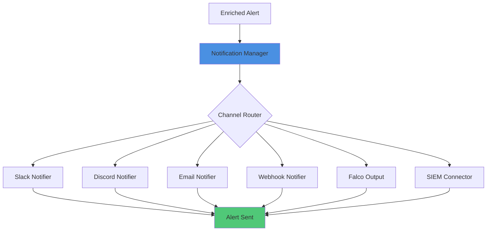

#### Notification Pipeline

```go
type NotificationManager struct {
    notifiers map[string]Notifier
    rateLimit *RateLimiter
    deduper   *Deduplicator
}

func (n *NotificationManager) Send(alert *EnrichedDriftAlert) error {
    // 1. Deduplicate
    if n.deduper.IsDuplicate(alert) {
        return nil
    }

    // 2. Apply rate limiting
    if !n.rateLimit.Allow(alert.Severity) {
        return ErrRateLimited
    }

    // 3. Get channels for this alert
    channels := alert.GetNotificationChannels()

    // 4. Send to each channel
    var errs []error
    for _, channelName := range channels {
        notifier, exists := n.notifiers[channelName]
        if !exists {
            continue
        }

        if err := notifier.Send(alert); err != nil {
            errs = append(errs, fmt.Errorf("channel %s: %w", channelName, err))
        }
    }

    if len(errs) > 0 {
        return fmt.Errorf("notification errors: %v", errs)
    }

    return nil
}
```

---

## Data Flow

### End-to-End Drift Detection Flow

This example shows AWS CloudTrail flow. For GCP (v0.5.0+), the flow is similar but uses GCP Audit Logs via Falco's gcpaudit plugin instead of CloudTrail.

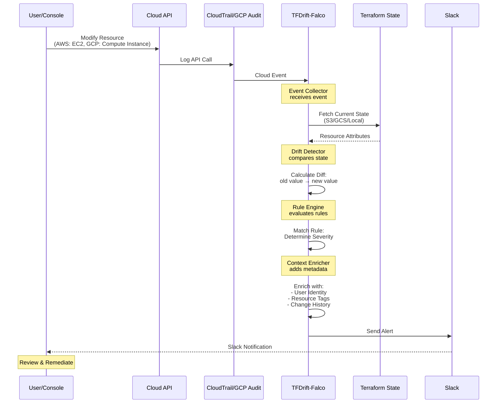

### Event Processing Pipeline

```
┌─────────────────────────────────────────────────────────────┐
│                    Event Ingestion Layer                     │
├─────────────────────────────────────────────────────────────┤
│  CloudTrail │ GCP Audit │ Azure Logs │ Falco Events         │
└───────┬─────────────────────────────────────────────────────┘
        │
        ▼
┌─────────────────────────────────────────────────────────────┐
│              Event Normalization & Filtering                 │
├─────────────────────────────────────────────────────────────┤
│  • Parse event structure                                     │
│  • Extract resource identifiers                              │
│  • Filter by configured event types                          │
└───────┬─────────────────────────────────────────────────────┘
        │
        ▼
┌─────────────────────────────────────────────────────────────┐
│                 Terraform State Lookup                       │
├─────────────────────────────────────────────────────────────┤
│  • Query resource in state index                             │
│  • Fetch current attribute values                            │
│  • Retrieve resource dependencies                            │
└───────┬─────────────────────────────────────────────────────┘
        │
        ▼
┌─────────────────────────────────────────────────────────────┐
│                    Drift Detection                           │
├─────────────────────────────────────────────────────────────┤
│  • Compare event data with state                             │
│  • Calculate attribute diffs                                 │
│  • Classify drift type                                       │
└───────┬─────────────────────────────────────────────────────┘
        │
        ▼
┌─────────────────────────────────────────────────────────────┐
│                    Rule Evaluation                           │
├─────────────────────────────────────────────────────────────┤
│  • Match resource type rules                                 │
│  • Evaluate conditions                                       │
│  • Determine severity                                        │
└───────┬─────────────────────────────────────────────────────┘
        │
        ▼
┌─────────────────────────────────────────────────────────────┐
│                 Context Enrichment                           │
├─────────────────────────────────────────────────────────────┤
│  • Resolve user identity                                     │
│  • Fetch resource tags                                       │
│  • Get change history                                        │
│  • Calculate blast radius                                    │
└───────┬─────────────────────────────────────────────────────┘
        │
        ▼
┌─────────────────────────────────────────────────────────────┐
│                  Alert Generation                            │
├─────────────────────────────────────────────────────────────┤
│  • Format alert message                                      │
│  • Add runbook links                                         │
│  • Generate remediation steps                                │
└───────┬─────────────────────────────────────────────────────┘
        │
        ▼
┌─────────────────────────────────────────────────────────────┐
│              Notification Distribution                       │
├─────────────────────────────────────────────────────────────┤
│  Slack │ Email │ PagerDuty │ SIEM │ Webhook                 │
└─────────────────────────────────────────────────────────────┘
```

---

## Integration Points

### Falco Integration

TFDrift-Falco integrates with Falco for both AWS CloudTrail events and GCP Audit Logs (v0.5.0+).

**Supported Falco Plugins:**
- **cloudtrail** - AWS CloudTrail events for AWS infrastructure monitoring
- **gcpaudit** (v0.5.0+) - GCP Audit Logs via Pub/Sub for GCP infrastructure monitoring

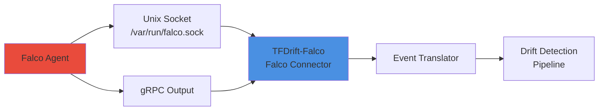

#### Falco Rules for Terraform Detection

```yaml
# falco-rules-terraform.yaml
- rule: Terraform State File Accessed
  desc: Detect access to Terraform state files
  condition: >
    evt.type in (open, openat) and
    fd.name glob "*.tfstate*" and
    not proc.name in (terraform, tfdrift)
  output: >
    Unauthorized access to Terraform state file
    (user=%user.name file=%fd.name process=%proc.name)
  priority: WARNING
  tags: [terraform, drift, state]

- rule: AWS API Call Without Terraform
  desc: Detect AWS API calls not made by Terraform
  condition: >
    cloud.provider="aws" and
    cloud.operation in (ModifyInstanceAttribute, PutBucketPolicy) and
    not user.name startswith "terraform-"
  output: >
    AWS API call outside Terraform workflow
    (user=%cloud.user operation=%cloud.operation resource=%cloud.resource)
  priority: NOTICE
  tags: [aws, terraform, drift]

- rule: GCP Resource Modification Without Terraform
  desc: Detect GCP Audit Log events not made by Terraform (v0.5.0+)
  condition: >
    gcp.methodName in (compute.instances.setMetadata, compute.firewalls.update, storage.buckets.update) and
    not gcp.authenticationInfo.principalEmail contains "terraform"
  output: >
    GCP resource modified outside Terraform workflow
    (user=%gcp.authenticationInfo.principalEmail method=%gcp.methodName resource=%gcp.resource.name)
  priority: NOTICE
  tags: [gcp, terraform, drift]
```

### Sysdig Secure Integration

```yaml
# Sysdig Secure Policy
policies:
  - name: "Terraform Drift Detection"
    description: "Alert on infrastructure changes outside IaC"
    enabled: true
    severity: "high"

    rules:
      - type: "falco"
        falco_rule: "AWS API Call Without Terraform"

      - type: "custom"
        condition: |
          evt.type = cloudtrail and
          aws.eventName in (ModifyInstanceAttribute, UpdateAssumeRolePolicy) and
          not aws.userIdentity.principalId contains "terraform"

    actions:
      - type: "webhook"
        endpoint: "http://tfdrift-falco:8080/webhook/sysdig"

      - type: "slack"
        channel: "#security-drift"

      - type: "create_incident"
```

---

## Deployment Models

### 1. Standalone Deployment

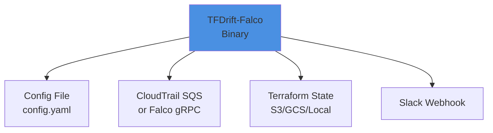

```bash
# Run as standalone daemon
tfdrift --config /etc/tfdrift/config.yaml --daemon

# Multi-cloud example: Monitor both AWS and GCP (v0.5.0+)
# - AWS: CloudTrail events via SQS
# - GCP: Audit Logs via Falco gcpaudit plugin
# - Terraform state: S3 (AWS), GCS (GCP), or unified backend
```

### 2. Kubernetes Sidecar Deployment

```yaml
# k8s-deployment.yaml
apiVersion: apps/v1
kind: Deployment
metadata:
  name: app-with-tfdrift
spec:
  template:
    spec:
      containers:
        - name: app
          image: myapp:latest

        - name: tfdrift-falco
          image: keitahigaki/tfdrift-falco:latest
          volumeMounts:
            - name: config
              mountPath: /config
            - name: falco-socket
              mountPath: /var/run/falco
          env:
            - name: TFDRIFT_CONFIG
              value: /config/config.yaml

      volumes:
        - name: config
          configMap:
            name: tfdrift-config
        - name: falco-socket
          hostPath:
            path: /var/run/falco
```

### 3. Centralized Monitoring Deployment

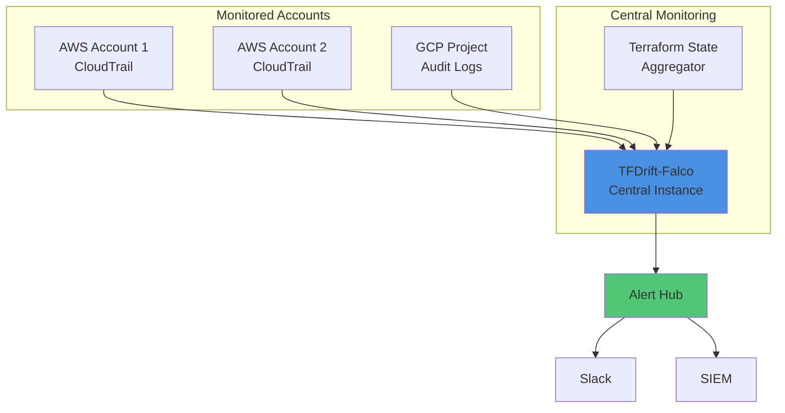

---

## Scalability Considerations

### Performance Metrics

| Metric | Target | Notes |
|--------|--------|-------|
| Event Processing Latency | < 5s | From event to alert |
| Throughput | 10,000 events/sec | Per instance |
| State Sync Latency | < 30s | For 1000 resources |
| Memory Usage | < 512MB | Base + 1MB per 100 resources |
| CPU Usage | < 200m | Idle, spikes to 1 core during detection |

### Horizontal Scaling

```yaml
# Partition by cloud account or region
deployment:
  replicas: 3

  partitioning:
    strategy: "hash"  # or "range", "custom"
    key: "aws_account_id"

    partitions:
      - instance: 1
        accounts: ["111111111111", "222222222222"]

      - instance: 2
        accounts: ["333333333333"]

      - instance: 3
        accounts: ["444444444444", "555555555555"]
```

### Caching Strategy

```go
type CacheManager struct {
    stateCache    *cache.LRU  // Terraform state
    ruleCache     *cache.LRU  // Evaluated rules
    identityCache *cache.LRU  // User identity resolution
}

// Cache TTLs
const (
    StateCacheTTL    = 5 * time.Minute
    RuleCacheTTL     = 1 * time.Hour
    IdentityCacheTTL = 15 * time.Minute
)
```

---

## Security Considerations

### Sensitive Data Handling

1. **Terraform State** - May contain secrets
   - Encrypt at rest and in transit
   - Use least-privilege IAM roles
   - Mask sensitive attributes in logs

2. **CloudTrail Events** - Contain user identities
   - Comply with data retention policies
   - Anonymize if required

3. **Notification Messages** - May leak infrastructure details
   - Configurable redaction rules
   - Secure webhook endpoints (HTTPS + auth)

### Authentication & Authorization

```yaml
# RBAC example
rbac:
  enabled: true

  roles:
    - name: "admin"
      permissions: ["read", "write", "delete"]

    - name: "viewer"
      permissions: ["read"]

  users:
    - email: "sre-team@example.com"
      role: "admin"

    - email: "dev-team@example.com"
      role: "viewer"
```

---

## Future Architecture Enhancements

### Phase 2: Machine Learning Integration

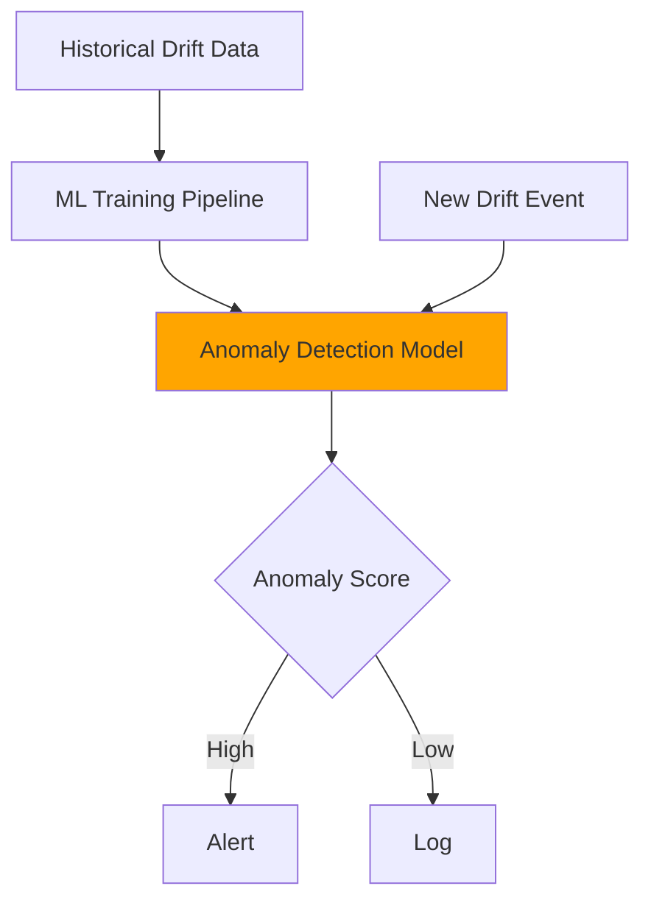

### Phase 3: Auto-Remediation

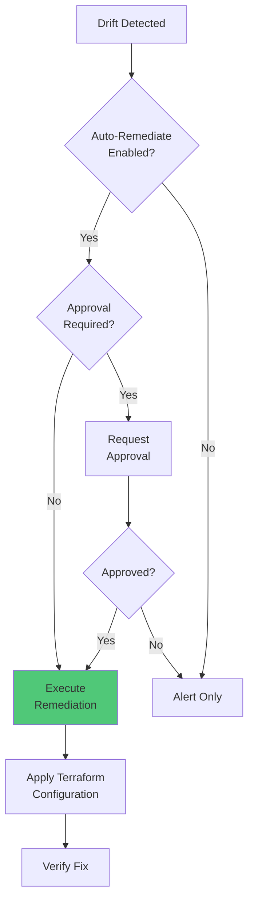

---

**Document Version:** 1.1 (v0.5.0 Multi-Cloud Update)
**Last Updated:** 2025-01-18
**Maintainer:** Keita Higaki
