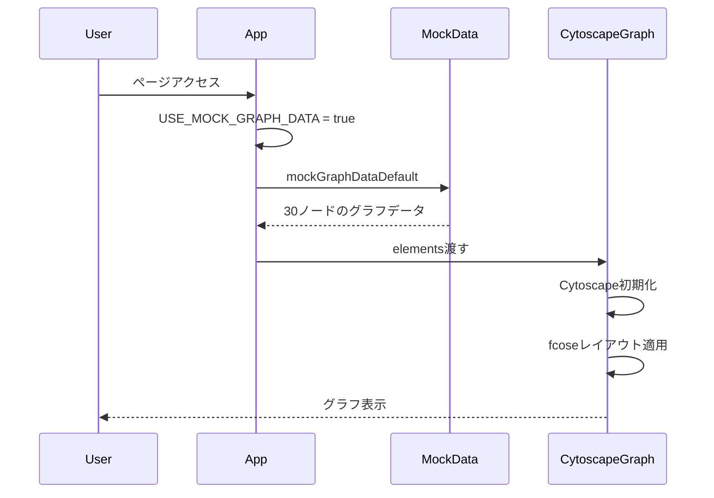
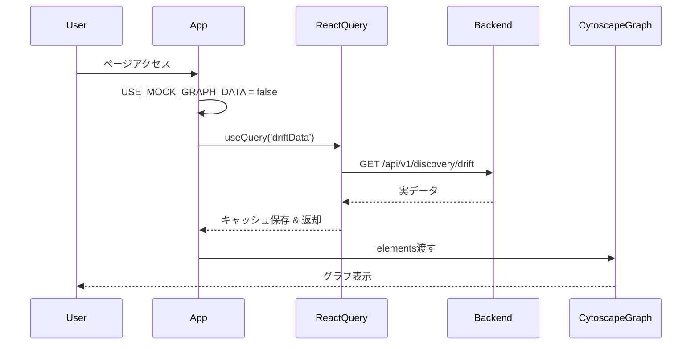
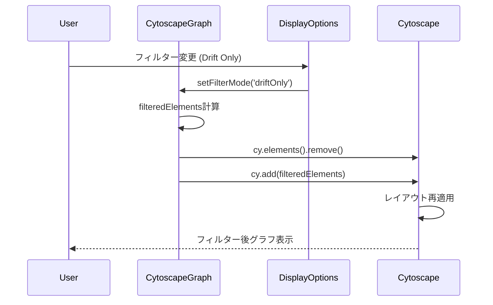

# TFDrift-Falco UI - Architecture Documentation

> **システムアーキテクチャとデザインパターン (v0.5.0+)**

**最終更新**: 2026-01-10
**バージョン**: v0.5.0+ (Cytoscape.js + Storybook駆動開発)

---

## 📋 目次

- [システムアーキテクチャ概要](#️-システムアーキテクチャ概要)
- [コンポーネント構成](#-コンポーネント構成)
- [データフロー](#-データフロー)
- [状態管理](#-状態管理)
- [Storybook駆動開発アーキテクチャ](#-storybook駆動開発アーキテクチャ)
- [グラフ可視化アーキテクチャ](#-グラフ可視化アーキテクチャ)
- [デザインパターン](#-デザインパターン)
- [パフォーマンス最適化](#-パフォーマンス最適化)
- [テスト戦略](#-テスト戦略)
- [将来の拡張性](#-将来の拡張性)

---

## 🏗️ システムアーキテクチャ概要

### アーキテクチャパターン

TFDrift-Falco UIは**レイヤードアーキテクチャ**と**Storybook駆動開発 (SDD)** を採用しています。

```
┌─────────────────────────────────────────────────────────────┐
│                   Presentation Layer                         │
│  (React Components, Cytoscape.js, UI Interactions)          │
├─────────────────────────────────────────────────────────────┤
│                   Application Layer                          │
│  (Business Logic, Custom Hooks, State Management)           │
├─────────────────────────────────────────────────────────────┤
│                      Data Layer                              │
│  (API Clients, React Query, Mock Data)                      │
├─────────────────────────────────────────────────────────────┤
│                  Storybook Layer                             │
│  (17 Stories, Mock Data, Visual Documentation)              │
├─────────────────────────────────────────────────────────────┤
│                    Backend Services                          │
│  (TFDrift API, Drift Detection, WebSocket/SSE)              │
└─────────────────────────────────────────────────────────────┘
```

### 主要技術スタック

| レイヤー | 技術 | 用途 |
|---|---|---|
| **UI Framework** | React 19.2 | コンポーネントベースUI |
| **Type Safety** | TypeScript 5.9 | 型安全性 |
| **Build Tool** | Vite 7.2 | 高速ビルド & HMR |
| **Graph Rendering** | Cytoscape.js 3.33 | グラフ可視化 |
| **State Management** | React Query 5.90, Zustand 5.0 | サーバー/クライアント状態 |
| **Styling** | Tailwind CSS 4.1 | ユーティリティファーストCSS |
| **Component Dev** | Storybook 10.1 | 分離開発・ドキュメント |
| **Testing** | Vitest 4.0, Playwright 1.57 | ユニット/E2Eテスト |

---

## 🧩 コンポーネント構成

### コンポーネントツリー

```
┌─────────────────────────────────────────────────┐
│              App-drift.tsx                       │
│  (Main Application Container)                   │
└────────────┬────────────────────────────────────┘
             │
     ┌───────┴────────────────────┐
     │                            │
     ▼                            ▼
┌────────────────┐    ┌───────────────────────┐
│ DriftDashboard │    │   CytoscapeGraph      │
│ ----------------│    │ ---------------------  │
│ - Status Badge │    │ - Graph Rendering     │
│ - Summary Cards│    │ - VPC/Subnet Hierarchy│
│ - Type Breakdown│   │ - 28 AWS Icons        │
└────────────────┘    └─────────┬─────────────┘
                                 │
                    ┌────────────┼────────────┐
                    │            │            │
                    ▼            ▼            ▼
           ┌──────────────┐ ┌──────────┐ ┌────────┐
           │DisplayOptions│ │  Legend  │ │ Nodes  │
           │- Draggable   │ │- 28 AWS  │ │ Edges  │
           │- Filters     │ │  Services│ │        │
           │- Layouts     │ └──────────┘ └────────┘
           └──────────────┘
```

### 主要コンポーネント詳細

#### **1. CytoscapeGraph** (`src/components/CytoscapeGraph.tsx`)

**責務**: グラフ可視化のコアコンポーネント

**Props**:
```typescript
interface CytoscapeGraphProps {
  elements: ElementDefinition[];  // ノード & エッジ
  layout?: LayoutName;             // fcose, dagre, cose, grid
  filterMode?: FilterMode;         // all, driftOnly, vpcOnly
  highlightDriftNodes?: boolean;
  onNodeClick?: (nodeId: string) => void;
  onEdgeClick?: (edgeId: string) => void;
}
```

**機能**:
- Cytoscape.js インスタンス管理
- VPC/Subnet階層表示 (Compound Nodes)
- 動的レイアウト切り替え
- フィルタリング (Drift のみ、VPC/ネットワークのみ)
- イベントハンドリング (ノード/エッジクリック)

**内部構造**:
```typescript
CytoscapeGraph
├── useEffect (Cytoscape初期化)
├── useEffect (レイアウト適用)
├── DisplayOptions (埋め込みパネル)
│   ├── LayoutSwitcher
│   ├── FilterSelector
│   ├── CloseButton
│   └── Legend
└── div#cy (Cytoscapeコンテナ)
```

#### **2. DriftDashboard** (`src/components/DriftDashboard.tsx`)

**責務**: Drift検知ステータス表示

**Props**:
```typescript
interface DriftDashboardProps {
  summary: DriftSummary;        // サマリー統計
  detection: DriftDetection;    // 詳細検知結果
}
```

**表示内容**:
- Overall Status (Drift Detected / No Drift)
- Summary Cards (4枚):
  - Terraform Resources
  - Unmanaged Resources
  - Missing Resources
  - Modified Resources
- Resource Type Breakdown (色分け表示)

#### **3. DisplayOptions** (CytoscapeGraph内)

**責務**: UIコントロールパネル

**機能**:
- ドラッグ可能 (react-draggable)
- レイアウト切り替えボタン
- フィルターモード選択
- 閉じるボタン (×)
- レジェンド表示

---

## 🔄 データフロー

### アーキテクチャ図

```
┌──────────────┐
│   Backend    │
│     API      │
│ (Port 8080)  │
└──────┬───────┘
       │
       ├─── GET /api/v1/discovery/drift ──────┐
       ├─── GET /api/v1/discovery/drift/summary
       └─── GET /api/v1/graph ────────────────┤
                                               │
                  ┌────────────────────────────┘
                  │
                  ▼
      ┌───────────────────────┐
      │   Mock Data Switch    │
      │  USE_MOCK_GRAPH_DATA  │
      │  USE_MOCK_DRIFT_DATA  │
      └────────┬──────────────┘
               │
      ┌────────┴──────────┐
      │                   │
      ▼                   ▼
┌──────────┐      ┌──────────────┐
│ Mock Data│      │ Real API Data│
│ (dev)    │      │ (production) │
└─────┬────┘      └──────┬───────┘
      │                  │
      └────────┬─────────┘
               │
               ▼
     ┌─────────────────┐
     │  React Query    │
     │  - Caching      │
     │  - Refetching   │
     └────────┬────────┘
              │
      ┌───────┴─────────┐
      │                 │
      ▼                 ▼
┌──────────────┐ ┌──────────────┐
│ useGraphData │ │ useDriftData │
└──────┬───────┘ └──────┬───────┘
       │                │
       └────────┬───────┘
                │
                ▼
     ┌─────────────────────┐
     │     Components      │
     │ - CytoscapeGraph    │
     │ - DriftDashboard    │
     └─────────────────────┘
```

### データフローシーケンス

#### A. 初期ロード (Mock Data有効時)



#### B. 実際のAPI使用時



#### C. ユーザーインタラクション



---

## 🎛️ 状態管理

### 状態管理戦略

TFDrift-Falco UIは、**サーバー状態**と**クライアント状態**を明確に分離しています。

```
┌─────────────────────────────────────────────────┐
│              State Management                    │
├─────────────────────────────────────────────────┤
│                                                  │
│  ┌─────────────────────┐  ┌─────────────────┐  │
│  │   Server State      │  │   Client State  │  │
│  │   (React Query)     │  │   (useState/    │  │
│  │                     │  │    Zustand)     │  │
│  │  - Graph Data       │  │  - FilterMode   │  │
│  │  - Drift Summary    │  │  - LayoutType   │  │
│  │  - Drift Detection  │  │  - SelectedNode │  │
│  │                     │  │  - PanelOpen    │  │
│  │  Cache & Refetch    │  │  Ephemeral      │  │
│  └─────────────────────┘  └─────────────────┘  │
│                                                  │
└─────────────────────────────────────────────────┘
```

### Server State (React Query)

**管理対象**: APIから取得するデータ

```typescript
// src/hooks/useGraphData.ts (将来実装)
export const useGraphData = () => {
  return useQuery({
    queryKey: ['graphData'],
    queryFn: async () => {
      const response = await fetch('/api/v1/graph');
      return response.json();
    },
    staleTime: 30000,      // 30秒間はfreshと見なす
    cacheTime: 3600000,    // 1時間キャッシュ保持
    refetchOnWindowFocus: false,
  });
};

// 使用例
const { data, isLoading, error } = useGraphData();
```

### Client State (React.useState)

**管理対象**: UIの一時的な状態

```typescript
// src/App-drift.tsx
const [filterMode, setFilterMode] = useState<FilterMode>('all');
const [layoutType, setLayoutType] = useState<LayoutName>('fcose');
const [selectedNode, setSelectedNode] = useState<string | null>(null);
const [isPanelOpen, setIsPanelOpen] = useState(true);
```

### モックデータスイッチ

開発環境では、モックデータとAPIデータを簡単に切り替え可能:

```typescript
// src/App-drift.tsx
const USE_MOCK_GRAPH_DATA = true;  // モック有効
const USE_MOCK_DRIFT_DATA = true;

const graphElements = USE_MOCK_GRAPH_DATA
  ? mockGraphDataDefault
  : realGraphData;
```

---

## 📖 Storybook駆動開発アーキテクチャ

### SDD (Storybook-Driven Development) の原則

1. **Story First**: コンポーネントより先にStoryを書く
2. **Isolated Development**: バックエンド不要の分離開発
3. **Living Documentation**: Storyが生きたドキュメント
4. **Visual Testing**: ビジュアルリグレッションテスト対応

### Storybook構造

```
.storybook/
├── main.ts              # Storybook設定
├── preview.ts           # グローバル設定・デコレーター
└── tsconfig.json        # TypeScript設定

src/components/
└── CytoscapeGraph.stories.tsx  # 17個のStory定義
```

### Story構成 (17個)

#### 1. 基本Story (3個)
```typescript
export const Default: Story = {
  args: {
    elements: mockGraphDataDefault,  // 30ノード
    layout: 'fcose',
  },
};

export const Empty: Story = {
  args: {
    elements: [],  // 空の状態
  },
};

export const VPCHierarchy: Story = {
  args: {
    elements: mockGraphDataVPCHierarchy,  // VPC/Subnet重点
  },
};
```

#### 2. レイアウトStory (4個)
```typescript
export const LayoutFcose: Story = {
  args: { layout: 'fcose' },
};
export const LayoutDagre: Story = {
  args: { layout: 'dagre' },
};
// ... cose, grid
```

#### 3. サイズStory (4個)
```typescript
export const SmallGraph: Story = {
  args: {
    elements: mockGraphDataSmall,  // 10ノード
  },
};
export const LargeGraph: Story = {
  args: {
    elements: mockGraphDataLarge,  // 100ノード
  },
};
// ... Medium (30), Very Large (200)
```

#### 4. Drift & Interactive Story (6個)
```typescript
export const DriftHighlighted: Story = {
  args: {
    highlightDriftNodes: true,
  },
};

export const InteractiveNodeClick: Story = {
  args: {
    onNodeClick: (nodeId) => console.log('Node clicked:', nodeId),
  },
};
// ... All AWS Services, Edge Click, Path Highlighting, Playground
```

### Storybook開発フロー

```
1. Story作成
   ↓
2. モックデータ準備
   ↓
3. Storybook起動 (npm run storybook)
   ↓
4. ブラウザで即座に確認 (4秒)
   ↓
5. コンポーネント実装
   ↓
6. Storyで動作確認
   ↓
7. Visual Regression Test (将来)
```

**効果**: フィードバックループ 2分 → 4秒 (30倍高速)

---

## 📊 グラフ可視化アーキテクチャ

### Cytoscape.js アーキテクチャ

```
┌────────────────────────────────────────────┐
│         CytoscapeGraph Component           │
├────────────────────────────────────────────┤
│  ┌─────────────────────────────────────┐  │
│  │   Cytoscape.js Instance (cy)        │  │
│  │  ┌───────────────────────────────┐  │  │
│  │  │   Elements (nodes + edges)    │  │  │
│  │  │  - 28 AWS Service Types       │  │  │
│  │  │  - VPC/Subnet (parent/child)  │  │  │
│  │  └───────────────────────────────┘  │  │
│  │  ┌───────────────────────────────┐  │  │
│  │  │   Styles (cytoscapeStyles.ts) │  │  │
│  │  │  - Node Sizes (60px default)  │  │  │
│  │  │  - VPC opacity 0.95           │  │  │
│  │  │  - Icon sizes 80%             │  │  │
│  │  └───────────────────────────────┘  │  │
│  │  ┌───────────────────────────────┐  │  │
│  │  │   Layout Algorithms           │  │  │
│  │  │  - fcose (compound優先)      │  │  │
│  │  │  - dagre (階層)               │  │  │
│  │  │  - cose, grid                 │  │  │
│  │  └───────────────────────────────┘  │  │
│  └─────────────────────────────────────┘  │
└────────────────────────────────────────────┘
```

### Compound Nodes (VPC/Subnet階層)

VPC/Subnet階層を表現するためにCytoscape.jsのCompound Nodes機能を使用:

```typescript
// VPC (親ノード)
{
  data: {
    id: 'vpc-123',
    label: 'VPC (10.0.0.0/16)',
    type: 'aws_vpc',
  },
  classes: 'vpc',
}

// Subnet (子ノード)
{
  data: {
    id: 'subnet-456',
    label: 'Subnet (10.0.1.0/24)',
    type: 'aws_subnet',
    parent: 'vpc-123',  // VPCの子として定義
  },
  classes: 'subnet',
}

// リソース (Subnet内)
{
  data: {
    id: 'eks-789',
    label: 'EKS Cluster',
    type: 'aws_eks',
    parent: 'subnet-456',  // Subnetの子として定義
  },
}
```

### レイアウトアルゴリズム

| Algorithm | 用途 | Compound対応 | 速度 |
|---|---|---|---|
| **fcose** | デフォルト | ✅ 最適 | 遅い (3000 iter) |
| **dagre** | 階層表示 | ⚠️ 弱い | 高速 |
| **cose** | 力学モデル | ✅ 対応 | 中速 |
| **grid** | グリッド配置 | ❌ 非対応 | 最速 |

**推奨**: VPC/Subnet階層を使用する場合は**fcose**

### スタイル定義

```typescript
// src/styles/cytoscapeStyles.ts
export const cytoscapeStyles = [
  // ノードデフォルトスタイル
  {
    selector: 'node',
    style: {
      'width': 60,              // v0.5.0+ で拡大 (45→60)
      'height': 60,
      'background-color': '#3b82f6',
      'label': 'data(label)',
      'font-size': 12,          // v0.5.0+ で拡大 (+2px)
      'background-image': 'data(icon)',
      'background-fit': 'contain',
      'background-width': '80%', // v0.5.0+ で拡大 (75%→80%)
      'background-height': '80%',
    },
  },
  // VPCスタイル (Compound Node)
  {
    selector: '.vpc',
    style: {
      'background-opacity': 0.95,    // v0.5.0+ で向上 (0.6→0.95)
      'border-width': 5,             // v0.5.0+ で太く (4→5)
      'border-color': '#10b981',
      'padding': 100,                // v0.5.0+ で拡大 (80→100)
    },
  },
  // Subnetスタイル (Compound Node)
  {
    selector: '.subnet',
    style: {
      'background-opacity': 0.9,     // v0.5.0+ で向上 (0.7→0.9)
      'border-width': 4,             // v0.5.0+ で太く (3→4)
      'border-color': '#3b82f6',
      'padding': 70,                 // v0.5.0+ で拡大 (50→70)
    },
  },
  // 28 AWS Service Types ...
];
```

### AWS公式アイコン統合

```typescript
// public/aws-icons/ に配置された28個のSVGアイコン
const awsIcons = {
  'aws_lambda': '/aws-icons/lambda.svg',
  'aws_eks': '/aws-icons/eks.svg',
  'aws_rds': '/aws-icons/rds.svg',
  // ... 全28種類
};

// Cytoscapeノードにアイコン適用
{
  data: {
    id: 'lambda-1',
    type: 'aws_lambda',
    icon: awsIcons['aws_lambda'],  // SVGパス
  },
}
```

---

## 🎨 デザインパターン

### 1. Presentational/Container Pattern

**Presentational (Stateless):**
```typescript
// 見た目のみ担当、Propsで制御
interface GraphViewProps {
  elements: ElementDefinition[];
  layout: LayoutName;
}

export const GraphView: React.FC<GraphViewProps> = ({ elements, layout }) => {
  return (
    <div id="cy" style={{ width: '100%', height: '100%' }}>
      {/* Cytoscape rendering */}
    </div>
  );
};
```

**Container (Stateful):**
```typescript
// データフェッチ & ビジネスロジック
export const GraphContainer = () => {
  const [layout, setLayout] = useState<LayoutName>('fcose');
  const elements = USE_MOCK_GRAPH_DATA
    ? mockGraphDataDefault
    : useGraphData().data;

  return <GraphView elements={elements} layout={layout} />;
};
```

### 2. Custom Hooks Pattern

```typescript
// src/hooks/useCytoscapeInstance.ts (将来実装)
export const useCytoscapeInstance = (containerRef, elements, layout) => {
  const [cy, setCy] = useState<cytoscape.Core | null>(null);

  useEffect(() => {
    if (!containerRef.current) return;

    const instance = cytoscape({
      container: containerRef.current,
      elements,
      style: cytoscapeStyles,
      layout: { name: layout },
    });

    setCy(instance);

    return () => instance.destroy();
  }, [containerRef, elements, layout]);

  return cy;
};
```

### 3. Factory Pattern (Mock Data)

```typescript
// src/mocks/graphData.ts
class GraphDataFactory {
  static createVPCHierarchy(vpcCount: number, subnetsPerVpc: number) {
    const nodes = [];
    const edges = [];

    for (let i = 0; i < vpcCount; i++) {
      const vpcId = `vpc-${i}`;
      nodes.push({
        data: { id: vpcId, label: `VPC ${i}`, type: 'aws_vpc' },
      });

      for (let j = 0; j < subnetsPerVpc; j++) {
        const subnetId = `subnet-${i}-${j}`;
        nodes.push({
          data: {
            id: subnetId,
            label: `Subnet ${j}`,
            type: 'aws_subnet',
            parent: vpcId,  // VPCの子
          },
        });
      }
    }

    return { nodes, edges };
  }
}
```

### 4. Render Props Pattern

```typescript
// 高階コンポーネント
export const withLoading = <P extends object>(
  Component: React.ComponentType<P>
) => {
  return ({ isLoading, ...props }: P & { isLoading: boolean }) => {
    if (isLoading) {
      return <div>Loading graph...</div>;
    }
    return <Component {...(props as P)} />;
  };
};

// 使用例
const CytoscapeGraphWithLoading = withLoading(CytoscapeGraph);
```

---

## ⚡ パフォーマンス最適化

### 1. Cytoscape.js パフォーマンス

#### fcose レイアウト最適化

```typescript
// v0.5.0+ で大規模グラフ対応を改善
const fcoseLayoutOptions = {
  name: 'fcose',
  quality: 'default',
  randomize: false,
  animate: true,
  animationDuration: 1000,
  // パフォーマンスチューニング
  numIter: 3000,              // イテレーション数 (v0.5.0+で増加)
  nodeSeparation: 100,        // ノード間距離 (v0.5.0+で拡大: 60→100)
  idealEdgeLength: 120,       // 理想エッジ長 (v0.5.0+で拡大: 80→120)
  nodeRepulsion: 4500,
  gravity: 0.25,
  gravityRange: 3.8,
  // Compound Nodes対応
  nestingFactor: 0.1,
  gravityCompound: 1.0,
  gravityRangeCompound: 1.5,
};
```

#### バッチレンダリング

```typescript
// 大量ノード追加時のパフォーマンス向上
cy.startBatch();
elements.forEach((el) => cy.add(el));
cy.endBatch();
```

### 2. React最適化

#### useMemo によるフィルタリング

```typescript
const filteredElements = useMemo(() => {
  if (filterMode === 'all') return elements;
  if (filterMode === 'driftOnly') {
    return elements.filter((el) =>
      el.data.hasDrift === true
    );
  }
  if (filterMode === 'vpcOnly') {
    return elements.filter((el) =>
      ['aws_vpc', 'aws_subnet', 'aws_security_group'].includes(el.data.type)
    );
  }
  return elements;
}, [elements, filterMode]);
```

#### useCallback によるイベントハンドラ

```typescript
const handleNodeClick = useCallback((nodeId: string) => {
  console.log('Node clicked:', nodeId);
  setSelectedNode(nodeId);
}, []);
```

### 3. 大規模グラフ対応 (100+ ノード)

#### Level of Detail (LOD) - 将来実装

```typescript
// ズームレベルに応じて詳細度を変更
cy.on('zoom', () => {
  const zoomLevel = cy.zoom();
  if (zoomLevel < 0.5) {
    // 遠い: アイコン非表示、ラベル簡略化
    cy.nodes().style('background-image', 'none');
  } else {
    // 近い: フル表示
    cy.nodes().style('background-image', 'data(icon)');
  }
});
```

#### Clustering - 将来実装

```typescript
// 同じSubnet内のノードをグループ化
const clusterNodes = (nodes, clusterKey) => {
  const clusters = {};
  nodes.forEach((node) => {
    const key = node.data[clusterKey];
    if (!clusters[key]) clusters[key] = [];
    clusters[key].push(node);
  });
  return clusters;
};
```

---

## 🧪 テスト戦略

### テストピラミッド

```
        ┌─────────┐
        │   E2E   │  ← 5%   (Playwright)
        └─────────┘
      ┌───────────────┐
      │  Integration  │  ← 20%  (React Testing Library)
      └───────────────┘
    ┌─────────────────────┐
    │    Unit Tests       │  ← 75%  (Vitest)
    └─────────────────────┘
```

### 1. Unit Tests (Vitest)

```typescript
// src/mocks/graphData.test.ts
describe('mockGraphDataDefault', () => {
  it('should have 30 nodes', () => {
    const { nodes } = mockGraphDataDefault;
    expect(nodes).toHaveLength(30);
  });

  it('should have VPC compound nodes', () => {
    const vpcNodes = mockGraphDataDefault.nodes.filter(
      (node) => node.data.type === 'aws_vpc'
    );
    expect(vpcNodes.length).toBeGreaterThan(0);
  });
});
```

### 2. Component Tests (React Testing Library)

```typescript
// src/components/CytoscapeGraph.test.tsx
describe('CytoscapeGraph', () => {
  it('renders graph container', () => {
    render(<CytoscapeGraph elements={mockGraphDataSmall} />);
    const container = screen.getByTestId('cy-container');
    expect(container).toBeInTheDocument();
  });

  it('applies fcose layout by default', () => {
    const { container } = render(
      <CytoscapeGraph elements={mockGraphDataDefault} />
    );
    // Cytoscape.jsインスタンスの検証
    expect(container.querySelector('#cy')).toBeTruthy();
  });
});
```

### 3. Storybook Tests (将来実装)

```typescript
// src/components/CytoscapeGraph.stories.test.ts
import { composeStories } from '@storybook/react';
import * as stories from './CytoscapeGraph.stories';

const { Default, VPCHierarchy } = composeStories(stories);

describe('CytoscapeGraph Stories', () => {
  it('Default story renders', () => {
    render(<Default />);
    expect(screen.getByTestId('cy-container')).toBeInTheDocument();
  });

  it('VPCHierarchy story shows compound nodes', () => {
    render(<VPCHierarchy />);
    // VPC階層の検証
  });
});
```

### 4. Visual Regression Tests (Chromatic - 将来実装)

```bash
# Chromaticでビジュアルリグレッションテスト
npx chromatic --project-token=<token>
```

---

## 🔮 将来の拡張性

### Phase 1: 安定化 (v0.5.1-v0.5.3) - 2-3週間

- [ ] UI機能拡充
  - ノード詳細パネル
  - 高度なフィルター (タグベース、検索)
  - エクスポート機能 (PNG, SVG, JSON)
- [ ] パフォーマンス最適化
  - Level of Detail (LOD)
  - Clustering
  - Web Worker でレイアウト計算

### Phase 2: リアルタイム (v0.6.0) - 1ヶ月

- [ ] WebSocket/SSE完全実装
  - リアルタイムグラフ更新
  - トースト通知
  - 自動再接続ロジック
- [ ] Drift履歴機能
  - タイムライン表示
  - 変更履歴 diff

### Phase 3: マルチクラウド (v0.7.0) - 1ヶ月

- [ ] GCP/Azureアイコン統合
- [ ] マルチクラウドフィルター
- [ ] プロバイダー別カラーリング

### Phase 4: エンタープライズ (v0.8.0) - 2ヶ月

- [ ] RBAC対応UI
- [ ] 高度なレポート生成
- [ ] カスタムダッシュボード

### Phase 5: AI (v0.9.0) - 2ヶ月

- [ ] 異常検知アラート
- [ ] 自動パターン認識
- [ ] 影響範囲予測

---

## 📚 参考資料

### 内部ドキュメント
- [プロジェクトロードマップ](../../PROJECT_ROADMAP.md)
- [Storybook駆動開発ガイド](STORYBOOK_DRIVEN_DEVELOPMENT.md)
- [UI README](../README.md)

### 外部リンク
- [Cytoscape.js Documentation](https://js.cytoscape.org/)
- [React Query Documentation](https://tanstack.com/query/latest)
- [Storybook Documentation](https://storybook.js.org/)
- [Tailwind CSS Documentation](https://tailwindcss.com/)

---

**作成者**: Keita Higaki
**最終更新**: 2026-01-10
**バージョン**: v0.5.0+
