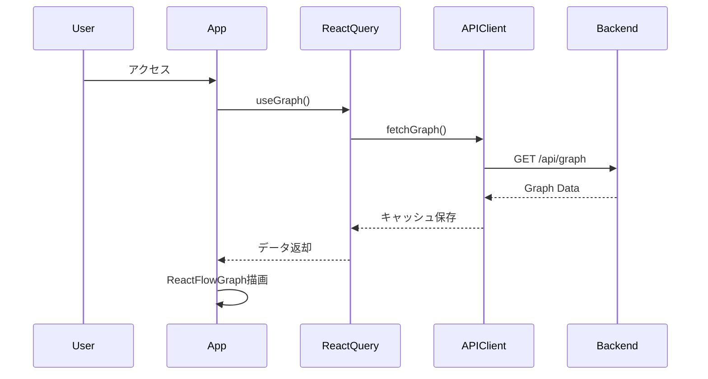
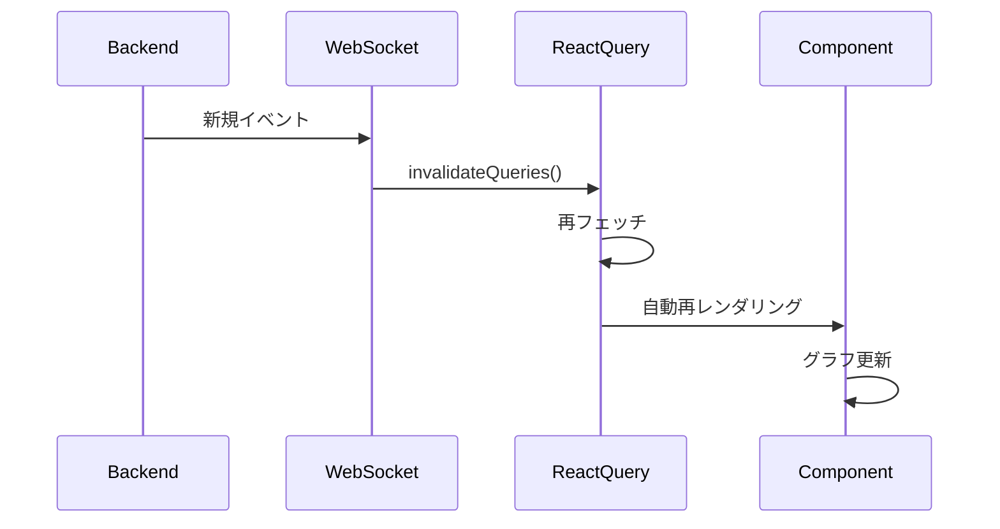
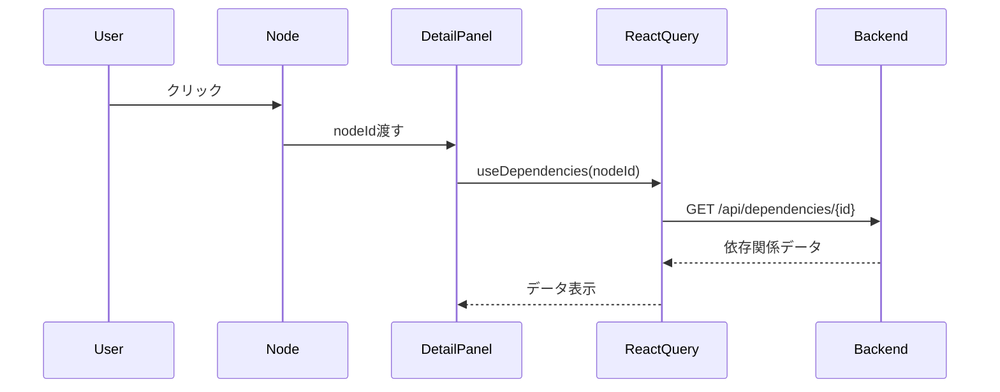

# TFDrift-Falco UI - Architecture Documentation

> **システムアーキテクチャとデザインパターン**

## 🏗️ システムアーキテクチャ概要

### アーキテクチャパターン

TFDrift-Falco UIは**レイヤードアーキテクチャ**と**Flux/Unidirectional Data Flow**を採用しています。

```
┌─────────────────────────────────────────────────────────────┐
│                    Presentation Layer                        │
│  (React Components, UI, User Interactions)                  │
├─────────────────────────────────────────────────────────────┤
│                   Application Layer                          │
│  (Business Logic, Custom Hooks, State Management)           │
├─────────────────────────────────────────────────────────────┤
│                      Data Layer                              │
│  (API Clients, React Query, WebSocket, SSE)                 │
├─────────────────────────────────────────────────────────────┤
│                    Backend Services                          │
│  (TFDrift API, GraphDB, Falco Events)                       │
└─────────────────────────────────────────────────────────────┘
```

---

## 📊 詳細アーキテクチャ図

### 1. データフローアーキテクチャ

```
┌──────────────┐
│   Backend    │
│     API      │
└──────┬───────┘
       │
       ├─── REST API ──────────┐
       ├─── WebSocket ─────────┤
       └─── SSE ───────────────┤
                                │
                                ▼
                    ┌────────────────────┐
                    │   API Clients      │
                    │  - client.ts       │
                    │  - websocket.ts    │
                    │  - sse.ts          │
                    └─────────┬──────────┘
                              │
                              ▼
                    ┌────────────────────┐
                    │  React Query       │
                    │  (Server State)    │
                    │  - Caching         │
                    │  - Refetching      │
                    │  - Optimistic UI   │
                    └─────────┬──────────┘
                              │
                 ┌────────────┼────────────┐
                 │            │            │
                 ▼            ▼            ▼
         ┌───────────┐ ┌──────────┐ ┌──────────┐
         │  useGraph │ │useDrifts │ │useEvents │
         └─────┬─────┘ └────┬─────┘ └────┬─────┘
               │            │            │
               └────────────┼────────────┘
                            │
                            ▼
                  ┌──────────────────┐
                  │   Components     │
                  │  - ReactFlowGraph│
                  │  - DriftTable    │
                  │  - DetailPanels  │
                  └──────────────────┘
```

### 2. コンポーネントアーキテクチャ

```
┌─────────────────────────────────────────────────┐
│             App Container                        │
│  (App-with-table.tsx / App-final.tsx)           │
└────────────┬────────────────────────────────────┘
             │
     ┌───────┴───────┐
     │               │
     ▼               ▼
┌─────────────┐  ┌─────────────┐
│ Left Panel  │  │ Main Graph  │
│  - Filters  │  │  - React    │
│  - Stats    │  │    Flow     │
│  - Controls │  │  - Nodes    │
└─────────────┘  └──────┬──────┘
                        │
            ┌───────────┼───────────┐
            │           │           │
            ▼           ▼           ▼
      ┌──────────┐ ┌─────────┐ ┌─────────┐
      │ Node     │ │ Context │ │ Detail  │
      │ Tooltip  │ │  Menu   │ │  Panel  │
      └──────────┘ └─────────┘ └─────────┘
```

### 3. 状態管理アーキテクチャ

```
┌─────────────────────────────────────────────────┐
│              State Management                    │
├─────────────────────────────────────────────────┤
│                                                  │
│  ┌─────────────────────┐  ┌─────────────────┐  │
│  │   Server State      │  │   Client State  │  │
│  │   (React Query)     │  │   (useState/    │  │
│  │                     │  │    Zustand)     │  │
│  │  - Graph Data       │  │  - UI State     │  │
│  │  - Drift Events     │  │  - Modal Open   │  │
│  │  - Falco Events     │  │  - Selected     │  │
│  │  - Statistics       │  │  - Filters      │  │
│  │                     │  │  - Theme        │  │
│  │  Cache & Refetch    │  │  Ephemeral      │  │
│  └─────────────────────┘  └─────────────────┘  │
│                                                  │
└─────────────────────────────────────────────────┘
```

---

## 🔄 主要データフロー詳細

### A. 初期ロード（Initial Load）



### B. リアルタイム更新（Real-time Updates）



### C. ユーザーインタラクション（User Interaction）



---

## 🎨 デザインパターン

### 1. Container/Presentational Pattern

**Container Components（Smart）:**
- データフェッチ
- ビジネスロジック
- 状態管理

例: `App-with-table.tsx`, `App-final.tsx`

**Presentational Components（Dumb）:**
- 見た目のみ
- Propsで制御
- 再利用可能

例: `Button`, `Card`, `CustomNode`

```typescript
// Container (Smart)
const GraphContainer = () => {
  const { data } = useGraph();
  const [selected, setSelected] = useState(null);

  return <GraphView data={data} onSelect={setSelected} />;
};

// Presentational (Dumb)
const GraphView = ({ data, onSelect }) => {
  return <div onClick={() => onSelect(data.id)}>{data.label}</div>;
};
```

### 2. Custom Hooks Pattern

**ロジックの抽出と再利用:**

```typescript
// カスタムフック
function useGraphSelection() {
  const [selected, setSelected] = useState(null);
  const [highlighted, setHighlighted] = useState([]);

  const handleSelect = (nodeId) => {
    setSelected(nodeId);
    // 依存関係をハイライト
    setHighlighted(getDependencies(nodeId));
  };

  return { selected, highlighted, handleSelect };
}

// 使用例
const GraphComponent = () => {
  const { selected, highlighted, handleSelect } = useGraphSelection();
  return <Graph onNodeClick={handleSelect} highlight={highlighted} />;
};
```

### 3. Render Props / Component Composition

```typescript
// 高階コンポーネント
const withLoading = (Component) => {
  return ({ isLoading, ...props }) => {
    if (isLoading) return <Loader />;
    return <Component {...props} />;
  };
};

// 使用
const GraphWithLoading = withLoading(ReactFlowGraph);
```

### 4. Factory Pattern（データ生成）

```typescript
// utils/sampleData.ts
class GraphFactory {
  static createCausalChain() {
    return {
      nodes: this.createNodes(),
      edges: this.createEdges()
    };
  }

  static createComplexGraph() {
    // ...
  }
}
```

---

## 🔐 セキュリティアーキテクチャ

### 1. API通信

```typescript
// api/client.ts
const apiClient = {
  baseURL: import.meta.env.VITE_API_URL,

  async request(endpoint, options) {
    // CSRF保護
    const token = getCsrfToken();

    // 認証ヘッダー
    const headers = {
      'X-CSRF-Token': token,
      'Authorization': `Bearer ${getAuthToken()}`,
      ...options.headers
    };

    return fetch(`${this.baseURL}${endpoint}`, {
      ...options,
      headers,
      credentials: 'include' // Cookie送信
    });
  }
};
```

### 2. XSS対策

- React自動エスケープ
- `dangerouslySetInnerHTML`の使用禁止
- ユーザー入力のサニタイズ

### 3. CSP (Content Security Policy)

```html
<!-- index.html -->
<meta http-equiv="Content-Security-Policy"
  content="default-src 'self';
           script-src 'self' 'unsafe-inline';
           style-src 'self' 'unsafe-inline';">
```

---

## ⚡ パフォーマンス最適化戦略

### 1. Code Splitting

```typescript
// 動的インポート
const HeavyComponent = lazy(() => import('./HeavyComponent'));

<Suspense fallback={<Loading />}>
  <HeavyComponent />
</Suspense>
```

### 2. Memoization

```typescript
// useMemo - 高コスト計算
const filteredNodes = useMemo(() =>
  nodes.filter(node => node.severity === 'critical'),
  [nodes]
);

// useCallback - 関数メモ化
const handleClick = useCallback((id) => {
  console.log(id);
}, []);

// React.memo - コンポーネントメモ化
export const ExpensiveComponent = memo(({ data }) => {
  return <div>{data}</div>;
});
```

### 3. Virtual Scrolling

```typescript
// 大量データの効率的表示
<VirtualList
  items={drifts}
  itemHeight={60}
  renderItem={(drift) => <DriftRow drift={drift} />}
/>
```

### 4. React Query最適化

```typescript
const { data } = useQuery({
  queryKey: ['graph'],
  queryFn: fetchGraph,
  staleTime: 30000,      // 30秒間はfreshと見なす
  cacheTime: 3600000,    // 1時間キャッシュ保持
  refetchOnWindowFocus: false,
  retry: 3
});
```

### 5. Image Optimization

- SVGアイコンの使用（スケーラブル、軽量）
- Lazy loading: `loading="lazy"`
- WebPフォーマット対応

---

## 📡 リアルタイム通信アーキテクチャ

### WebSocket vs SSE vs Polling

| 機能 | WebSocket | SSE | Polling |
|------|-----------|-----|---------|
| **双方向通信** | ✅ | ❌ | ❌ |
| **自動再接続** | 手動実装 | ✅ | N/A |
| **サーバープッシュ** | ✅ | ✅ | ❌ |
| **ブラウザ互換性** | 広い | やや狭い | 全て |
| **実装複雑度** | 高 | 低 | 最低 |

### TFDrift-Falcoの選択

```typescript
// 用途別使い分け
const connections = {
  // 双方向が必要な場合（チャット、協調編集等）
  websocket: new WebSocketClient('/ws'),

  // サーバープッシュのみ（イベントストリーム）
  sse: new SSEClient('/events'),

  // フォールバック（接続失敗時）
  polling: setInterval(fetchUpdates, 5000)
};
```

---

## 🧪 テスト戦略

### テストピラミッド

```
        ┌─────────┐
        │   E2E   │  ← 5%   (Playwright)
        └─────────┘
      ┌───────────────┐
      │  Integration  │  ← 20%  (React Testing Library)
      └───────────────┘
    ┌─────────────────────┐
    │    Unit Tests       │  ← 75%  (Vitest)
    └─────────────────────┘
```

### 1. Unit Tests（単体テスト）

```typescript
// utils/reactFlowAdapter.test.ts
describe('convertToReactFlow', () => {
  it('should convert Cytoscape nodes to React Flow format', () => {
    const cytoscapeData = {
      nodes: [{ data: { id: '1', label: 'Node 1' } }],
      edges: []
    };

    const result = convertToReactFlow(cytoscapeData);

    expect(result.nodes).toHaveLength(1);
    expect(result.nodes[0].id).toBe('1');
  });
});
```

### 2. Component Tests（コンポーネントテスト）

```typescript
// components/CustomNode.test.tsx
describe('CustomNode', () => {
  it('renders node with cloud icon', () => {
    render(
      <ReactFlowProvider>
        <CustomNode data={{ type: 'aws_lambda', label: 'Lambda' }} />
      </ReactFlowProvider>
    );

    expect(screen.getByText('Lambda')).toBeInTheDocument();
  });
});
```

### 3. Integration Tests（統合テスト）

```typescript
// App.integration.test.tsx
describe('App Integration', () => {
  it('loads graph and displays nodes', async () => {
    server.use(
      rest.get('/api/graph', (req, res, ctx) => {
        return res(ctx.json(mockGraphData));
      })
    );

    render(<App />);

    await waitFor(() => {
      expect(screen.getByTestId('graph-canvas')).toBeInTheDocument();
    });
  });
});
```

---

## 🔧 ビルド＆デプロイ

### Development

```bash
npm run dev
# → Vite dev server (HMR有効)
# → http://localhost:5173
```

### Production Build

```bash
npm run build
# → TypeScript compile (tsc -b)
# → Vite bundle
# → Output: dist/
```

### 最適化

```javascript
// vite.config.ts
export default defineConfig({
  build: {
    rollupOptions: {
      output: {
        manualChunks: {
          'react-vendor': ['react', 'react-dom'],
          'graph-vendor': ['reactflow', 'cytoscape'],
          'ui-vendor': ['lucide-react', '@radix-ui/react-tabs']
        }
      }
    },
    chunkSizeWarningLimit: 1000
  }
});
```

---

## 📦 依存関係管理

### Critical Dependencies

```json
{
  "react": "^19.2.0",           // UIフレームワーク
  "reactflow": "^11.11.4",      // グラフ可視化
  "@tanstack/react-query": "^5.90.12",  // データフェッチ
  "tailwindcss": "^4.1.18",     // スタイリング
  "typescript": "^5.9.3"        // 型安全性
}
```

### Dependency Update Strategy

- **Patch**: 自動更新（セキュリティ修正）
- **Minor**: 月次レビュー（新機能）
- **Major**: 四半期レビュー（Breaking Changes）

```bash
# 脆弱性チェック
npm audit

# 依存関係更新
npm update

# メジャーバージョン更新
npx npm-check-updates -u
```

---

## 🚀 スケーラビリティ戦略

### 1. コンポーネント分割

大規模グラフ（1000+ノード）でもパフォーマンス維持:

- **LOD (Level of Detail)**: ズームレベルに応じて詳細度変更
- **Clustering**: ノードのグループ化
- **Progressive Loading**: 段階的なデータロード

### 2. データストリーミング

```typescript
// 巨大データセットの効率的処理
async function* streamGraph() {
  for (let i = 0; i < totalChunks; i++) {
    const chunk = await fetchChunk(i);
    yield chunk;
  }
}

for await (const chunk of streamGraph()) {
  addNodesToGraph(chunk);
}
```

### 3. Web Workers

```typescript
// 重い計算をバックグラウンドで実行
const worker = new Worker('./graph-layout.worker.ts');
worker.postMessage({ nodes, edges });
worker.onmessage = (e) => {
  const { layoutedNodes } = e.data;
  updateGraph(layoutedNodes);
};
```

---

## 📊 モニタリング＆ロギング

### Performance Monitoring

```typescript
// パフォーマンス計測
performance.mark('graph-render-start');
renderGraph(data);
performance.mark('graph-render-end');

performance.measure('graph-render',
  'graph-render-start',
  'graph-render-end'
);

const measure = performance.getEntriesByName('graph-render')[0];
console.log(`Graph render took ${measure.duration}ms`);
```

### Error Tracking

```typescript
// エラーバウンダリ
class ErrorBoundary extends React.Component {
  componentDidCatch(error, errorInfo) {
    // エラーログサービスへ送信
    logErrorToService(error, errorInfo);
  }

  render() {
    if (this.state.hasError) {
      return <ErrorFallback />;
    }
    return this.props.children;
  }
}
```

---

## 🔮 将来の拡張性

### Phase 5: Advanced Analytics

- [ ] 時系列分析ダッシュボード
- [ ] 異常検知アラート
- [ ] カスタムクエリビルダー

### Phase 6: Collaboration

- [ ] マルチユーザーコラボレーション
- [ ] コメント・アノテーション機能
- [ ] 変更履歴追跡

### Phase 7: AI Integration

- [ ] 自動パターン検出
- [ ] 影響範囲予測
- [ ] スマート推奨

---

**最終更新**: 2026-01-01
**メンテナー**: TFDrift-Falco Team
